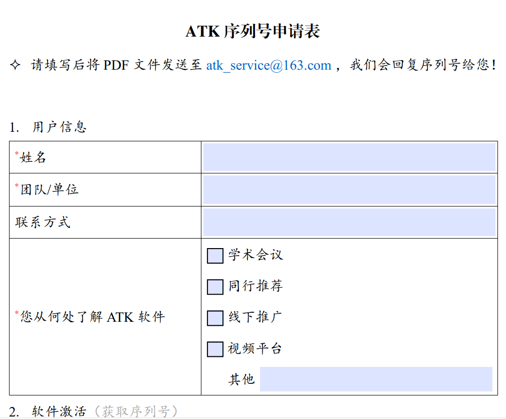

# Email

## Application Process

### Open the Application Form

Click the <kbd>Application Form</kbd> button in the software registration window.

Wait for the system to load and open the PDF guide.

::: tip Tip
If the PDF does not open automatically, check that a PDF reader is installed on your system.
:::

### Fill in the Application Form

Fill in the required information as described in the PDF document:

::: warning Important
Double-check the machine code carefully. **An incorrect entry will make the Register Id unusable.** We recommend copying and pasting directly from the registration window.
:::

### Send the Email

Send the completed application form to the designated email address:

::: info Email Details

- **Recipient email**: `atk_service@163.com`
- **Email subject**: `ATK Register Id Application - [Your Organization Name]`

:::

### Wait for Review

Our team will review your application and reply with the Register Id as soon as possible, usually within 2 minutes (provided the information is accurate).

::: warning Note
If you do not receive a reply within 10 minutes, check your spam folder, or contact us directly through [Contact Us](./05-直接联系我们.md).
:::

<!--@include:./.include/填入注册码.md-->