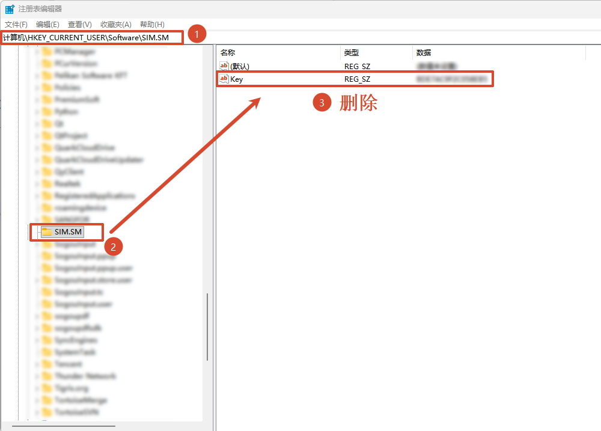
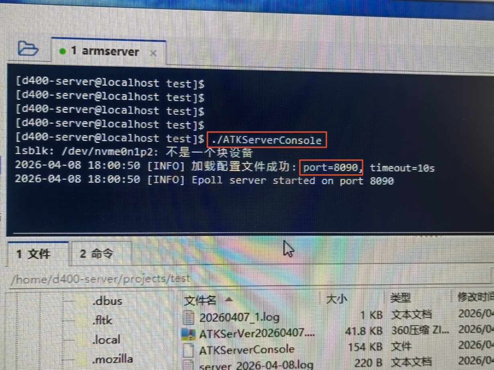
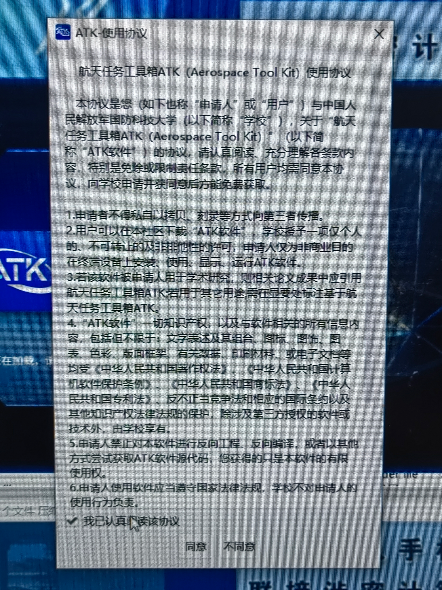
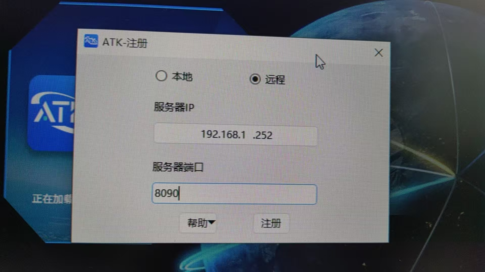

# Remote Service Registration

## Server Prerequisites: Cleanup

If you have previously completed a local ATK registration on this machine, you need to clean up leftover registry entries first:

1. Open the Registry Editor (press `Win + R`, type `regedit`, and press Enter).

2. Navigate to: `Computer\HKEY_CURRENT_USER\Software\SIM.SM`.

3. Right-click and delete the registry entry named `Key`.



## Server Startup and Registration

### First-Time Startup Registration Process

1. Log in to the server where the ATK server is installed, and navigate to the directory containing the server program via the terminal.

2. Run the server startup command:

   ```bash
   ./ATKServerConsole
   ```

3. After the program starts, it automatically generates a **machine code** (example: `30C48ACB13924C96`) and prompts "Enter Register Id".

4. Contact us to obtain a Register Id (email: `atk_service@163.com`, phone: `13739092019`), enter the provided Register Id, and press <kbd>Enter</kbd> to confirm.


5. After successful registration, the terminal outputs startup logs, showing **configuration file loaded successfully** and the **service port** (default or custom port, example: `8090`).


### Quick Start for Registered Server

If the server has already been registered, you do not need to repeat cleanup or enter the Register Id. Simply run the startup command:

```bash
./ATKServerConsole
```

The terminal output logs include the **service port number** (critical for client configuration). The example port is `8090`.



::: warning Custom Port
The server configuration file `server_config.ini` supports changing the port. The default port is `8090`. After changing the port, restart the service for the change to take effect.
:::

## Client License Agreement

1. Launch the ATK client. The **ATK License Agreement** window appears automatically.
2. Check the **I have read the agreement** checkbox.
3. Click **Agree** to enter the main interface.



## Client Remote Registration Configuration

The client needs to be linked to the server IP and port to complete remote registration. Follow these steps:

1. In the **ATK Registration** window, select the **Remote** radio button.
2. In the **Server IP** field, enter the IP address of the server where the ATK server is running (example: `192.168.1.252`).
3. In the **Server Port** field, enter the port number used by the server at startup (example: `8090`).
4. Click **Register** to complete remote service registration.

