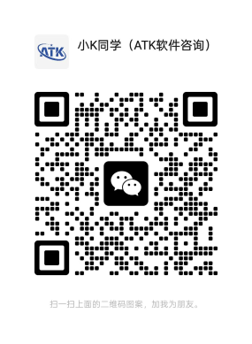
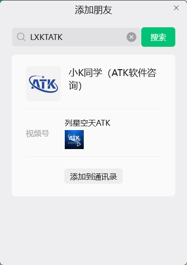

# Contact Us

## Contact Information

If you need personal assistance, you can add our staff on WeChat:

::: info Contact Information
**WeChat ID**: `LXKTATK`
:::

Scan the QR code or search for the WeChat ID to add us as a friend:

::: tip Verification Message
When adding us as a friend, we recommend noting **"ATK Register Id Application"** in the verification message so our staff can process your request more quickly.
:::

## Application Steps

After adding us on WeChat, please send the following information:

1. **Machine Code**: The 16-character code shown in the registration window.
2. **Organization Name**: The full name of your organization.
3. **Contact Person**: Your name.
4. **Phone Number**: A mobile number where you can be reached.

::: warning Important
Double-check the machine code carefully. **An incorrect entry will make the Register Id unusable.** We recommend copying and pasting it directly from the registration window.
:::

## Waiting for a Reply

Our staff will send the Register Id via WeChat as soon as possible (during business hours).

::: warning Note
- We recommend contacting us on weekdays between 8:00 and 17:30. Replies outside business hours may be delayed.
- If you have not received a reply within 2 business days, check whether WeChat messages are being blocked, or try [Email](./03-邮件申请.md).
:::

<!--@include:./.include/填入注册码.md-->