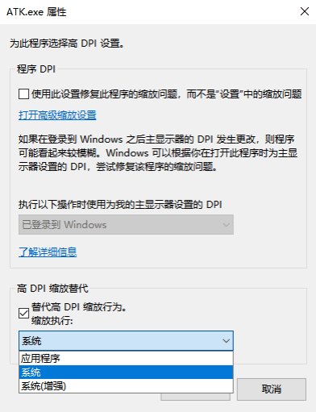

# High-DPI Display

::: info Applicable Scenarios
High-DPI laptops (resolution higher than 1920×1080), 4K monitors, and devices with Windows scaling greater than 100%.
:::

::: tip How to Tell If You Need to Adjust
If you encounter any of the following after opening ATK, follow this guide to adjust:
- Blurry text or icons in the interface
- Overlapping or incomplete buttons
- Abnormal window proportions, with some content cut off
:::

## Adjustment Steps

1. Find the ATK shortcut on your desktop, right-click it, and select <kbd>Properties</kbd>.

2. In the **Properties** dialog, switch to the **Compatibility** tab.

3. Find and click <kbd>Change high DPI settings</kbd>.

4. In the **High DPI Settings** dialog, check **Override high DPI scaling behavior**.

5. In the **Scaling performed by** dropdown, change the default **Application** to **System** or **System (Enhanced)**.

6. Click <kbd>OK</kbd> to save the settings, and **restart ATK** for the changes to take effect.

::: warning Note
- You must **restart ATK** after making changes. Closing and reopening the window alone is not enough.
- If you are using the portable version, modify the properties of `ATK.exe`. If you are using a shortcut created by the deb package installation, modify the shortcut properties.
:::

## If the Problem Persists

If the issue is still not resolved after following the steps above, try the following:

1. Temporarily set the Windows display scaling to **100%** (Settings → Display → Scale and layout).
2. Restart ATK and check whether the display is normal.
3. If it is normal, try gradually increasing the scaling to find a balance between clarity and usability.
4. If none of these steps work, please [Contact Us](../03-ATK注册码获取指南/05-直接联系我们.md) for technical support.