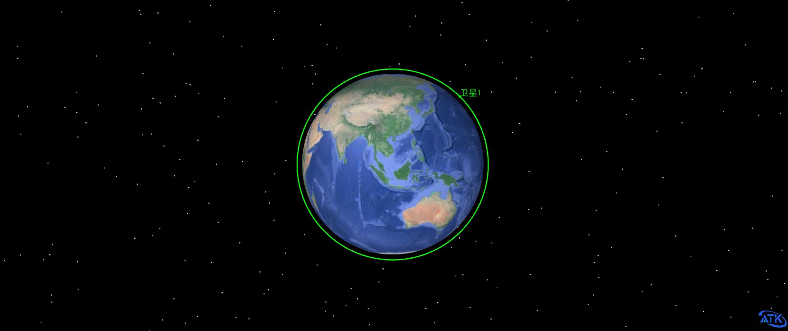

# Initial Orbit Generation

<PathViewer
  :relative-paths="files"
/>

## Scenario Description

This example generates a dawn-dusk orbit satellite with a local time of ascending node at 6:30.

## Creating the Scenario

1. Run ATK.exe and click <kbd>Create a new scenario file</kbd> to create a scenario named **Morningandusktracks**.

2. Set the simulation time. In the **ATK: New Scenario Wizard** dialog, set the time period:

   | Start Epoch                | End Epoch                  |
   | -------------------------- | -------------------------- |
   | 2024-03-18 00:00:00.000 | 2024-03-19 00:00:00.000 |

3. Click <kbd>OK</kbd> to complete scenario creation.

## Creating the Satellite and Setting Properties

1. In the toolbar, click <kbd>Insert</kbd> under <kbd>Start</kbd> to create a satellite object. Select **Scenario Object** – **Satellite**, **Insertion Method** – **Orbit Generation Wizard**, then click <kbd>Insert…</kbd> to open the Orbit Generation Wizard interface.

2. Use the Orbit Generation Wizard to set satellite properties:

   - **Orbit Type** – select **Sun‑Synchronous Orbit**.
   - Select **Orbit Altitude** and set it to 400000 m.
   - Select **Local Time of Ascending Node** and set it to **06:30:00.000**.
   - Leave other options as default and click <kbd>OK</kbd> to create the satellite.

3. Run the scenario. Click <kbd>Start</kbd> to run the scenario. The created satellite is shown below.

   

