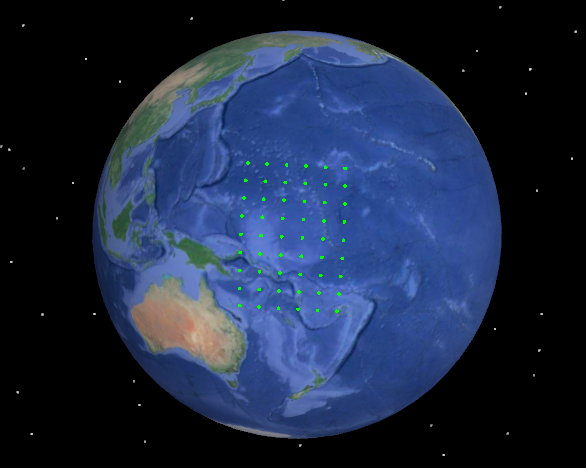
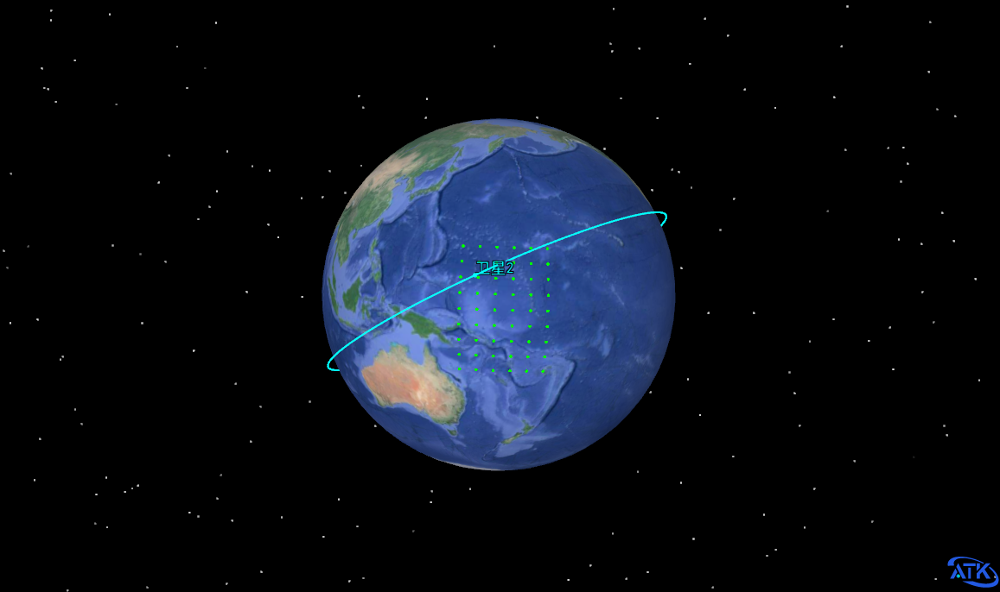
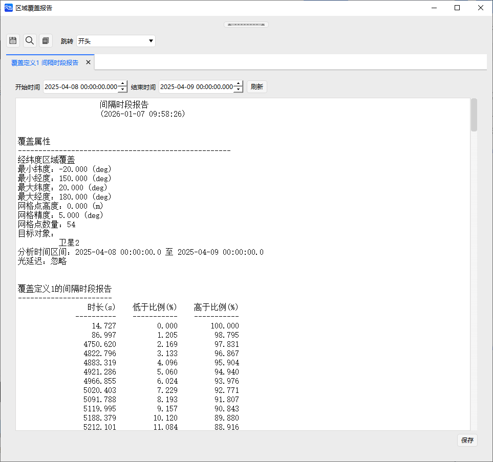
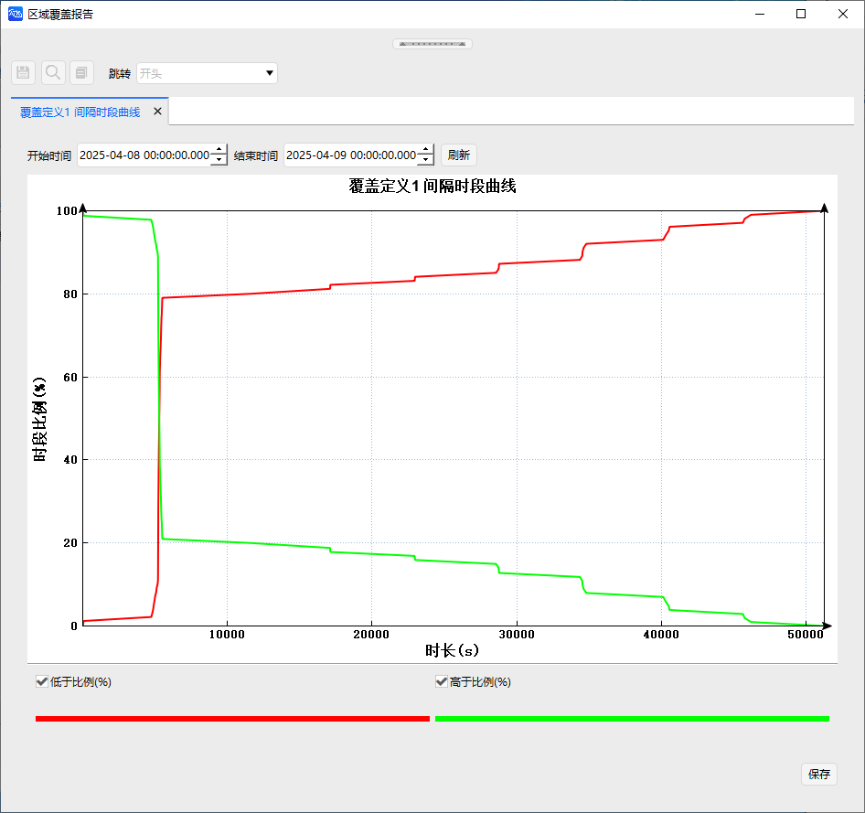
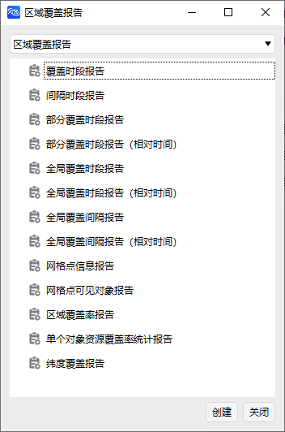
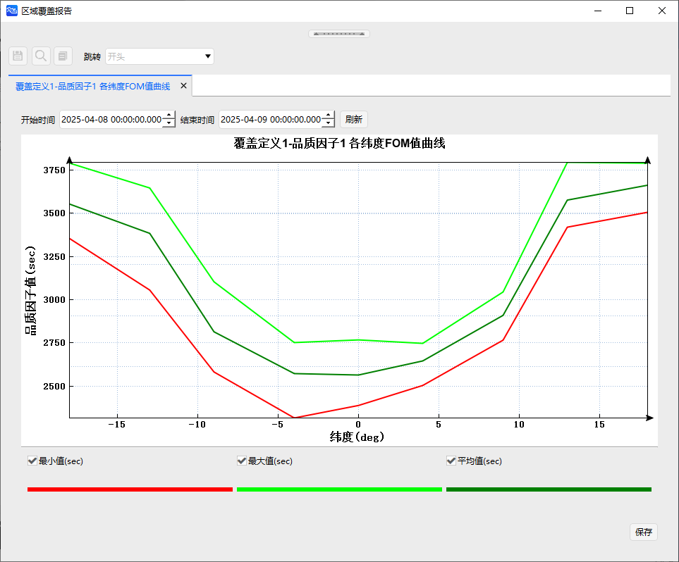
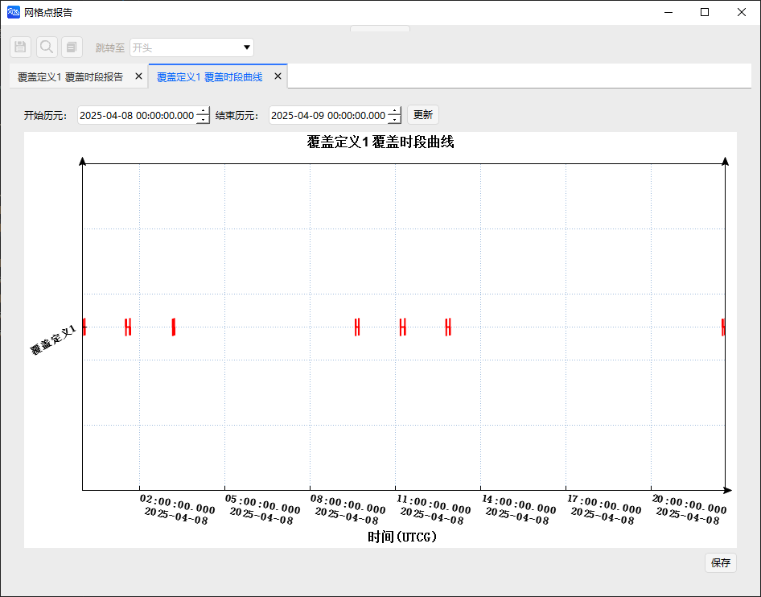
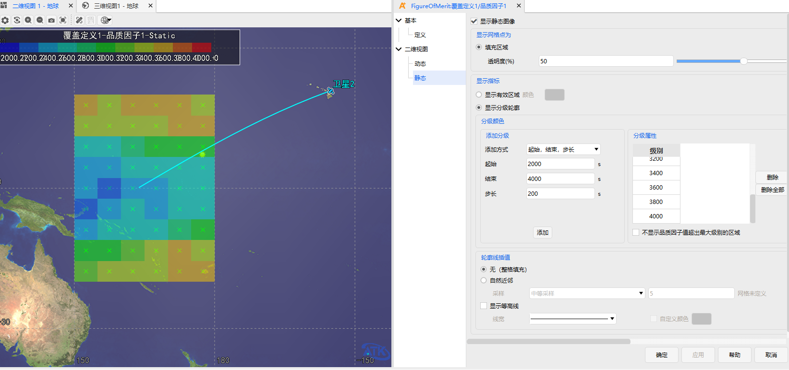

# Area Coverage Example

<PathViewer
  :relative-paths="files"
/>

## Scenario Description

This example simulates coverage analysis of a specified area by a satellite group. The coverage area range is: Latitude **-20° to 20°**, Longitude **150° to 180°**. Starlink satellites are selected for the analysis.

## Creating the Scenario

1. Run ATK.exe and click <kbd>Create a new scenario file</kbd> to create a scenario named **AreaCoverage**.

2. Set the simulation time. In the **ATK: New Scenario Wizard** dialog, set the time period.

   | Start Epoch (UTCG_MM) | End Epoch (UTCG_MM)   |
   | :-------------------: | :-------------------: |
   | 2025-04-08 00:00:00.000 | 2025-04-09 00:00:00.000 |

3. Click <kbd>OK</kbd> to complete scenario creation.

## Creating Objects

1. **Create and Edit the Coverage Definition Object**

   - In the toolbar, click <kbd>Insert</kbd> under <kbd>Start</kbd> to create a Coverage Definition object.

   - Select **Scenario Object** - **Coverage Definition**, **Insertion Method** - **Insert Default Type**, click <kbd>Insert…</kbd>, then click <kbd>Close</kbd>.

   - Right‑click **Coverage Definition 1** in the Object Browser and select <kbd>Properties</kbd> to open the Coverage Definition properties page.

   - Select **Basic** - **Grid**. Set the **Grid Region Configuration Parameters** as follows:

     | Parameter              | Value |
     | :--------------------: | :---: |
     | Minimum Latitude (deg) | -20   |
     | Minimum Longitude (deg)| 150   |
     | Maximum Latitude (deg) | 20    |
     | Maximum Longitude (deg)| 180   |

   - Set **Grid Definition** - **Lat/Lon Spacing (deg)** to 5, leave others as default, and click <kbd>OK</kbd>.

   - Under **Properties** - **Visualization** - **Display**, set **Point Size** to 35.

   

2. **Create and Edit the Figure of Merit Object**

   - In the toolbar, click <kbd>Insert</kbd> under <kbd>Start</kbd>.

   - Select **Attached Object** - **Figure of Merit**, **Insertion Method** - **Insert Default Type**, click <kbd>Insert…</kbd>. In the pop‑up window, select **Coverage Definition 1** as the target object and click <kbd>OK</kbd>.

   - Right‑click **Figure of Merit 1** in the Object Browser and select <kbd>Properties</kbd> to open the Figure of Merit properties page.

   - In the Figure of Merit basic definition, set the **Type** to **Coverage Time**, **Computation** to **Daily Maximum**, and check **Enable** for the effective condition.

3. **Create Satellite Objects**

   - In the toolbar, click <kbd>Insert</kbd> under <kbd>Start</kbd>.

   - Select **Scenario Object** - **Satellite**, **Insertion Method** - **Insert Default Type**, and click <kbd>Insert…</kbd>.

   

## Area Coverage Analysis and Results

1. **Area Coverage Analysis**

   - Click **Coverage Definition 1**, then click <kbd>Tools</kbd> - <kbd>Area Coverage</kbd> to open the Area Coverage Analysis tool window.

   - Click <kbd>Select Object</kbd>, choose **Coverage Definition 1** in the **Select Object** window, and click <kbd>OK</kbd>.

   - Keep the default scenario simulation time for the computation interval.

   - Select all **Satellite 2** objects and click <kbd>Compute</kbd>.

2. **View Area Coverage Report Results**

   After computation, view the area coverage analysis results in the **Reports**/**Charts** panel on the right. Select **Interval Period Report** and **Interval Time Curve** to see the results as shown below.

   

   

   Additional area coverage **Reports** and **Charts** are available as shown below.

   

   

3. **View Figure of Merit Reports**

   Click <kbd>Reports</kbd> - <kbd>Figure of Merit Reports…</kbd> and <kbd>Figure of Merit Charts…</kbd> to generate the corresponding reports and curves.

   

   

   Additional figure of merit **Reports** and **Charts** are available as shown below.

   

   

4. **Grid Inspection Tool**

   Click <kbd>Grid Inspection Tool</kbd> and select a grid point from Coverage Definition 1 in the 2D view to obtain the related parameters of that grid point. To better visualize the results, modify the **Point Size** under **Coverage Definition 1** - **Properties** - **Visualization** - **Display** to **5**, as shown below.

   

   Click <kbd>Reports</kbd> and <kbd>Charts</kbd> in the **Grid Inspection Tool** to display the relevant reports and curves. The results are shown below.

   

   

5. **2D Static Image Display for Figure of Merit**

   - Under **Figure of Merit** - **Properties** - **2D View** - **Static**, you can configure the display of the figure of merit static image. Custom classification zones are supported. From **Coverage Definition 1** - **Figure of Merit 1** - **Grid Point FOM Value Report**, the figure of merit values (sec) in the current scenario range from 2000 to 4000. Therefore, set **Start** to 2000, **End** to 4000, and **Step** to 200.

   - In **Classification Properties**, click <kbd>Delete All</kbd>, then in the configured **Add Classification** section, click <kbd>Add</kbd>, then <kbd>Apply</kbd>, and view the result in the 2D view.

   

