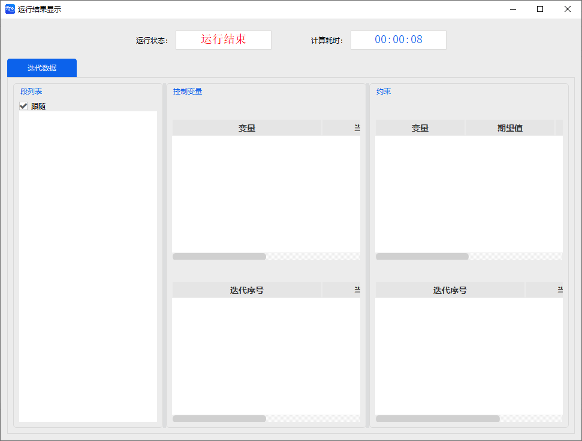
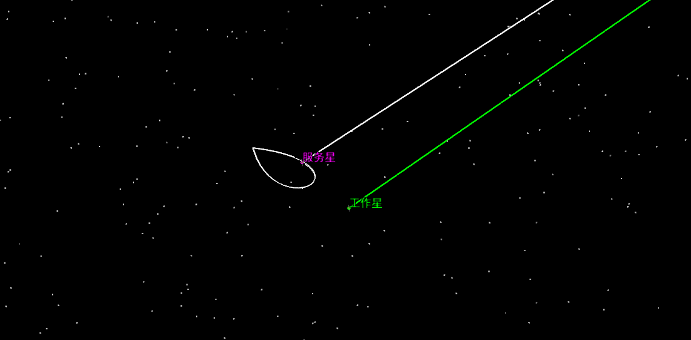

# RPO

<PathViewer
  :relative-paths="files"
/>

## Scenario Description

To better provide satellite services (repair, refueling, etc.), pre-contact observation fly-around is essential.

This example simulates an on-orbit servicing observation mission for a geosynchronous satellite, using a teardrop fly-around pattern.

## Mission Control Sequence Description

To simulate the teardrop fly-around mission, the following task sequence is constructed:

- An initial state segment: contains an initial state segment for the target satellite.
- A teardrop fly-around segment: used to perform the teardrop fly-around mission around the target.

## Creating the Scenario

1. Run ATK.exe and click <kbd>Create a new scenario file</kbd> to create a scenario named **Teardrop**.

2. Set the simulation time. In the **ATK: New Scenario Wizard** dialog, set the time period.

   | Start Epoch                | End Epoch                  |
   | -------------------------- | -------------------------- |
   | 2007-03-08 00:00:00.000 | 2007-03-13 00:00:00.000 |

3. Click <kbd>OK</kbd> to complete scenario creation.

## Creating Satellites and Setting Properties

1. **Create and Edit Satellite Objects**

   - In the toolbar, click <kbd>Insert!</kbd> under <kbd>Start</kbd> to create satellite objects.
   - Select **Scenario Object** – **Satellite**, **Insertion Method** – **Insert Default Type**, click <kbd>Insert…</kbd>, then click <kbd>Close</kbd>.
   - Right‑click **Satellite 1** and **Satellite 2**, select <kbd>Rename</kbd>, and rename them to **Target Satellite** and **Service Satellite**.

2. **Set Target Satellite Orbital Parameters**

   - Propagator model settings. Right‑click **Target Satellite**, select <kbd>Properties</kbd> to enter the satellite parameter settings interface, and select **Orbit Propagator** – **HPOP**.
   - Set **Orbit Epoch (UTCG_MM)** – **2007-03-08 00:00:00.000**.
   - Select **Coordinate System** – **J2000**, **Coordinate Type** – **Orbital Elements**, and set the orbital elements.

   | Parameter                | Value |
   | ------------------------ | ----- |
   | Semi-major Axis (km)     | 42164 |
   | Eccentricity             | 0     |
   | Inclination (deg)        | 0     |
   | RAAN (deg)               | 0     |
   | Argument of Perigee (deg)| 0     |
   | True Anomaly (deg)       | 0     |

3. **Set Service Satellite Initial State**

   - Define the initial state segment. For the initial state setup of the Service Satellite, refer to the initial segment configuration in the [Hohmann Transfer](../02-案例教程/3.4轨道机动规划工具案例/3.4.1霍曼转移.md) section of the Orbit Maneuver Planning example.
   - Alternatively, define the initial state segment using a relative coordinate system with respect to the **Target Satellite**: Right‑click **Service Satellite**, select <kbd>Properties</kbd> to enter the satellite parameter settings interface, and select **Orbit Propagator** – **Maneuver Planning**. In the upper left, under **Reference Satellite**, select **Target Satellite** and add it as a reference. For the **InitialState** segment, select **Reference Spacecraft** – **Target Satellite**'s **VVLH Coordinate System**.

4. **Orbit Propagator Settings for the Teardrop Fly-Around Segment**

   - Select **New** – **Insert RPO Segment** – **Accompanying Flight** – **Teardrop Fly-Around Segment**.
   - Click **Orbit Propagation** – <kbd>Advanced Settings…</kbd>.
   - Select **Central Body** – **Earth**; under **Gravity**, select **Model** – **WGS84**; under **Third-Body Gravity**, select **Sun, Moon** – **Point-Mass Model**; check **Atmospheric Drag Perturbation** and select **NRLMSISE00** as the atmospheric model; check **Solar Radiation Pressure**; leave others unchecked.
   - Click <kbd>OK</kbd>.
   - In the upper left, click <kbd>Reference Satellite</kbd> and add **Target Satellite**; under RPO parameters, select **Target Satellite** as the reference spacecraft.
   - Set the teardrop controlled fly-around parameters as follows:

   | Parameter Name                      | Value               |
   | ----------------------------------- | ------------------- |
   | Number of Revolutions               | 5                   |
   | Starting Point Distance             | -300m               |
   | Maneuver Point Distance             | -800m               |
   | Waiting Time                        | 21600               |
   | Maximum True Anomaly Change         | 5                   |
   | Solution Algorithm                  | Sequential Quadratic Programming |

## Running the Mission Control Sequence

Since the RPO segment is pre‑constructed and easy to operate, the entire teardrop fly-around mission control sequence consists of only these two parts. After configuration, the segment node operation area on the left appears as shown below.

1. **Run Results Display**

   - Click <kbd>Run</kbd> to start computing the mission control sequence. A pop‑up window shows the run status and computation time.

     

   - Click **Results Data** on the right panel of the **Teardrop Fly-Around Segment** to view the impulse application times and magnitudes for each maneuver in the mission control sequence.

2. **3D View Display**

   Click the <kbd>3D View</kbd> button under <kbd>Views</kbd>, select **Local Viewpoint** in the upper left, then select **Satellites** – **Target Satellite** to center the view on the **Target Satellite**.

   To display the accompanying trajectory: click **Service Satellite** <kbd>Properties</kbd> – <kbd>3D View</kbd> – <kbd>Orbit System</kbd> – <kbd>Add VVLH System</kbd>, and check **Show** for the Target Satellite's VVLH.

   

   The white teardrop‑shaped trajectory in the figure is the teardrop fly-around trajectory of the **Service Satellite** relative to the **Target Satellite**.

