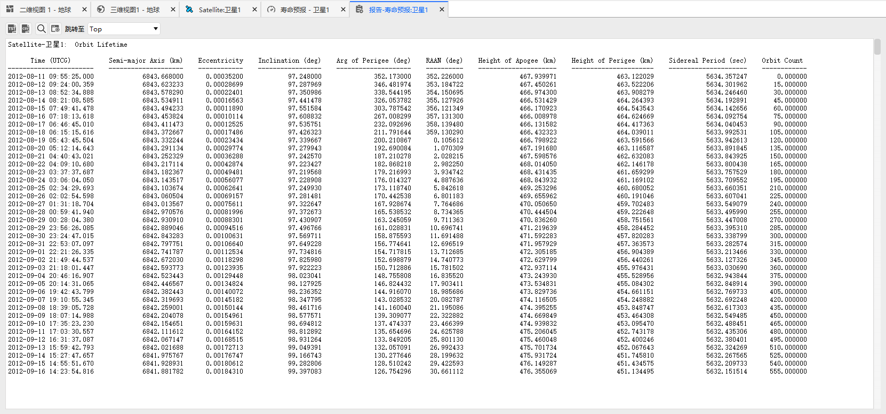
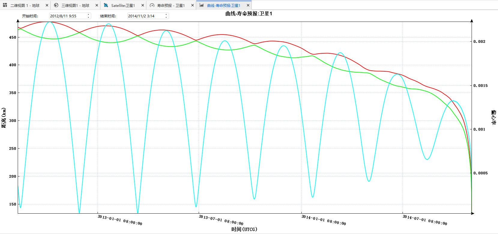

# 寿命预报案例

<PathViewer
  :relative-paths="files"
/>

## 案例想定

本案例对一颗低轨卫星进行轨道寿命预报和轨道衰减量计算。

## 创建任务场景

1. 运行 ATK.exe，点击 <kbd>新建一个想定文件</kbd> 新建一个想定 **寿命预报**。

2. 设置仿真时间。在【ATK：新建想定向导】对话框中设置时间段。

   | 开始历元(UTCG)      | 结束历元(UTCG)      |
   | ------------------- | ------------------- |
   | 2012-08-10 00:00:00 | 2015-03-06 00:00:00 |

3. 点击 <kbd>确定</kbd> 完成场景建立。

## 创建卫星并进行属性设置

1. 点击工具栏 <kbd>开始</kbd> 中的 <kbd>插入</kbd> 创建卫星对象。选择 **想定对象** — **卫星**，**选择插入方式** — **插入默认类型**，点击 <kbd>插入…</kbd>，点击 <kbd>关闭</kbd>。

2. 右键单击卫星，选择 <kbd>属性</kbd>，进入卫星参数设置界面，在 **轨道预报器** — **二体** 中，设置相关参数：

   | 参数            | 数值                |
   | --------------- | ------------------- |
   | 历元时间        | 2012-08-11 09:55:25 |
   | 半长轴(m)       | 6843668             |
   | 偏心率          | 0.000352            |
   | 轨道倾角(deg)   | 97.248              |
   | 升交点赤经(deg) | 352.226             |
   | 近拱点角距(deg) | 352.173             |
   | 真近点角(deg)   | 64.382              |

## 轨道寿命预报

1. 选择卫星1，在 **工具栏** - **卫星** 中选择 **寿命预报**。

2. 根据卫星的阻力面积设为 7.2727 平方米，大气阻力系数 2.2，质量 1000 kg；

3. 限制方式选择：轨道预报圈数或时间；预报时间限制：67500 day；预报圈数限制：100000；陨落高度限制：120km；

4. 大气密度设置：NRLMSISE00 模型，勾选采用插值查表；

5. 点击轨道寿命预报中的 <kbd>计算</kbd> 按钮，可以得到当前卫星对象的陨落时间（陨落至 120km 稠密大气层）、轨道寿命、及剩余轨道圈数；

6. 点击 <kbd>报告</kbd> 或 <kbd>图表</kbd>，可以查看卫星陨落衰减的具体报告和图表曲线。

   

   

## 轨道衰减量计算

前置操作步骤同轨道寿命预报计算一致，在 **寿命预报** - **衰减量计算停止时间** 处输入想要计算的轨道衰减天数（以 30 天为例），点击右侧轨道衰减的 <kbd>计算</kbd> 按钮，可以得到 30 天的累计衰减量。

