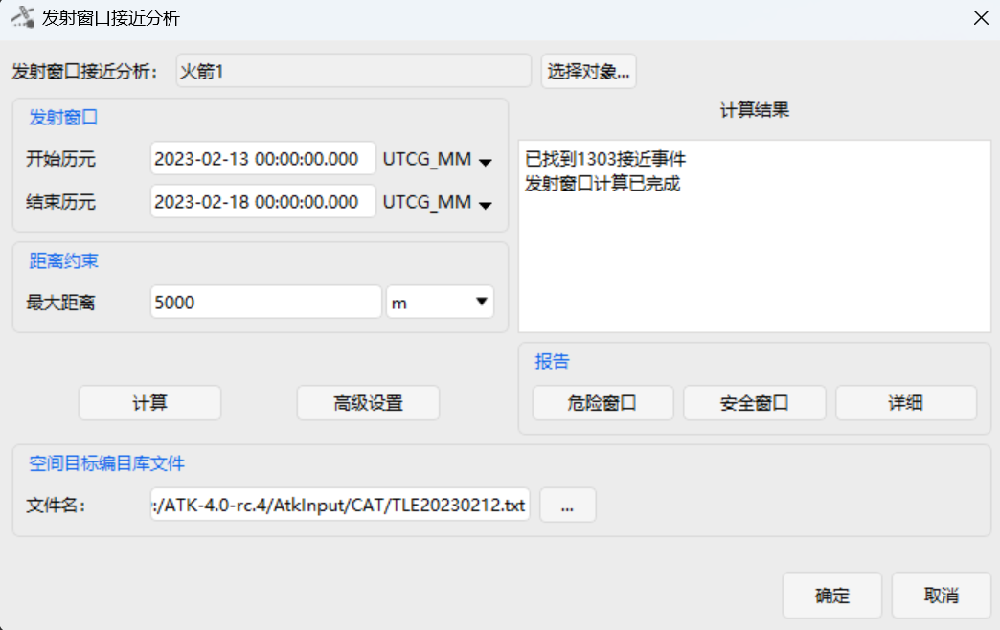
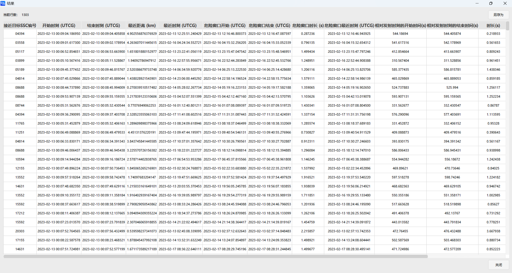
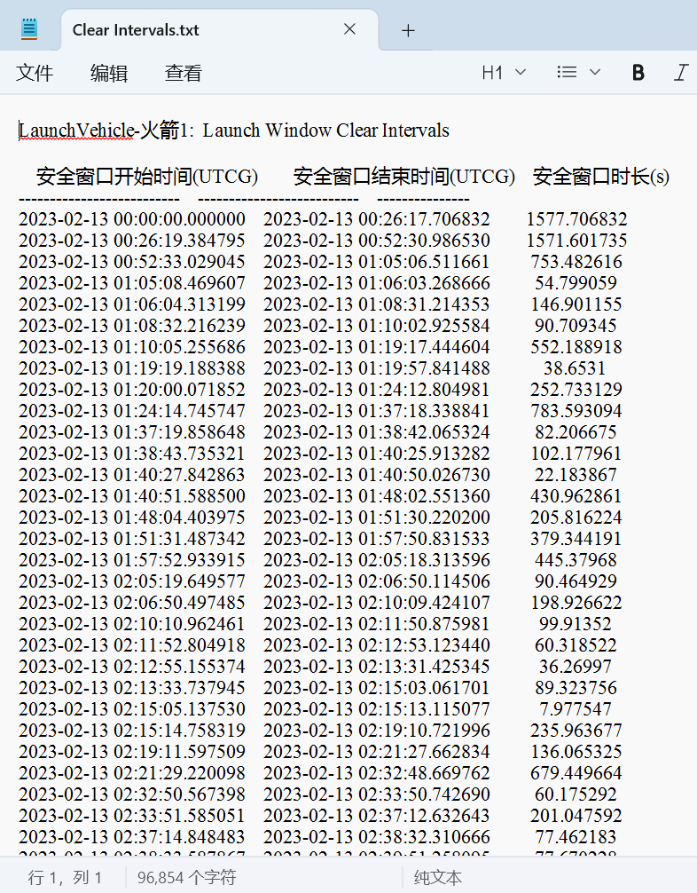

# 发射窗口接近分析案例
<PathViewer
  :relative-paths="files"
/>

## 案例想定

本案例进行火箭发射窗口内的接近分析及结果展示介绍。

## 创建任务场景

1. 运行 ATK 软件，选择上方 <kbd>开始</kbd> 工具栏，点击 <kbd>新建</kbd> 按钮，创建一个想定文件 **火箭发射窗口分析**。

2. 在【ATK: 新建想定向导】对话框中设置 **开始历元** 与 **结束历元**：

   | 开始历元 (UTCG_MM)   | 结束历元 (UTCG_MM)      |
   |:-----------------------:|-------------------------|
   | 2023-02-13 00:00:00.000 | 2023-02-18 00:00:00.000 |

3. 点击 <kbd>确定</kbd> 完成场景创建。

## 插入火箭并进行属性设置

1. 点击 <kbd>开始</kbd> 工具栏下的 <kbd>插入</kbd> 按钮，打开【插入对象】页面。

2. 选择 **火箭** 对象，再选择 **插入默认类型** 方式，点击 <kbd>插入...</kbd> 按钮，将对象插入场景。

3. 双击新插入的 **火箭** 对象，进入【属性】设置界面。

4. 点击 **轨道预报器** 下拉框，选择 **STK星历**。

5. 点击 **星历文件** 右侧的 <kbd>...</kbd> 按钮，在系统文件管理器中选择 <PathCopy :entry="launchVehicleFile" /> 文件，点击右下角 <kbd>打开(O)</kbd> 按钮，将其加载到 ATK 中。

6. 点击【属性】设置页面右下角的 <kbd>应用</kbd> 按钮，完成属性设置。

## 发射窗口接近分析

1. 在左侧对象视图选中 **火箭** 对象，选择上方 <kbd>火箭</kbd> 工具栏，点击 <kbd>发射窗口接近分析</kbd>。

2. 将 **发射窗口** 一栏的 **开始历元** 和 **结束历元** 分别设置为：

   | 开始历元 (UTCG_MM)      | 结束历元 (UTCG_MM)      |
   | ------------------- | ------------------- |
   | 2023-02-13 00:00:00.000 | 2023-02-18 00:00:00.000 |

3. 点击 **空间目标编目库文件** 下的 <kbd>...</kbd> 按钮，在系统文件管理器中选择 <PathCopy :entry="tleFile" /> 文件，点击右下角 <kbd>打开(O)</kbd> 按钮，将其加载到 ATK 中。其余参数保持默认设置即可；

4. 点击 <kbd>计算</kbd> 按钮；

## 结果分析

计算完成后，将在 **计算结果** 下方展示区显示接近事件结果；

点击 **报告** 一栏的 <kbd>详细</kbd> 按钮，将展示接近事件的详细信息；

点击 **报告** 一栏的 <kbd>安全窗口</kbd> 按钮，将弹出文件保存窗口，可将 `Clear Intervals.txt` 文件保存至需要的位置；

