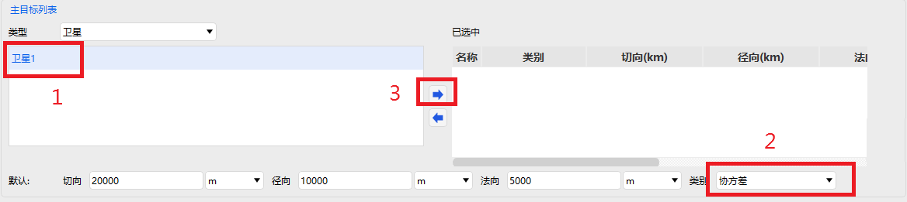

# Advanced Conjunction Analysis

<PathViewer
  :relative-paths="files"
/>

## Scenario Description

This example demonstrates one-to-many advanced conjunction analysis and presents the results.

::: warning Known Issue
This case must be created entirely from scratch to compute correctly. If you open a saved file and compute directly, the results will be incorrect.

**Correct Workflow**:

1. Open ATK, create a new "Advanced Conjunction Analysis" scenario file, and complete all settings as described in the documentation.
2. Click Compute in the "Advanced Conjunction Analysis Tool" to obtain correct results.

**Steps to Reproduce the Issue**:

1. After the correct workflow above, save the scenario file and close ATK.
2. Reopen ATK and load the saved scenario file.
3. Enter the "Advanced Conjunction Analysis Tool" and click Compute.
4. The results will display "No conjunction events found!", which is inconsistent with the initial results.
:::

## Creating the Scenario

1. Run ATK software, select the <kbd>Start</kbd> toolbar at the top, and click the <kbd>New</kbd> button to create a scenario file named **Advanced Conjunction Analysis**.

2. In the **ATK: New Scenario Wizard** dialog, set the **Start Epoch** and **End Epoch** as follows:

   | Start Epoch (UTCG_MM)    | End Epoch (UTCG_MM)      |
   |--------------------------|--------------------------|
   | 2023-02-13 00:00:00.000 | 2023-02-18 00:00:00.000 |

3. Click <kbd>OK</kbd> to complete scenario creation.

## Inserting a Satellite and Setting Properties

1. Click the <kbd>Insert</kbd> button under the <kbd>Start</kbd> toolbar to open the **Insert Object** page.

2. Select the **Satellite** object, then select **Insert Default Type** as the insertion method, and click the <kbd>Insert…</kbd> button to insert the object into the scenario.

3. Double‑click the newly inserted **Satellite** object to open the **Properties** settings interface.

4. Click the **Orbit Propagator** drop‑down and select **HPOP**; click the **Coordinate Type** drop‑down and select **Orbital Elements**; then set the orbital elements as follows:

   | Orbital Element          | Value     |
   |--------------------------|-----------|
   | Semi-major Axis          | 7000137 m |
   | Eccentricity             | 0.01      |
   | Inclination              | 28.5 deg  |
   | RAAN                     | 0 deg     |
   | Argument of Perigee      | 0 deg     |
   | True Anomaly             | 0 deg     |

5. Click the <kbd>Covariance…</kbd> button. In the pop‑up window, check the <kbd>Compute Covariance</kbd> checkbox, then click <kbd>OK</kbd> to enable covariance computation.

6. Click the <kbd>Apply</kbd> button at the bottom right of the **Properties** page to complete the property settings.

## Inserting the Advanced Conjunction Analysis Object and Setting Properties

1. Click the <kbd>Insert</kbd> button under the <kbd>Start</kbd> toolbar to open the **Insert Object** page.

2. Select the **Advanced Conjunction Analysis** object, then select **Insert Default Type** as the insertion method, and click the <kbd>Insert…</kbd> button to insert the object into the scenario.

3. Double‑click the newly inserted **Advanced Conjunction Analysis** object to open the **Properties** settings interface.

4. **Analysis Period** settings. Users can set the analysis period as needed; this example uses the default parameters.

5. **Primary Target List** settings. Select the **Satellite 1** object in the left panel, click the <kbd>Category</kbd> drop‑down in the lower right, select **Covariance**, and click the <kbd>Right Arrow</kbd> button to move it to the selected list.

   

6. **Secondary Target List** settings. Click the <kbd>Type</kbd> drop‑down at the top left, select **Catalog Object**, click the <kbd>Add</kbd> button at the bottom right of the left panel, select the <PathCopy :entry="tleFile" /> file in the system file manager to import it into the software. Then select the **TLE20230212.txt** object in the left panel, click the <kbd>Category</kbd> drop‑down in the lower right, select **Quadratic**, and click the <kbd>Right Arrow</kbd> button to move it to the selected list.

   

7. Advanced settings. Switch the **Properties** interface from **Basic - Main Configuration** to **Basic - Advanced**, check the <kbd>Orbit Epoch Expiration Limit</kbd> and <kbd>Orbital Path Filter Threshold</kbd> checkboxes, keeping the default parameter values. In the **Advanced Ellipsoid Properties - Error Ellipsoid Database** section, click the <kbd>…</kbd> button for each of **Time Quadratic Database**, **Fixed Orbit Class Database**, and **Quadratic/Fixed Class Database** to import the corresponding data files. The file paths are:

   | Data File                 | Path                                                                      |
   |---------------------------|---------------------------------------------------------------------------|
   | Time Quadratic Database   | (ATK Root Directory)\AstroData\Database\Satellite\atkQuadDB.qdb           |
   | Fixed Orbit Class Database| (ATK Root Directory)\AstroData\Database\Satellite\atkFxdOrbCls.foc        |
   | Quadratic/Fixed Database  | (ATK Root Directory)\AstroData\Database\Satellite\atkQuadOrbCls.qoc       |

8. Switch the **Properties** interface back from **Basic - Advanced** to **Basic - Main Configuration**, and click the <kbd>Compute</kbd> button.

## Result Analysis

After computation completes, click <kbd>Reports</kbd> to display the results.

To generate custom data reports, right‑click the **Advanced Conjunction Analysis** object, select <kbd>Data Report</kbd> to enter the **Report Manager** page. Click the <kbd>Styles - New</kbd> button on the right to create a new style. Select **New Style 1**, click the <kbd>Styles - Properties…</kbd> button to enter the **Properties** page. Here, users can freely select the desired result items and click the <kbd>Right Arrow</kbd> button to add them to the **Report Content** column on the right. Click the <kbd>OK</kbd> button at the bottom right to complete the custom data report setup. Return to the **Report Manager** page, select **New Style 1**, and click the <kbd>Display - Generate…</kbd> button on the right to view the custom report in a new window.

## Related Documentation

- [Advanced Conjunction Analysis Module](../5.专业使用指南/05-高级接近分析.md)

