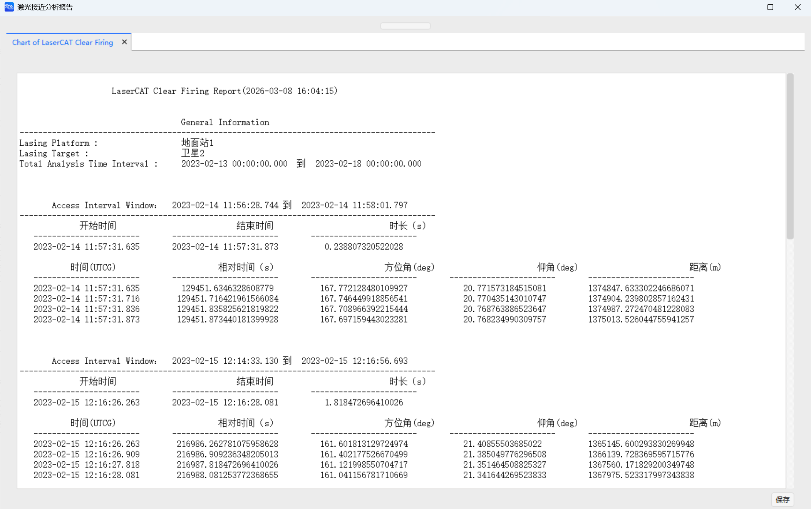

# Laser Conjunction Analysis Example

<PathViewer
  :relative-paths="files"
/>

## Scenario Description

This example demonstrates laser conjunction analysis during the tracking process of a space object by a ground-based laser station, and presents the results.

## Creating the Scenario

1. Run ATK software, select the <kbd>Start</kbd> toolbar at the top, and click the <kbd>New</kbd> button to create a scenario file named **Laser Conjunction Analysis**.

2. In the **ATK: New Scenario Wizard** dialog, set the **Start Epoch** and **End Epoch** as follows:

   | Start Epoch (UTCG_MM)    | End Epoch (UTCG_MM)      |
   |:------------------------:|--------------------------|
   | 2023-02-13 00:00:00.000 | 2023-02-18 00:00:00.000 |

3. Click <kbd>OK</kbd> to complete scenario creation.

## Inserting a Ground Station and Setting Properties

1. Click the <kbd>Insert</kbd> button under the <kbd>Start</kbd> toolbar to open the **Insert Object** page.

2. Select the **Ground Station** object, then select **Insert Default Type** as the insertion method, and click the <kbd>Insert…</kbd> button to insert the object into the scenario.

3. Double‑click the newly inserted **Ground Station** object to open the **Properties** settings interface.

4. Click the **Position - Type** drop‑down, select **Geodetic Coordinates**, and then set the following values:

   | Geodetic Coordinate |  Value   |
   |:-------------------:|:--------:|
   | Latitude            |  30 deg  |
   | Longitude           | 110 deg  |
   | Altitude            |   0 m    |

5. Click the <kbd>Apply</kbd> button at the bottom right of the **Properties** page to complete the property settings.

## Inserting a Satellite and Setting Properties

1. Click the <kbd>Insert</kbd> button under the <kbd>Start</kbd> toolbar to open the **Insert Object** page.

2. Select the **Satellite** object, then select **Insert Default Type** as the insertion method, and click the <kbd>Insert…</kbd> button to insert the object into the scenario.

3. Double‑click the newly inserted **Satellite** object to open the **Properties** settings interface.

4. Click the **Orbit Propagator** drop‑down and select **Two-Body**; click the **Coordinate Type** drop‑down and select **Orbital Elements**; then set the orbital elements as follows:

   | Orbital Element          | Value     |
   |:------------------------:|:---------:|
   | Semi-major Axis          | 7000137 m |
   | Eccentricity             | 0.01      |
   | Inclination              | 20 deg    |
   | RAAN                     | 0 deg     |
   | Argument of Perigee      | 0 deg     |
   | True Anomaly             | 0 deg     |

5. Click the <kbd>Apply</kbd> button at the bottom right of the **Properties** page to complete the property settings.

## Laser Conjunction Analysis

1. In the left object view, select the **Ground Station** object, then select the <kbd>Ground Station</kbd> toolbar at the top and click <kbd>Laser Conjunction Analysis</kbd>.

2. Click the <kbd>Select Object</kbd> button to the right of **Execute Laser Conjunction Analysis**, select the **Ground Station 1** object in the pop‑up window, and click <kbd>OK</kbd>.

3. In the **Pointing Method** section, click the drop‑down, select **Track Target**, then select the **Satellite 2** object and click the <kbd>Select</kbd> button.

4. In the **Database** section, click the first <kbd>…</kbd> button, select the <PathCopy :entry="tleFile" /> file in the system file manager, and click the <kbd>Open</kbd> button to load it into ATK.

5. In the **Filters** section, check the <kbd>Element Set Max Age - Use</kbd> checkbox.

6. Other parameters can be set as needed; this example uses the default values.

7. Click the <kbd>Compute</kbd> button.

## Result Analysis

Click the <kbd>Reports - Safe Tracking Intervals…</kbd> button to view the data report of intervals during which the laser will not inadvertently illuminate other space objects during tracking.

Click the <kbd>Charts - Safe Tracking Intervals…</kbd> button to view the corresponding chart report.

Click the <kbd>Reports - Potential Hazardous Targets…</kbd> button to view the data report of potentially hazardous targets.

Click the <kbd>Charts - Potential Hazardous Targets…</kbd> button to view the corresponding chart report.

## Related Documentation

- [Laser Conjunction Analysis Tool](../5.专业使用指南/21-激光接近分析工具.md)

