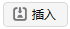
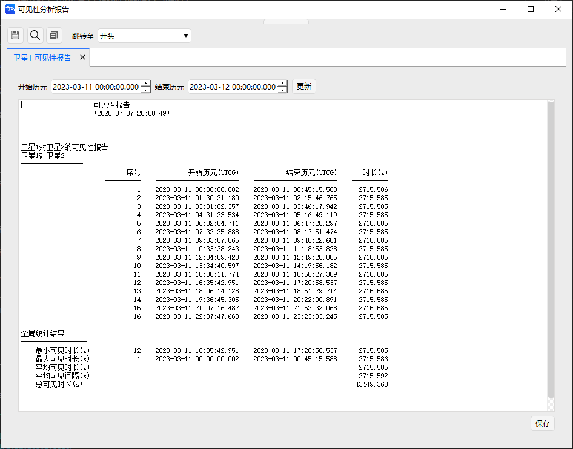
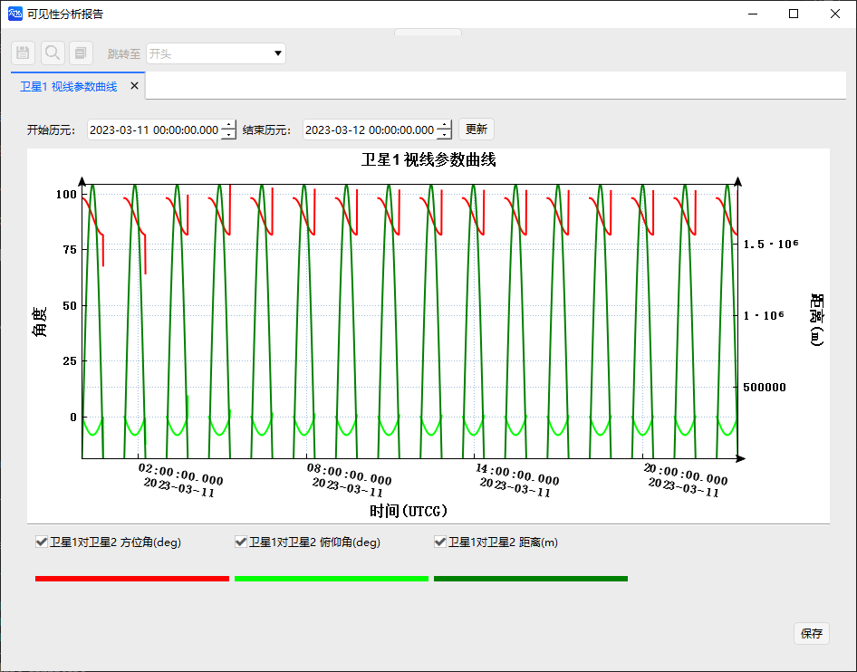
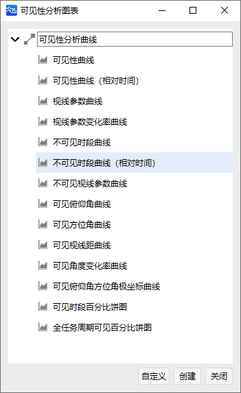
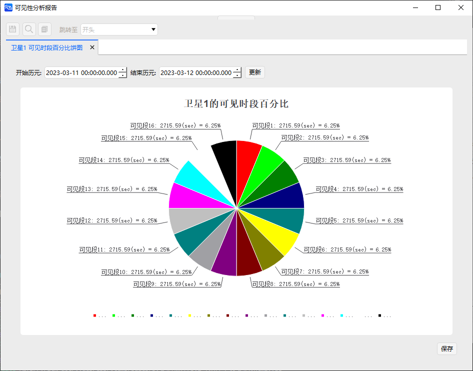

<PathViewer
  :relative-paths="files"
/>

# Access Tool Example

The Access tool is used to determine whether a link can be established between two objects (whether they are visible) under their current properties and parameter constraints. It can be used for visibility analysis in tasks such as inter-satellite communication.

This example demonstrates how to calculate access times, the azimuth and elevation of the viewed object relative to the analysis object, and the range between the two objects, as well as generate reports and visualization charts.

## Creating a Scenario

1. Run ATK.exe and click <kbd>Create a new scenario file</kbd>;

2. In the **New Scenario Wizard** dialog, set the scenario **Name** to `AccessExample`;

3. Set the scenario time period:

| Start Epoch (UTCG_MM)          | End Epoch (UTCG_MM)          |
| ------------------------------ | ---------------------------- |
| 2023-03-11 00:00:00.000 | 2023-03-12 00:00:00.000 |

4. Click <kbd>OK</kbd> to complete the scenario creation.

## Creating Objects

1. In the toolbar, click <kbd>Start</kbd> and then  to create an object;

2. Select **Scenario Object** — **Satellite**, **Insertion Method** — **Insert Default Type**;

3. Click <kbd>Insert...</kbd> twice to insert two satellites;

4. Click <kbd>Close</kbd> to close the **Insert Object** dialog.

## Modifying Object Properties

1. Select **Satellite 1**, right-click and choose <kbd>Properties</kbd>, or double-click it to open the **Properties** page;

2. In the **Coordinate System** select ICRF or J2000, and in the **Coordinate Type** select **Orbital Elements**, then modify the orbital elements as follows:

| Orbital Element          | Value      |
| ------------------------ | ---------- |
| Semi-major Axis (m)      | 6678137    |
| Eccentricity             | 0.0        |
| Inclination (deg)        | 45.0       |
| RAAN (deg)               | 0          |
| Argument of Perigee (deg)| 0          |
| True Anomaly (deg)       | 0          |

3. Click <kbd>Apply</kbd> to save the changes;

4. In the **Constraints** section of the current page, click <kbd>Basic</kbd>;

5. Modify the **Azimuth (deg)** constraint as:

| Min | Max |
| --- | --- |
| 0   | 180 |

6. Modify the **Elevation (deg)** constraint as:

| Min | Max |
| --- | --- |
| -45 | 45  |

7. Check **Line-of-Sight Constraint**;

8. Click <kbd>Apply</kbd> — <kbd>OK</kbd>;

9. Keep Satellite 2 with default parameters, make no changes.

## Viewing 2D and 3D View Trajectories

1. Click <kbd>Start</kbd> ;

2. View the 2D and 3D results.

## Viewing Access Calculation Results

1. Click <kbd>Tools</kbd> — ;

2. Select **Access Object**, then click <kbd>Select Object</kbd>;

3. Select **Satellite 1** and click <kbd>OK</kbd>;

4. Set the computation time period as:

| Start Epoch (UTC)           | End Epoch (UTC)           |
| --------------------------- | ------------------------- |
| 2023-03-11 00:00:00.000 | 2023-03-12 00:00:00.000 |

5. Select **Satellite 2**, then click  <kbd>Compute</kbd>;

6. On the right side, click **Report** — <kbd>Access Analysis</kbd> to view the satellite access period report data file;

7. Click <kbd>Save</kbd> to save the Access Analysis report;

8. Close the **Access Analysis Report** page. Under **Report** — <kbd>More...</kbd>, you can choose additional report types;

For example: Range Rate Report

9. Click **Chart** — <kbd>Line-of-Sight Parameters</kbd> to get the line-of-sight parameters chart report;

10. Close the **Access Analysis Report** page. Under **Chart** — <kbd>More...</kbd>, you can choose additional chart types.

For example: Visible Period Percentage Pie Chart

