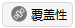
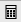
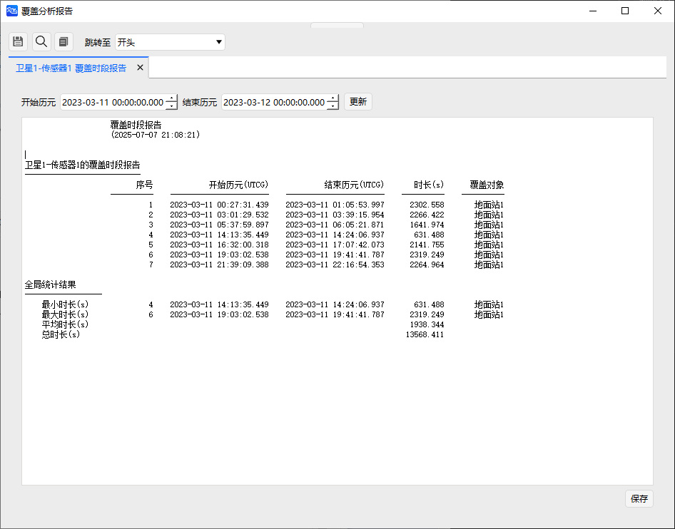
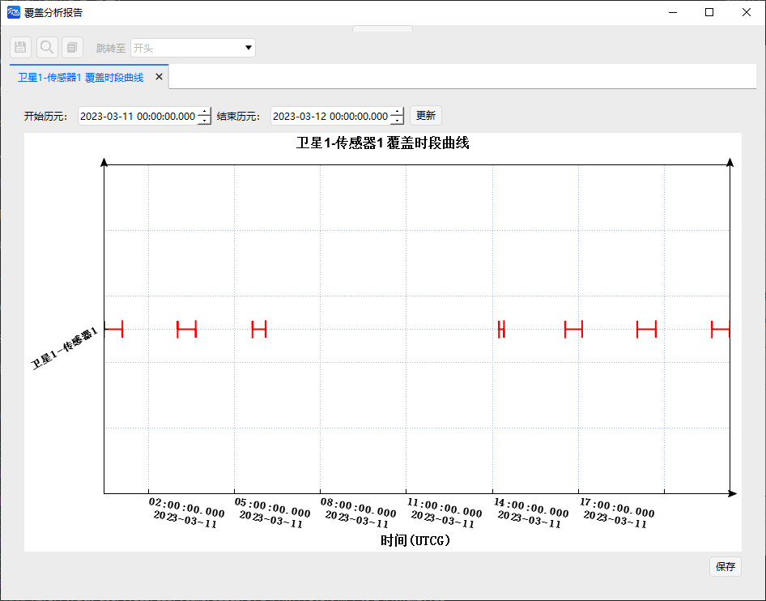
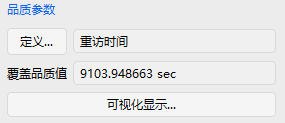

# 覆盖工具案例
<PathViewer
  :relative-paths="files"
/>

覆盖工具可以实现分析一个或多个对象针对于地面目标的覆盖性能，能够生成覆盖时间分析报告，同时可在不同的评估标准下对覆盖效果进行分析。

## 创建任务场景

1. 运行 ATK.exe，点击 <kbd>新建一个想定文件</kbd>；

2. 在【新建想定向导】对话框中，设置 **场景** 名称为 **CoverageExample**；

3. 设置场景时段为：

| 开始历元(UTCG_MM)          | 结束历元(UTCG_MM)          |
| ----------------------- | ----------------------- |
| 2023-03-11 00:00:00.000 | 2023-03-12 00:00:00.000 |

4. 点击 <kbd>确定</kbd> 完成场景建立。

## 创建卫星对象

1. 点击工具栏 <kbd>开始</kbd> 中的 <kbd>插入</kbd> 创建对象；

2. 选择 **想定对象** - **卫星**，**选择插入方式** - **轨道生成向导**；

3. 点击 <kbd>插入…</kbd>；

4. 选择 **轨道类型** - **回归轨道**；

5. 设置轨道参数为：

|         参数        | 数值 |
|:-------------------:|:----:|
|     大致高度(km)    |  500 |
|    轨道倾角(deg)    |  45  |
|       回归圈数      |  10  |
| 首个升交点经度(deg) |   0  |

6. 点击 <kbd>确定</kbd>。

## 添加传感器

1. 点击工具栏 <kbd>开始</kbd> 中的 <kbd>插入</kbd> 创建对象；

2. 选择 **附加对象** - **传感器**

3. 点击 <kbd>插入…</kbd>；

4. 选择 **CoverageExample** - **卫星1** 对象；

5. 点击 <kbd>确定</kbd>；

6. 右击 **CoverageExample** - **传感器1** 对象，点击 <kbd>属性</kbd>；

7. 选择 **传感器类型** - **简单圆锥**；

8. 设置 **半锥角(deg)** 为 50；

9.  点击 <kbd>确定</kbd>。

## 创建覆盖目标

1. 点击工具栏 <kbd>开始</kbd> 中的 <kbd>插入</kbd> 创建对象；

2. 选择 **想定对象** - **地面站**，**选择插入方式** - **插入默认类型**；

3. 点击 <kbd>插入...</kbd>；

4. 右击 **CoverageExample** - **地面站1** 对象，点击 <kbd>属性</kbd>；

5. 选择 **位置** - **类型** 为 **地理坐标**；

6. 设置地面站位置为：

|    参数   | 数值 |
|:---------:|:----:|
| 纬度(deg) |  30  |
| 经度(deg) |  110 |
|  高度(km) |   0  |

7. 点击 <kbd>确定</kbd>。

## 查看场景的二维和三维视图

1. 点击 <kbd>开始</kbd> 工具栏中的  按钮；

2. 查看二维和三维视图结果。

## 进行覆盖性分析

1. 点击 <kbd>工具</kbd> - <kbd>覆盖性</kbd> ；

2. 点击 <kbd>选择对象...</kbd>，进行 **分析对象** 设置；

3. 选择 **卫星1** - **传感器1** 对象，点击 <kbd>确定</kbd>；

4. 设置计算时间段为：

|    开始历元(UTCG_MM)    |    结束历元(UTCG_MM)    |
|:-----------------------:|:-----------------------:|
| 2023-03-11 00:00:00.000 | 2023-03-12 00:00:00.000 |

5. 选择 **地面站1**，点击 <kbd>计算</kbd> ；

6. 点击 **报告** - <kbd>覆盖时段</kbd>，查看覆盖时段报告；

7. 点击 <kbd>保存</kbd>，保存可见性分析报告；

8. 关闭【覆盖分析报告】页面，在 **报告** - <kbd>更多...</kbd> 中可以选择更多的数据报告类型；

9. 点击 **图表** - <kbd>覆盖时段</kbd>，查看可视化覆盖时段图表；

10. 关闭【覆盖分析报告】页面，在 **图表** - <kbd>更多...</kbd> 中可以选择更多的图表曲线类型。

## 覆盖品质分析

1. 点击 **品质参数** - <kbd>定义…</kbd>；

2. 选择 **类型** - **重访时间**；**计算** - **平均值**；其他选项保持默认；

3. 点击 <kbd>确定</kbd>，得到重访时间平均值。

