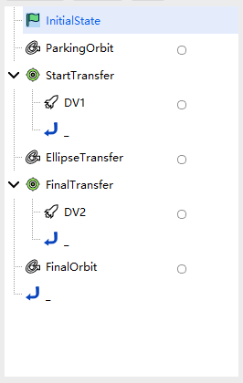
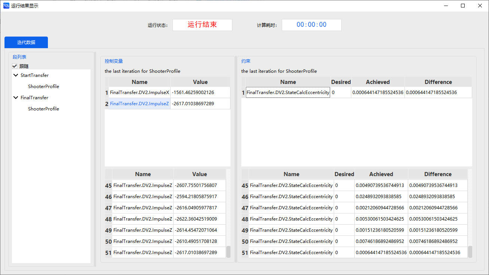
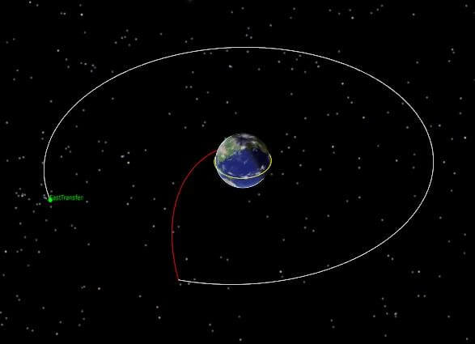

# LEO to GEO Fast Transfer

<PathViewer
  :relative-paths="files"
/>

## Scenario Description

The objective of this example is to transfer a satellite from a low-Earth parking orbit with a radius of 6700 km to a geostationary orbit with a radius of 42164.197 km.

While the Hohmann transfer is the most efficient two-impulse maneuver for this case, it is also one of the slowest. When minimizing flight time is the most important mission objective (e.g., for interception), a fast transfer orbit can be employed. This maneuver is considerably faster than the Hohmann transfer, but also consumes more fuel.

## Mission Control Sequence Description

To design a fast transfer orbit from a low-Earth parking orbit with a radius of 6700 km to a target orbit with a radius of 42164.197 km, we need to construct the following mission sequence.

- An **Initial State Segment**: defines the initial parking orbit with a radius of 6700 km;
- A **Propagation Segment**: propagates the parking orbit forward;
- A **Target Sequence Segment**: contains an impulsive maneuver to place the spacecraft into a highly elliptical transfer orbit;
- A **Propagation Segment**: propagates the spacecraft's orbit to a specified point on the elliptical orbit;
- A **Target Sequence Segment**: contains an impulsive maneuver to shorten the transfer orbit and insert the spacecraft into the outer circular orbit (fast transfer);
- A **Propagation Segment**: propagates the spacecraft's orbit on the target circular orbit.

## Creating the Scenario

1. Run ATK software, select the **Start** toolbar at the top, and click <kbd>New</kbd> to create a scenario file named "FastTransfer".

2. In the **ATK: New Scenario Wizard** dialog, set the **Start Epoch** and **End Epoch**:

| Start Epoch (UTCG_MM)           | End Epoch (UTCG_MM)             |
| ------------------------------- | ------------------------------- |
| 2022-11-05 00:00:00.000 | 2022-11-07 00:00:00.000 |

3. Click <kbd>OK</kbd> to complete scenario creation.

## Inserting the Satellite

1. Click <kbd>Insert</kbd>  under the **Start** toolbar to open the **Insert Object** dialog.

2. Select the **Satellite** object, then select **Insert Default Type** as the insertion method, and click <kbd>Insert…</kbd> to insert the object into the scenario.

3. Right‑click the newly inserted **Satellite** object, click <kbd>Rename</kbd> , and rename it to "FastTransfer".

## Defining the Initial Orbit Parameters

1. Double‑click the "FastTransfer" object to open the **Properties** settings interface.

2. Click the **Orbit Propagator** drop‑down and select **Maneuver Planning**. If the mission control sequence already has a default initial segment, define it directly; otherwise, click <kbd>New</kbd>  to add an "Initial State Segment"  and name it "InitialState".

3. Select the "InitialState" sequence, click the <kbd>…</kbd> button to the right of **Coordinate System** to open the **Select Coordinate System** dialog, select **Earth** in the left panel and **J2000** in the right panel, then click <kbd>OK</kbd>.

4. Click the **Coordinate Type** drop‑down and select **Orbital Elements**, then set the orbital elements as follows:

| Orbital Element          | Value    |
| :----------------------- | :------- |
| Semi-major Axis          | 6700 km  |
| Eccentricity             | 0        |
| Inclination              | 0 deg    |
| RAAN                     | 0 deg    |
| Argument of Perigee      | 0 deg    |
| True Anomaly             | 0 deg    |

5. Click <kbd>Apply</kbd> at the bottom right to complete the initial orbit parameter settings.

## Setting Up the Initial Orbit Propagation Segment

1. If the mission control sequence already has a default propagation segment, define it directly; otherwise, click <kbd>New</kbd>  to add a **Propagation Segment**  and name it "ParkingOrbit".

2. Orbit Propagator Settings

   - Click <kbd>Advanced Settings…</kbd> to the right of **Orbit Propagation**;
   - Click the <kbd>…</kbd> button to the right of **Central Body** and select **Earth**; select **JGM3** from the **Gravity - Model** drop‑down; check the **Atmospheric Drag Perturbation**, **Solar Radiation Pressure**, **Third-Body Gravity - Moon**, and **Third-Body Gravity - Sun** checkboxes; keep other parameters at default;
   - Click <kbd>OK</kbd>.

3. Stopping Condition Settings

   - If the "ParkingOrbit" propagation segment already has a default "Duration" stopping condition, define it directly; otherwise, in the **Stopping Conditions** section, click <kbd>New</kbd>  and select **Duration** as the stopping condition;
   - Set the **Trigger Value** to 7200 sec;
   - Click <kbd>Apply</kbd>.

## Maneuver into the Elliptical Transfer Orbit

1. **Define the Target Sequence Segment**

   - Click <kbd>New</kbd>  to insert a **Target Sequence Segment**  and name it "StartTransfer";
   - Left‑click the  icon under "StartTransfer", then click <kbd>New</kbd>  to embed a **Maneuver Segment**  under the "StartTransfer" sequence, and rename it "DV1".

2. **Select Variables**

   - Right‑click the maneuver segment "DV1", select **Constraint Configuration…**, double‑click to select **Keplerian Elements - Radius of Apoapsis** as the target variable, and click <kbd>OK</kbd>;
   - Click the **Maneuver Type** drop‑down and select **Impulse**; click the <kbd>…</kbd> button to the right of **Thrust Axes** and select **VNC**; check the **Cartesian Coordinates** checkbox;
   - Click the check icon  behind the **Delta-V Vx** text field to set it as a **Design Variable** .

3. **Configure the Targeter**

   Select "StartTransfer". If a default **Differential Correction** targeter already exists on the right, define it directly; otherwise, click **Configuration - New** , select **Differential Correction**, and click <kbd>OK</kbd>. Double‑click the **Configuration - Differential Correction** entry to enter the targeter settings interface.

   - Check the checkboxes under the **Applied** column in both the **Control Variables** and **Constraints** sections to select the variables and constraints to be used;

   | Control Variable | Constraint                   |
   | ---------------- | ---------------------------- |
   | ImpulseX         | StateCalcRadiusOfApoapsis |

   - In the **Constraint - Expected Value** column, enter the expected value for the apoapsis geocentric distance as 84328394 m, leave other parameters at default;

   - Click <kbd>OK</kbd>.

## Setting Up the Elliptical Transfer Orbit Propagation Segment

1. **Define the Propagation Segment**

   Click <kbd>New</kbd>  to add a **Propagation Segment**  after "StartTransfer", and name it "EllipseTransfer", representing the transitional elliptical orbit.

2. **Orbit Propagator Settings**

   - Click <kbd>Advanced Settings…</kbd> to the right of **Orbit Propagation**;
   - Click the <kbd>…</kbd> button to the right of **Central Body** and select **Earth**; select **JGM3** from the **Gravity - Model** drop‑down; check the **Atmospheric Drag Perturbation**, **Solar Radiation Pressure**, **Third-Body Gravity - Moon**, and **Third-Body Gravity - Sun** checkboxes; keep other parameters at default;
   - Click <kbd>OK</kbd>.

3. **Stopping Condition Settings**

   - If the "EllipseTransfer" propagation segment already has a default "Duration" stopping condition, select it and click <kbd>Delete</kbd> ;
   - In the **Stopping Conditions** section, click <kbd>New</kbd> , select **Distance from Central Body** as the stopping condition, and set the **Trigger Value** to 42164197 m;
   - Click <kbd>Apply</kbd>.

## Maneuver into the Target Circular Orbit

1. **Define the Target Sequence Segment**

   - Click <kbd>New</kbd>  to insert a **Target Sequence Segment**  after "EllipseTransfer", and name it "FinalTransfer";

   - Left‑click the  icon under "FinalTransfer", then click <kbd>New</kbd>  to embed a **Maneuver Segment**  under the "FinalTransfer" sequence, and rename it "DV2".

2. **Select Variables**

   - Right‑click the maneuver segment "DV2", select **Constraint Configuration…**, double‑click to select **Keplerian Elements - Eccentricity** as the target variable, and click <kbd>OK</kbd>;
   - Click the **Maneuver Type** drop‑down and select **Impulse**; click the <kbd>…</kbd> button to the right of **Thrust Axes** and select **VNC**; check the **Cartesian Coordinates** checkbox;
   - Click the check icons  behind the **Delta-V Vx** and **Delta-V Vz** text fields to set them as **Design Variables** .

3. **Configure the Targeter**

   Select "FinalTransfer". If a default **Differential Correction** targeter already exists on the right, define it directly; otherwise, click **Configuration - New** , select **Differential Correction**, and click <kbd>OK</kbd>. Double‑click the **Configuration - Differential Correction** entry to enter the targeter settings interface.

   - Check the checkboxes under the **Applied** column in both the **Control Variables** and **Constraints** sections to select the variables and constraints to be used;

     | Control Variable | Control Variable | Constraint               |
     | ---------------- | ---------------- | ------------------------ |
     | ImpulseX         | ImpulseZ         | StateCalcEccentricity |

   - Select "ImpulseX" and "ImpulseZ" in the **Control Variables** section, and change the **Control Variable - Maximum Step** to 300. In the **Constraint - Convergence Tolerance** column, change the convergence tolerance for eccentricity to 0.001. Leave other parameters at default;

   - Click <kbd>OK</kbd>.

## Setting Up the Target Circular Orbit Propagation Segment

1. **Define the Propagation Segment**

   Click <kbd>New</kbd>  to add a **Propagation Segment**  after "FinalTransfer", and name it "FinalOrbit".

2. **Orbit Propagator Settings**

   - Click <kbd>Advanced Settings…</kbd> to the right of **Orbit Propagation**;
   - Click the <kbd>…</kbd> button to the right of **Central Body** and select **Earth**; select **JGM3** from the **Gravity - Model** drop‑down; check the **Atmospheric Drag Perturbation**, **Solar Radiation Pressure**, **Third-Body Gravity - Moon**, and **Third-Body Gravity - Sun** checkboxes; keep other parameters at default;
   - Click <kbd>OK</kbd>.

3. **Stopping Condition Settings**

   - If the "FinalOrbit" propagation segment already has a default "Duration" stopping condition, define it directly; otherwise, in the **Stopping Conditions** section, click <kbd>New</kbd>  and select **Duration** as the stopping condition;
   - Set the **Trigger Value** to 172800 sec;
   - Click <kbd>Apply</kbd>.

## Running the Mission Control Sequence

After the entire mission control sequence is constructed, you can click the white box  to the right of each **Propagation Segment** and **Maneuver Segment** to select a color. The complete mission control sequence is shown below:

1. **Run Results Display**

   - Click <kbd>Run</kbd>  to start computing the mission control sequence. Click <kbd>Display</kbd>  to view the run results.

     

   - Click the **Target Sequence Segments**  in the left task sequence to view the corresponding run results. Reference results are shown below:

     | StartTransfer |                            | Current Value |
     | :------------ | :------------------------- | :------------ |
     | Control Var.  | ImpulseX                   | 2781.5472 m/s |
     | Constraint    | CStateCalcRadiusOfApoapsis | 84328.394 km  |

     | FinalTransfer |                       | Current Value |
     | :------------ | :-------------------- | :------------ |
     | Control Var.  | ImpulseX              | -1561.4626 m/s |
     | Control Var.  | ImpulseZ              | -2617.0104 m/s |
     | Constraint    | StateCalcEccentricity | 6.4415×10-4    |

2. **3D View Display**

   Click <kbd>3D View</kbd>  under the **Views** toolbar at the top. By operating the time slider, you can view the orbit shape.

   

3. **Run Results Analysis**

   In the "DV2" maneuver segment, the values of variables "ImpulseX" and "ImpulseZ" are negative because the transfer is to a lower-energy orbit and involves deceleration. In terms of impulse magnitude, the fast transfer is more costly, but the required time is much shorter than that of a Hohmann transfer.

