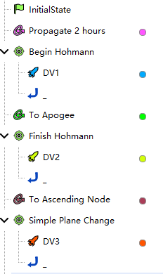
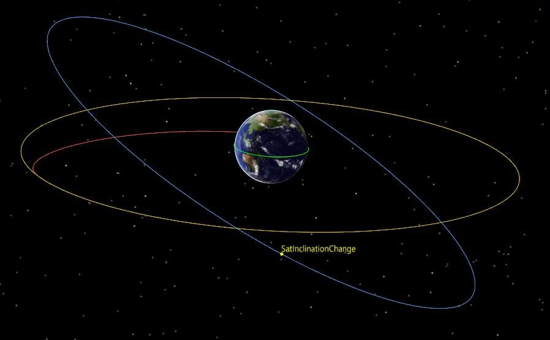

# Inclination Change

<PathViewer
  :relative-paths="files"
/>

## Scenario Description

Inclination change and targeting is a single-impulse maneuver method for orbital change. This type of problem can be solved using the impulsive maneuver modeling capability and targeter in the Maneuver Planning module.

This example demonstrates the design process of a Hohmann transfer from a circular orbit with a radius of 6570 km and an inclination of 28 degrees to a circular orbit with a radius of 42160 km and an inclination of 28 degrees, followed by a plane change at the ascending node to a target circular orbit with an inclination of 0 degrees.

## Mission Control Sequence Description

To design a transfer orbit from a parking orbit with a radius of 6570 km and inclination of 28 degrees to a circular orbit with a radius of 42160 km and inclination of 28 degrees, and then perform a plane change at the ascending node to the target circular orbit with 0-degree inclination, the following mission sequence needs to be constructed.

- An **Initial State Segment**: defines the parking orbit with a radius of 6570 km and inclination of 28 degrees;

- A **Propagation Segment**: propagates the parking orbit forward;

- A **Target Sequence Segment**: contains an impulsive maneuver to place the spacecraft into the elliptical transfer orbit;

- A **Propagation Segment**: propagates the spacecraft's orbit to the apogee of the elliptical orbit;

- A **Target Sequence Segment**: contains an impulsive maneuver to place the spacecraft into a circular orbit;

- A **Propagation Segment**: propagates the spacecraft's orbit on the circular orbit to the second passage through the ascending node;

- A **Target Sequence Segment**: contains an impulsive maneuver to place the spacecraft into the target circular orbit at the ascending node;

- A **Propagation Segment**: propagates the spacecraft's orbit on the target circular orbit.

## Creating the Scenario

1. Run ATK.exe and click <kbd>Create a new scenario file</kbd> to create a scenario named "InclinationChange".

2. Set the simulation time. In the **ATK: New Scenario Wizard** dialog, set:

   | Start Epoch | End Epoch |
   | --- | --- |
   | 2022-11-05 00:00:00.000000 | 2022-11-08 00:00:00.000000 |

3. Click <kbd>OK</kbd> to complete scenario creation.

## Creating Objects and Defining Initial Orbit Parameters

1. **Create and Edit Satellite Objects**

   - In the toolbar, click <kbd>Insert</kbd> under **Start** to create a satellite object;

   - Select **Scenario Object** — **Satellite** , **Insertion Method** — **Insert Default Type**, click <kbd>Insert…</kbd>, then click <kbd>Close</kbd>;

   - In the left **Object** panel, right‑click **Satellite 1** and select <kbd>Rename</kbd>, renaming it to **SatInclinationChange**;

   - In the left **Object** panel, right‑click **SatInclinationChange** and select **Properties** to open the satellite parameter settings interface, then select **Orbit Propagator** — **Maneuver Planning**.

2. **Define the Initial Segment**

   If the mission control sequence already has a default initial segment, define it directly; otherwise, click <kbd>New</kbd> to add an **Initial State Segment**  and name it **28 deg Inclined Orbit**.

3. **Orbit Epoch Settings**

   Set the **Orbit Epoch (UTCG)** — "5 Nov 2022 00:00:00.000".

4. **Coordinate-Related Settings**

   Select **Coordinate System** — **Earth J2000**, **Coordinate Type** — **Orbital Elements**, and set the orbital elements as follows:

   | Parameter | Value |
   | --- | --- |
   | Semi-major Axis | 6570 km |
   | Eccentricity | 0 |
   | Inclination | 28° |
   | RAAN | 0° |
   | Argument of Perigee | 0° |
   | True Anomaly | 0° |

## Setting Up the Initial Orbit Propagation Segment

1. **Define the Propagation Segment**

   If the mission control sequence already has a default propagation segment, define it directly; otherwise, click <kbd>New</kbd> to add a **Propagation Segment**  and name it **Propagate 2 hours**.

2. **Orbit Propagator Settings**

   - Click **Orbit Propagation** — <kbd>Advanced Settings…</kbd> to enter the orbit propagator;

   - Select **Central Body** — **Earth**, select **Gravity** — **Model** — **JGM3**, check **Atmospheric Drag Perturbation**, check **Solar Radiation Pressure**, check **Third-Body Gravity** — **Sun**, **Moon**, and select **Point-Mass** as the model type;

   - Click <kbd>OK</kbd>.

3. **Stopping Condition Settings**

   - In the **Stopping Conditions** section, click the <kbd>New</kbd>  icon, select **CAsStopDuration** (Duration) as the stopping condition (if a default stopping condition already exists, set the parameters directly);

   - Set the **Trigger Value** to "7200" sec.

## Maneuver into the Elliptical Transfer Orbit

1. **Define the Target Sequence Segment**

   - Click <kbd>New</kbd> to add a **Target Sequence Segment**  and name it **Begin Hohmann**;

   - Click <kbd>New</kbd> to embed a **Maneuver Segment**  under the **Target Sequence Segment**  — **Begin Hohmann**, and name it **DV1**.

2. **Select Variables for DV1**

   - Select **Maneuver Type** — **Impulse**, **Thrust Axes** — **VNC**, and coordinate type **Cartesian**;

   - Click the check icon  behind the **VX** text field to set it as a **Design Variable** ;

   - Right‑click the maneuver segment **DV1**, select **Constraint Configuration…**, double‑click to select **Keplerian Elements** — **Radius of Apoapsis** as the target variable, and click <kbd>OK</kbd>.

3. **Configure the Targeter**

   Select **Begin Hohmann**, click **Configuration** — <kbd>New</kbd>, select **Differential Correction**, and click <kbd>OK</kbd>. (If a default differential correction targeter already exists, set the parameters directly.)

   - Double‑click **Configuration** — **Configuration Type** — **Differential Correction** to enter the targeter settings interface;

   - Check the checkboxes under the **Applied** column in both the **Control Variables** and **Constraints** sections to select the variables and constraints to be used;

   | Control Variable | Constraint                   |
   | ---------------- | ---------------------------- |
   | ImpulseX         | StateCalcRadiusOfApoapsis |

   - In the **Constraint** — **Expected Value** column, enter the expected value for the apoapsis geocentric distance as 42160000 m. Keep **Perturbation**, **Convergence Tolerance**, **Maximum Step**, etc., at default values;

   - Click <kbd>OK</kbd> after configuration, then re‑enter the targeter settings interface to view the configured results.

## Setting Up the Elliptical Transfer Orbit Propagation Segment

1. **Define the Propagation Segment**

   Click <kbd>New</kbd> to add a **Propagation Segment**  after the **Target Sequence Segment**  — **Begin Hohmann**, and name it **To Apogee**, representing the transitional elliptical orbit.

2. **Orbit Propagator Settings**

   - Click **Orbit Propagation** — <kbd>Advanced Settings…</kbd>;

   - Select **Central Body** — **Earth**, **Gravity** — **Model** — **JGM3**, check **Atmospheric Drag Perturbation**, check **Solar Radiation Pressure**, check **Third-Body Gravity** — **Sun**, **Moon**, and select **Point-Mass** as the model type;

   - Click <kbd>OK</kbd>.

3. **Stopping Condition Settings**

   In the **Stopping Conditions** section, click the <kbd>New</kbd> icon and select **CAsStopApoapsis** (Apoapsis) as the stopping condition.

## Maneuver into the Transitional Circular Orbit

1. **Define the Target Sequence Segment**

   - Click <kbd>New</kbd> to insert a **Target Sequence Segment**  after the **Propagation Segment**  — **To Apogee**, and name it **Finish Hohmann**;

   - Within this sequence, click <kbd>New</kbd> to embed a **Maneuver Segment**  under **Target Sequence Segment**  — **Finish Hohmann**, and name it **DV2**.

2. **Select Variables**

   - Select **Maneuver Type** — **Impulse**, **Thrust Axes** — **VNC**, and coordinate type **Cartesian**;

   - Click the check icon  behind the **VX** text field to set it as a **Design Variable** ;

   - Right‑click the maneuver segment **DV2**, select **Constraint Configuration…**, double‑click to select **Keplerian Elements** — **Eccentricity** as the target variable, and click <kbd>OK</kbd>.

3. **Configure the Targeter**

   Select **Finish Hohmann**, click **Configuration** — <kbd>New</kbd>, select **Differential Correction**, and click <kbd>OK</kbd>.

   - Double‑click **Configuration** — **Configuration Type** — **Differential Correction** to enter the targeter settings interface;

   - Check the checkboxes under the **Applied** column in both the **Control Variables** and **Constraints** sections to select the variables and constraints to be used;

   | Control Variable | Constraint               |
   | ---------------- | ------------------------ |
   | ImpulseX         | StateCalcEccentricity |

   - In the **Constraint** — **Expected Value** column, enter the expected eccentricity value as 0. In the **Constraint** — **Convergence Tolerance** column, change the eccentricity convergence tolerance to 0.001. Keep **Perturbation**, **Maximum Step**, etc., at default values;

   - Click <kbd>OK</kbd> after configuration, then re‑enter the targeter settings interface to view the configured results.

## Setting Up the Transitional Circular Orbit Propagation Segment

1. **Define the Propagation Segment**

   Click <kbd>New</kbd> to insert a **Propagation Segment**  after the **Target Sequence Segment**  — **Finish Hohmann**, and name it **To Ascending Node**.

2. **Orbit Propagator Settings**

   - Click **Orbit Propagation** — <kbd>Advanced Settings…</kbd>;

   - Select **Central Body** — **Earth**, **Gravity** — **Model** — **JGM3**, check **Atmospheric Drag Perturbation**, check **Solar Radiation Pressure**, check **Third-Body Gravity** — **Sun**, **Moon**, and select **Point-Mass** as the model type;

   - Click <kbd>OK</kbd>.

3. **Stopping Condition Settings**

   In the **Stopping Conditions** section, click the <kbd>New</kbd> icon and select **CAsStopAscendingNode** (Ascending Node) as the stopping condition, and set the **Repeat Count** to 2.

## Maneuver into the Target Circular Orbit

1. **Define the Target Sequence Segment**

   - Click <kbd>New</kbd> to insert a **Target Sequence Segment**  after the **Propagation Segment**  — **To Ascending Node**, and name it **Simple Plane Change**;

   - Within this sequence, click <kbd>New</kbd> to embed a **Maneuver Segment**  under **Target Sequence Segment**  — **Simple Plane Change**, and name it **DV3**.

2. **Select Variables**

   - Select **Maneuver Type** — **Impulse**, **Thrust Axes** — **VNC**, and coordinate type **Cartesian**;

   - Click the check icons  behind the **VX** and **VY** text fields to set them as **Design Variables** ;

   - Right‑click the maneuver segment **DV3**, select **Constraint Configuration…**, double‑click to select **Keplerian Elements** — **Eccentricity** and **Keplerian Elements** — **Inclination** as the target variables, and click <kbd>OK</kbd>.

3. **Configure the Targeter**

   Select **Simple Plane Change**, click **Configuration** — <kbd>New</kbd>, select **Differential Correction**, and click <kbd>OK</kbd>; double‑click **Configuration** — **Configuration Type** — **Differential Correction** to enter the targeter settings interface.

   - Check the checkboxes under the **Applied** column in both the **Control Variables** and **Constraints** sections to select the variables and constraints to be used;

   | Control Variable | Constraint               |
   | ---------------- | ------------------------ |
   | ImpulseX         | StateCalcEccentricity    |
   | ImpulseY         | StateCalcInclination     |

   - In the **Constraint** — **Expected Value** column, enter the expected eccentricity value as 0 and the expected inclination value as 0. In the **Constraint** — **Convergence Tolerance** column, change the eccentricity convergence tolerance to 0.001 and the inclination convergence tolerance to 0. Keep **Perturbation**, **Maximum Step**, etc., at default values;

   - Click <kbd>OK</kbd> after configuration, then re‑enter the targeter settings interface to view the configured results.

## Setting Up the Target Circular Orbit Propagation Segment

1. **Define the Propagation Segment**

   Click <kbd>New</kbd> to insert a **Propagation Segment**  after the **Target Sequence Segment**  — **Simple Plane Change**, and name it **Propagate 36 hours**.

2. **Orbit Propagator Settings**

   - Click **Orbit Propagation** — <kbd>Advanced Settings…</kbd>;

   - Select **Central Body** — **Earth**, **Gravity** — **Model** — **JGM3**, check **Atmospheric Drag Perturbation**, check **Solar Radiation Pressure**, check **Third-Body Gravity** — **Sun**, **Moon**, and select **Point-Mass** as the model type;

   - Click <kbd>OK</kbd>.

3. **Stopping Condition Settings**

   In the **Stopping Conditions** section, click the <kbd>New</kbd> icon and select **CAsStopDuration** (Duration) as the stopping condition. Set the **Trigger Value** to **129600 sec**.

## Running the Mission Control Sequence

After the entire mission control sequence is constructed, click the white box  to the left of each **Propagation Segment** and **Maneuver Segment** to select a color. After configuration, the segment node operation area on the left appears as follows:

1. **Run Results Display**

   - Click <kbd>Run</kbd> to start computing the mission control sequence. Click <kbd>Display</kbd> to view the run results.

   

   - Click the **Target Sequence Segments**  in the left **Segment List** to view the corresponding run results. Reference results are shown below:

   | Begin Hohmann |  | Current Value |
   | --- | --- | --- |
   | Control Var.  | ImpulseX | 2457.0942 m/s |
   | Constraint    | StateCalcRadiusOfApoapsis | 42160 km |

   | Finish Hohmann |  | Current Value |
   | --- | --- | --- |
   | Control Var.  | ImpulseX | 1480.2414 m/s |
   | Constraint    | StateCalcEccentricity | 1.3150×10-6 |

   | Simple Plane Change |  | Current Value |
   | --- | --- | --- |
   | Control Var.  | ImpulseX | -360.0360 m/s |
   | Control Var.  | ImpulseY | -1444.7600 m/s |
   | Constraint    | StateCalcInclination | 0 |
   | Constraint    | StateCalcEccentricity | 3.6232×10-6 |

2. **3D View Display**

   Click <kbd>3D View</kbd>  under the **Views** menu. Use the time slider in the **Time View** to view the orbit shape.

   

