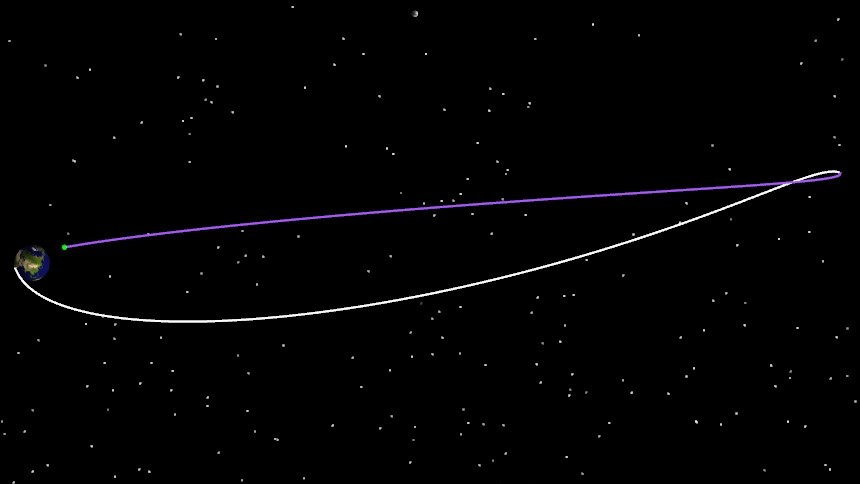

# Cislunar Transfer Based on Free-Return Trajectory

<PathViewer
  :relative-paths="files"
/>

## Scenario Description

A free-return trajectory is one that departs from Earth and can safely return to Earth without any intermediate maneuvers, comprising both the outbound cislunar transfer and the lunar return phases. Such trajectories offer high safety and are commonly used in crewed lunar exploration missions. This example demonstrates the process from a low-Earth orbit to a perilune altitude of 100 km, then returning to a perigee altitude of 50 km with an orbital inclination of 43 degrees under a free-return condition.

This example focuses on the cislunar transfer segment based on a free-return trajectory, covering the design process of applying an orbital maneuver to insert into a 100-km lunar orbit.

## Mission Control Sequence Description

To design the cislunar transfer based on a free-return trajectory, we need to construct the following mission sequence:

A **Target Sequence Segment**: contains an initial state segment, a maneuver segment, and two propagation segments to obtain the spacecraft's free-return trajectory.

## Creating the Scenario

1. Run ATK.exe and click <kbd>Create a new scenario file</kbd> to create a scenario named "exLunarFreeReturn".

2. Set the simulation time: In the **ATK: New Scenario Wizard** dialog, set the **Start Epoch** to 2028-06-24 16:24:55.000 and the **End Epoch** to 2028-06-30 02:00:00.000.

| Start Epoch | End Epoch |
| ----------------------- | ----------------------- |
| 2028-06-24 16:24:55.000 | 2028-06-30 02:00:00.000 |

3. Click <kbd>OK</kbd> to complete scenario creation.

## Creating Objects

1. **Create and Edit Satellite Objects**

   - In the toolbar, click <kbd>Insert</kbd>  under **Start** to create a satellite object.

   - Select **Scenario Object** — **Satellite** , **Insertion Method** — **Insert Default Type**, click <kbd>Insert…</kbd>, then click <kbd>Close</kbd>.

   - In the left **Object** panel, right‑click "Satellite 1", select <kbd>Rename</kbd> , and rename it to "exLunarFreeReturn".

   - In the left **Object** panel, right‑click "exLunarFreeReturn" and select <kbd>Properties</kbd> to open the **Satellite Parameter Settings** interface, then select **Orbit Propagator** — **Maneuver Planning**.

## Designing the Free-Return Trajectory

1. **Define the Target Sequence Segment**

   - Delete the default initial segment.

   - Click <kbd>New</kbd>  to add a **Target Sequence Segment**  and name it "Cislunar Free-Return Trajectory Planning".

2. **Define the Initial Segment**

   Embed an **Initial State Segment**  under "Cislunar Free-Return Trajectory Planning" and name it "Initial State". Set the **Orbit Epoch (UTCG)** — "24 Jun 2028 16:25:59.184". Select **Coordinate System** — **Earth J2000**, **Coordinate Type** — **Orbital Elements**, and set the orbital elements as follows:

   | Parameter | Value |
   | ---- | ---- |
   | Semi-major Axis | 6548151 m |
   | Eccentricity | 0 |
   | Inclination | 21° |
   | RAAN | 149° |
   | Argument of Perigee | 185° |
   | True Anomaly | 14° |

3. **Define the Maneuver Segment**

   - Click <kbd>New</kbd>  to insert a **Maneuver Segment**  after the "Initial State", and name it "Cislunar Transfer Maneuver".

   - Select **Maneuver Type** — **Impulse**, **Thrust Axes** — **VNC**, and coordinate type **Cartesian**.

   - Set **Delta-V Vx** — "3160 m/s", **Delta-V Vy** — "0 m/s", **Delta-V Vz** — "0 m/s".

4. **Define the Propagation Segment to Perilune**

   - Click <kbd>New</kbd>  to insert a **Propagation Segment**  after the "Cislunar Transfer Maneuver" , and name it "Propagate to Perilune".

   - Click **Orbit Propagation** — <kbd>Advanced Settings…</kbd>, select **Central Body** — **Earth**, **Gravity** — **Gravity Field Model** — **WGS84**, **Degree** — "20", **Order** — "20". Uncheck **Atmospheric Drag Perturbation**, check **Solar Radiation Pressure Perturbation**, check **Third-Body Perturbation** — **Sun**, **Moon**, and select **Point-Mass** as the model type. Click <kbd>OK</kbd>.

   - In the **Stopping Conditions** section, click the <kbd>New</kbd>  icon and select **CAsStopPeriapsis** (Periapsis) as the stopping condition, set the **Central Body** to "Moon", and set the **Repeat Count** to "1".

5. **Define the Lunar Return Propagation Segment**

   - Click <kbd>New</kbd>  to insert a **Propagation Segment**  after the "Propagate to Perilune" , and name it "Lunar Return".

   - Click **Orbit Propagation** — <kbd>Advanced Settings…</kbd>, with the same settings as the previous step.

   - In the **Stopping Conditions** section, click the <kbd>New</kbd>  icon and select **CAsStopEpoch** (Epoch) as the stopping condition, setting the **Trigger Value** to "2028-06-30 02:01:04.184000".

   - Add another **CAsStopPeriapsis** (Periapsis) as a stopping condition, set the **Central Body** to "Earth", and set the **Repeat Count** to "1".

6. **Select Variables**

   - In the "Initial State" segment, click the icon  behind the **Orbit Epoch** text field and the icon  behind the **RAAN** text field to set them as **Design Variables** .

   - In the "Cislunar Transfer Maneuver" segment, click the icon  behind the **Delta-V Vx** text field to set it as a **Design Variable** .

   - Right‑click the "Propagate to Perilune" segment, select <kbd>Constraint Configuration…</kbd>, double‑click to select **Keplerian Elements** — **Altitude of Periapsis** as the target variable, set the **Central Body** to "Moon", and click <kbd>OK</kbd>.

   - Right‑click the "Lunar Return" segment, select <kbd>Constraint Configuration…</kbd>, double‑click to select **Keplerian Elements** — **Altitude of Periapsis** and **Inclination** as the target variables, set the **Central Body** for both to "Earth", and click <kbd>OK</kbd>.

7. **Configure the Targeter**

   - Select "Cislunar Free-Return Trajectory Planning". In the **Configuration** section, click the <kbd>New</kbd>  icon and select **Differential Correction**; if a **Differential Correction** already exists by default, no new one is needed.

   - Double‑click the **Differential Correction** frame to enter the **Targeter Settings** interface. Check the checkboxes under the **Applied** column in both the **Control Variables** and **Constraints** sections to select the variables and constraints to be used.

   | Control Variable | Constraint |
   | ---- | ---- |
   | UTC | CStateCalcAltitudeOfPeriapsis |
   | RAAN | CStateCalcAltitudeOfPeriapsis |
   | ImpulseX | CStateCalcInclination |

   - Keep **Control Variables** at default options.

   - For **Constraint** — **CStateCalcAltitudeOfPeriapsis-TargetSeq.Propagate to Perilune**, set the **Expected Value** to 100000 m and the **Convergence Tolerance** to 100 m.

   - For **Constraint** — **CStateCalcAltitudeOfPeriapsis-TargetSeq.Lunar Return**, set the perigee altitude **Expected Value** to 50000 m and the **Convergence Tolerance** to 100 m.

   - For **Constraint** — **CStateCalcInclination-TargetSeq.Lunar Return**, set the inclination **Expected Value** to 43 deg and the **Convergence Tolerance** to 0.1 deg.

   - **Perturbation**, **Maximum Step**, and other parameters can be left at default values.

   - After configuration, click <kbd>OK</kbd>. Re‑enter the **Targeter Settings** interface to view the configured results.

## Running the Mission Control Sequence and Analysis

After the entire mission control sequence is constructed, click the white box  to the left of each **Propagation Segment** and **Maneuver Segment** to select a color. After configuration, the segment node operation area on the left appears as follows:

1. **Run Results Display**

   - Click <kbd>Run</kbd>  to start computing the mission control sequence. Click <kbd>Display</kbd>  to view the run results.

   

   - Click the **Target Sequence Segment**  in the left **Segment List** to view the corresponding run results. Reference results are shown below:

   | Cislunar Free-Return Trajectory Planning | Variable | Current Value |
   | ---- | ---- | ---- |
   | Control Var. | Initial State UTC | 17:54:42.63 |
   | Control Var. | Initial State RAAN | 2.6207 |
   | Control Var. | Cislunar Transfer Maneuver ImpulseX | 3163.2735 |
   | Constraint | Propagate to Perilune StateCalcAltitudeOfPeriapsis | 100000.0016 |
   | Constraint | Lunar Return StateCalcAltitudeOfPeriapsis | 49999.9690 |
   | Constraint | Lunar Return StateCalcInclination | 0.750492 |

2. **3D View Display**

   Click <kbd>3D View</kbd>  under the **Views** menu. Use the time slider in the **Time View** to view the orbit shape.

   

   

