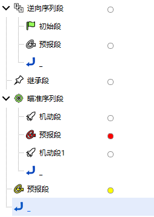
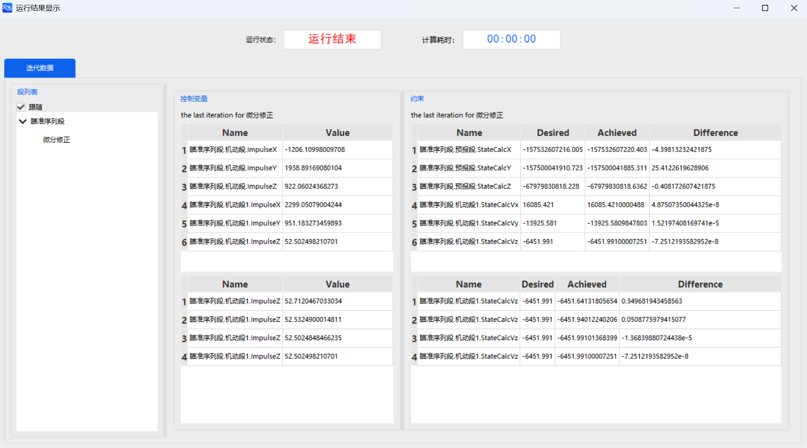
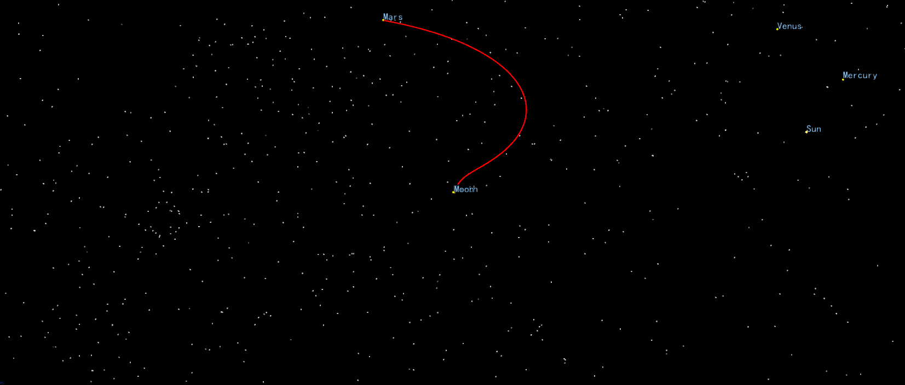

# Mars Exploration Mission

<PathViewer
  :relative-paths="files"
/>

## Scenario Description

Mars is the planet in the solar system most similar to Earth in terms of its environment. Its geological and climatic evolution records may contain key evidence of extraterrestrial life. Future Mars exploration missions will not only systematically answer the fundamental scientific question of whether life ever existed beyond Earth, but also provide indispensable technological and strategic precursors for establishing humanity's first long-term extraterrestrial settlement and expanding interplanetary civilization.

The primary objective of this example is to use the Orbit Maneuver Planning tool to design a complete mission that departs from an Earth parking orbit, undergoes an extended interplanetary cruise, and is ultimately captured by Mars's gravity into a Mars orbit.

## Mission Control Sequence Description

To design this Mars exploration mission, we need to construct the following mission control sequence:

- A **Backward Sequence Segment**: contains an initial segment and a propagation segment, defining the probe's initial parking orbit near Earth;
- An **Inheritance Segment**: inherits the orbital state defined by the Backward Sequence Segment;
- A **Target Sequence Segment**: contains two maneuver segments and one propagation segment, with the maneuver segments enabling the probe to enter the Earth-Mars transfer orbit and the Mars orbit respectively;
- A **Propagation Segment**: propagates the probe's orbit in the Mars orbit.

## Creating the Scenario

1. Run ATK software, select the **Start** toolbar at the top, and click <kbd>New</kbd> to create a scenario file named "MarsProbe".

2. In the **ATK: New Scenario Wizard** dialog, set the **Start Epoch** and **End Epoch**:

   | Start Epoch (UTCG_MM) | End Epoch (UTCG_MM) |
   | --------------------- | ------------------- |
   | 1996-12-04 00:00:00.000 | 1998-03-01 00:00:00.000 |

3. Click <kbd>OK</kbd> to complete scenario creation.

## Inserting the Satellite

1. Click <kbd>Insert</kbd> under the **Start** toolbar to open the **Insert Object** page.

2. Select the **Satellite** object, then select **Insert Default Type** as the insertion method, and click <kbd>Insert…</kbd> to insert the object into the scenario.

3. Right‑click the newly inserted **Satellite** object, click <kbd>Rename</kbd>, and rename it to "Mars Probe".

## Defining the Initial Orbit Parameters

1. Double‑click the "Mars Probe" object to open the **Properties** settings interface.

2. Click the **Orbit Propagator** drop‑down and select **Maneuver Planning**. If the mission control sequence already has a default initial segment, delete it first. Then click <kbd>New</kbd> to add a **Backward Sequence Segment** .

3. Left‑click the  icon under the "Backward Sequence Segment", then click <kbd>New</kbd> to embed an **Initial State Segment**  under the Backward Sequence Segment.

4. Select the "Initial State Segment", click the <kbd>…</kbd> button to the right of **Coordinate System** to open the **Select Coordinate System** page, select **Sun** in the left panel and **ICRF** in the right panel, then click <kbd>OK</kbd>.

5. Click the **Coordinate Type** drop‑down and select **Position Velocity**, then set the parking orbit as follows:

   | Position Velocity | Value |
   | :---------------: | :---: |
   | Position X | 45185148451.156 m |
   | Position Y | 128778294016.309 m |
   | Position Z | 55833289785.561 m |
   | Velocity X | -30772.467 m/s |
   | Velocity Y | 11394.328 m/s |
   | Velocity Z | 5063.7930 m/s |

6. Left‑click the  icon under the "Initial State Segment", then click <kbd>New</kbd> to embed a **Propagation Segment**  under the Backward Sequence Segment.

7. Orbit Propagator Settings

   Select the newly added "Propagation Segment" and configure the orbit propagator:

   - Click the <kbd>Advanced Settings…</kbd> button to the right of **Orbit Propagation**;
   - Click the <kbd>…</kbd> button to the right of **Central Body** and select **Earth**; select **WGS84** from the **Gravity - Model** drop‑down; check the **Atmospheric Drag Perturbation**, **Solar Radiation Pressure**, **Third-Body Gravity - Moon**, and **Third-Body Gravity - Sun** checkboxes; keep other parameters at default;
   - Click <kbd>OK</kbd>.

8. Stopping Condition Settings

   - If the "Propagation Segment" already has a default "Duration" stopping condition, define it directly; otherwise, in the **Stopping Conditions** section, click <kbd>New</kbd> and select **Duration** as the stopping condition;
   - Set the **Trigger Value** to 43200 sec.

9. Click the <kbd>Apply</kbd> button at the bottom right to complete the initial setup.

## Inheritance Segment Settings

1. Click <kbd>New</kbd> to add an **Inheritance Segment**  after the Backward Sequence Segment.

2. Select the "Inheritance Segment", click the <kbd>…</kbd> button to the right of **Inheritance Properties - Inherit From**, select the **Backward Sequence Segment - Initial State Segment** object in the **Select Segment Object** pop‑up, and click <kbd>OK</kbd>.

3. Click the <kbd>Apply</kbd> button at the bottom right to complete the Inheritance Segment settings.

## Maneuver into the Earth-Mars Transfer Orbit and Mars Orbit

1. **Define the Target Sequence Segment**

   Click <kbd>New</kbd> to add a **Target Sequence Segment** .

2. **Set Up the Maneuver Segment**

   - Left‑click the  icon under the "Target Sequence Segment", then click <kbd>New</kbd> to embed a **Maneuver Segment**  under the Target Sequence Segment;
   - Click the **Maneuver Type** drop‑down and select **Impulse**; click the <kbd>…</kbd> button to the right of **Thrust Axes** and select **ICRF**; check the **Cartesian Coordinates** checkbox;
   - Click the check icons  behind the **Delta-V Vx**, **Delta-V Vy**, and **Delta-V Vz** text fields to set them as **Design Variables** . At the same time, set the initial values for the three delta‑V components:

   | Variable Name | Value (m/s) |
   | :-----------: | :---------: |
   | Delta-V Vx    | -1209.16    |
   | Delta-V Vy    | 1950.33     |
   | Delta-V Vz    | 923.761     |

3. **Set Up the Propagation Segment**

   - Left‑click the  icon under the "Maneuver Segment", then click <kbd>New</kbd> to embed a **Propagation Segment**  under the Maneuver Segment.
   - Select the newly added "Propagation Segment", click the <kbd>Advanced Settings…</kbd> button to the right of **Orbit Propagation**;
   - Click the <kbd>…</kbd> button to the right of **Central Body** and select **Earth**; select **WGS84** from the **Gravity - Model** drop‑down; check the **Atmospheric Drag Perturbation**, **Solar Radiation Pressure**, **Third-Body Gravity - Moon**, and **Third-Body Gravity - Sun** checkboxes; keep other parameters at default. Switch from the default **Perturbation Forces** tab to the **Integration Parameters** tab and set the **Maximum Extrapolation Time** to 86400000 sec. Click <kbd>OK</kbd>.
   - If the "Propagation Segment" already has a default "Duration" stopping condition, define it directly; otherwise, in the **Stopping Conditions** section, click <kbd>New</kbd>, select **Duration** as the stopping condition, and set the **Trigger Value** to 18316800 sec.
   - Right‑click the "Target Sequence Segment - Propagation Segment", select **Constraint Configuration…**, double‑click to select **Cartesian Coordinates - Position X**, **Cartesian Coordinates - Position Y**, and **Cartesian Coordinates - Position Z** as constraints. Select each constraint in turn, click the <kbd>…</kbd> button to the right of **Constraint Parameters - Coordinate System**, select **Sun** as the coordinate origin and **ICRF** as the coordinate axes in the pop‑up, and click <kbd>OK</kbd> to set the constraint coordinate system to **Sun ICRF**. Click <kbd>OK</kbd> to confirm.

4. **Set Up Maneuver Segment 1**

   - Left‑click the  icon under the "Propagation Segment", then click <kbd>New</kbd> to embed a **Maneuver Segment**  under the Target Sequence Segment;
   - Right‑click "Maneuver Segment 1", select **Constraint Configuration…**, double‑click to select **Cartesian Coordinates - Velocity X**, **Cartesian Coordinates - Velocity Y**, and **Cartesian Coordinates - Velocity Z** as constraints. Select each constraint in turn, click the <kbd>…</kbd> button to the right of **Constraint Parameters - Coordinate System**, select **Sun** as the coordinate origin and **ICRF** as the coordinate axes in the pop‑up, and click <kbd>OK</kbd> to set the constraint coordinate system to **Sun ICRF**. Click <kbd>OK</kbd> to confirm;
   - Select "Maneuver Segment 1", click the **Maneuver Type** drop‑down and select **Impulse**; click the <kbd>…</kbd> button to the right of **Thrust Axes** and select **ICRF**; check the **Cartesian Coordinates** checkbox;
   - Click the check icons  behind the **Delta-V Vx**, **Delta-V Vy**, and **Delta-V Vz** text fields to set them as **Design Variables** . At the same time, set the initial values for the three delta‑V components:

   | Variable Name | Value (m/s) |
   | :-----------: | :---------: |
   | Delta-V Vx    | 2302.94     |
   | Delta-V Vy    | 944.07      |
   | Delta-V Vz    | 51.7827     |

5. **Configure the Targeter**

   Select the "Target Sequence Segment". If a default **Differential Correction** targeter already exists on the right, define it directly; otherwise, click **Configuration - New**, select **Differential Correction**, and click <kbd>OK</kbd>. Double‑click the **Configuration - Differential Correction** entry to enter the targeter settings interface.

   - Check the checkboxes under the **Applied** column in both the **Control Variables** and **Constraints** sections to select the variables and constraints to be used;

   | Object | Control Variable |
   | :----: | :--------------: |
   | Target Seq - Maneuver Segment | ImpulseX |
   | Target Seq - Maneuver Segment | ImpulseY |
   | Target Seq - Maneuver Segment | ImpulseZ |
   | Target Seq - Maneuver Segment 1 | ImpulseX |
   | Target Seq - Maneuver Segment 1 | ImpulseY |
   | Target Seq - Maneuver Segment 1 | ImpulseZ |

   | Object | Constraint |
   | :----: | :--------: |
   | Target Seq - Propagation Segment | StateCalcX |
   | Target Seq - Propagation Segment | StateCalcY |
   | Target Seq - Propagation Segment | StateCalcZ |
   | Target Seq - Maneuver Segment 1  | StateCalcVx |
   | Target Seq - Maneuver Segment 1  | StateCalcVy |
   | Target Seq - Maneuver Segment 1  | StateCalcVz |

   - In the **Constraint - Expected Value** section, set the following expected values for each constraint:

   | Constraint Name | Expected Value |
   | :-------------: | :------------: |
   | StateCalcX | -157532607216.005 m |
   | StateCalcY | -157500041910.723 m |
   | StateCalcZ | -67979830818.228 m |
   | StateCalcVx | 16085.421 m/s |
   | StateCalcVy | -13925.581 m/s |
   | StateCalcVz | -6451.991 m/s |

   - Leave other parameters at default and click <kbd>OK</kbd>.

## Mars Orbit Propagation

1. Click <kbd>New</kbd> to add a **Propagation Segment**  after the Target Sequence Segment.

2. Orbit Propagator Settings

   Select the newly added "Propagation Segment", click the <kbd>Advanced Settings…</kbd> button to the right of **Orbit Propagation**:

   - Click the <kbd>…</kbd> button to the right of **Central Body**, select **Mars**, and click <kbd>OK</kbd>; select **GMM1** from the **Gravity - Model** drop‑down, and set both **Degree** and **Order** to 0; **Uncheck** the **Solar Radiation Pressure**, **Third-Body Gravity - Moon**, and **Third-Body Gravity - Sun** checkboxes; leave other parameters at default and click <kbd>OK</kbd>;
   - If the "Propagation Segment" already has a default "Duration" stopping condition, define it directly; otherwise, in the **Stopping Conditions** section, click <kbd>New</kbd>, select **Duration** as the stopping condition, and set the **Trigger Value** to 43200 sec.

3. Click the <kbd>Apply</kbd> button at the bottom right to complete the case setup.

## Running the Mission Control Sequence

After the entire mission control sequence is constructed, click the white box  to the right of each **Propagation Segment** to select a color. The complete mission control sequence is shown below:

1. **Run Results Display**

   Click <kbd>Run</kbd> to start computing the mission control sequence. Click <kbd>Display</kbd> to view the run results.

   

2. **3D View Display**

   Click <kbd>3D View</kbd> under the **Views** toolbar at the top. By operating the time slider, you can view the orbit shape.

   

