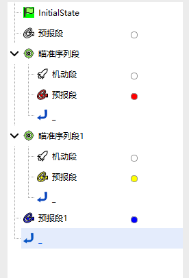
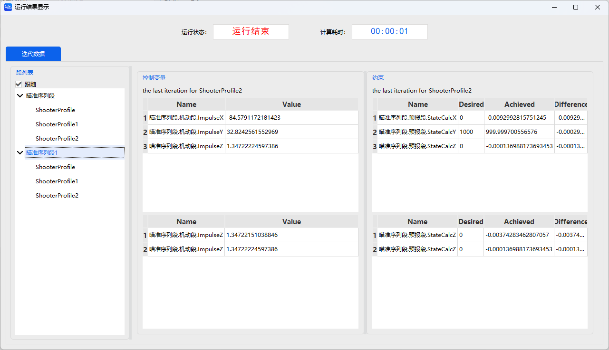
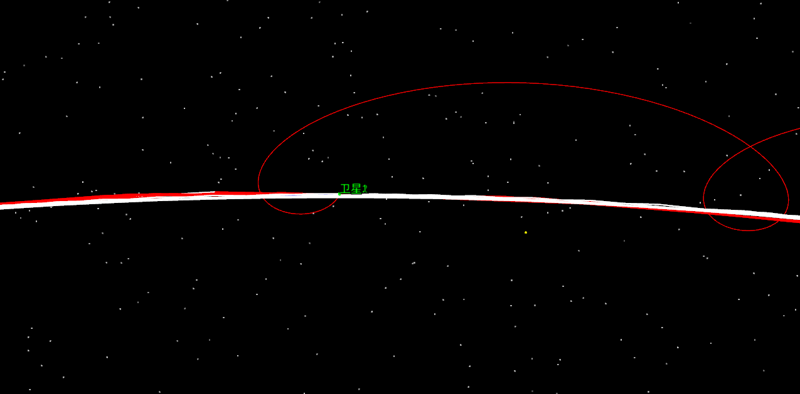
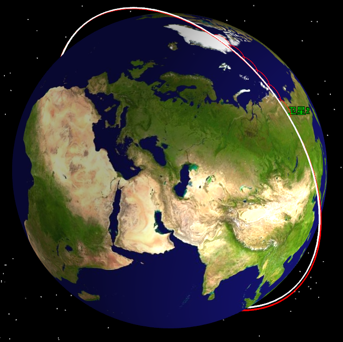

# 交会绕飞

<PathViewer
  :relative-paths="files"
/>

## 案例想定

交会绕飞是指一颗航天器（服务航天器）沿既定轨道接近目标航天器并完成绕飞任务的过程，通常用于在轨观测、补给或对接演练。

本案例将展示如何利用脉冲机动和瞄准序列规划，实现航天器从低轨接近目标航天器，并在指定相对位置完成绕飞。本案例设定：

- 服务航天器初始轨道为近地圆轨道，轨道高度约 6570 km，轨道倾角约 98.5°；

- 目标航天器轨道高度约 6570 km，轨道倾角约 98.5°，相位有一定偏移；

- 航天器通过脉冲机动进行相对位置调节，实现绕飞接近，最终保持指定相对位置和速度要求。

## 任务控制序列说明

为了完成交会绕飞任务，需要构建以下任务控制序列：

- 一个 **初始段**：定义服务航天器初始轨道参数；

- 一个 **预报段**：对轨道进行外推，为机动段提供预测信息；

- 一个 **瞄准序列段**：包含一次或多次脉冲机动，实现对目标航天器相对位置的调整；

- 一个 **预报段**：将航天器轨道外推至绕飞近点位置；

- 一个 **瞄准序列段**：针对绕飞终点进行微调机动，确保目标约束（相对位置、相对速度）满足要求；

- 一个 **预报段**：完成绕飞轨迹的外推，验证最终轨道和状态是否符合设计要求。

## 创建任务场景

1. 运行 ATK.exe，点击 <kbd>新建一个想定文件</kbd> 新建一个想定 “LEO_rendezvous”。

2. 设置仿真时间。在【ATK：新建想定向导】中设置：

   | 开始历元 | 结束历元 |
   | --- | --- |
   | 2018-07-01 16:00:00.000 | 2018-07-03 16:00:00.000 |

3. 点击 <kbd>确定</kbd> 完成场景建立。

## 创建卫星对象

1. **创建及编辑卫星对象**

   - 点击工具栏【开始】中的 <kbd>插入</kbd> 创建卫星对象；

   - 选择【想定对象】—【卫星】，【选择插入方式】—【插入默认类型】，点击 <kbd>插入…</kbd>，插入卫星1、卫星2，点击 <kbd>关闭</kbd>。

## 卫星1初始轨道参数设置

1. **轨道预报器设置**

   在左侧【对象】页面上，右键单击【卫星1】，选择【属性】，出现卫星参数设置界面，选择【轨道预报器】—【机动规划】。

2. **定义初始段**

   如果任务控制序列已经有默认的初始段，则直接进行定义，否则点击 <kbd>新增</kbd> 按钮添加一个 **初始段** 。

3. **轨道历元设置**

   设置【轨道历元（UTCG_MM）】—“2018-07-01 16:00:00.000”。

4. **坐标相关设置**

   选择【坐标系】—【Earth ICRF】，【坐标类型】—【轨道根数】，轨道根数设置如下表：

   | 参数 | 数值 |
   | --- | --- |
   | 远拱点高度 | 500 km |
   | 近拱点高度 | 500 km |
   | 轨道倾角 | 98.5° |
   | 升交点赤经（RAAN） | 90° |
   | 近拱点角距 | 0° |
   | 真近点角 | 0° |

## 长期预报段属性设置

1. **轨道预报器设置**

   - 点击【轨道预报】—<kbd>高级设置…</kbd>；

   - 选择【中心天体】—【Earth】，【引力】中选择【模型】—【JGM3】，勾选【大气阻力摄动】，勾选【太阳光压】，勾选【三体引力】—【太阳】、【月球】，并在【类型】中选择【点质量】模型；

   - 点击 <kbd>确定</kbd>。

2. **停止条件设置**

   - 在停止条件点击 <kbd>新增图标</kbd>，选择 **CAsStopDuration**【预报时长】作为停止条件（如已有默认的停止条件，直接设置参数）；

   - 设置触发值为 **172800sec**，误差值 0.0001。

## 卫星2初始轨道参数设置

1. **轨道预报器设置**

   在左侧【对象】页面上，右键单击【卫星2】，选择【属性】，出现卫星参数设置界面，选择【轨道预报器】—【机动规划】。

2. **定义初始段**

   如果任务控制序列已经有默认的初始段，则直接进行定义，否则点击 <kbd>新增</kbd> 按钮添加一个 **初始段** 。

3. **轨道历元设置**

   设置【轨道历元（UTCG_MM）】—“2018-07-01 16:00:00.000”。

4. **坐标相关设置**

   选择【坐标系】—【Earth ICRF】，【坐标类型】—【轨道根数】，轨道根数设置如下表：

   | 参数 | 数值 |
   | --- | --- |
   | 远拱点高度 | 500 km |
   | 近拱点高度 | 500 km |
   | 轨道倾角 | 98.5° |
   | 升交点赤经（RAAN） | 90° |
   | 近拱点角距 | 0° |
   | 真近点角 | 30° |

## 初始接近预报段设置

1. **定义预报段**

   如果任务控制序列已经有默认的预报段，则直接进行定义，否则点击 <kbd>新增</kbd> 按钮添加一个 **预报段** 。

2. **轨道预报器设置**

   - 点击【轨道预报】—<kbd>高级设置…</kbd>，进入轨道预报器；

   - 选择【中心天体】—【Earth】，【引力】中选择【模型】—【JGM3】，勾选【大气阻力摄动】，勾选【太阳光压】，勾选【三体引力】—【太阳】、【月球】，并在【类型】中选择【点质量】模型；

   - 点击 <kbd>确定</kbd>。

3. **停止条件设置**

   - 在停止条件点击 <kbd>新增</kbd> 图标，选择 **CAsStopDuration**【预报时长】作为停止条件（如已有默认的停止条件，直接设置参数）；

   - 设置触发值为 **600sec**，误差值为 0.0001。

## 首次交会瞄准序列设置

1. **定义瞄准序列段**

   - 点击 <kbd>新增</kbd> 按钮添加一个 **瞄准序列段** ；

   - 点击 <kbd>新增</kbd> 按钮在 **瞄准序列段**  嵌入一个 **机动段** ；

   - 点击 <kbd>新增</kbd> 按钮在 **机动段**  后新增一个 **预报段** 。

2. **选择机动变量**

   - 选择【机动类型】—【脉冲】，【推力坐标轴】—【RIC】，坐标类型选择【直角坐标】；

   - 点击 **VxVyVz** 文字段后方的勾选图标  将其勾选为设计变量 。

3. **定义预报段**

   - 点击【轨道预报】—<kbd>高级设置…</kbd>，进入轨道预报器；

   - 选择【中心天体】—【Earth】，【引力】中选择【模型】—【JGM3】，勾选【大气阻力摄动】，勾选【太阳光压】，勾选【三体引力】—【太阳】、【月球】，并在【类型】中选择【点质量】模型；

   - 点击 <kbd>确定</kbd>；

   - 选择 **CAsStopDuration**【预报时长】作为停止条件（如已有默认的停止条件，直接设置参数）；

   - 设置触发值为 **36000sec**，误差值为 0.0001；

   - 右键点击该预报段，选择【约束配置…】，双击选择【笛卡尔坐标系】—【位置X】、【位置Y】、【位置Z】作为目标变量；【约束参数】-坐标系选择【卫星1 RIC】。点击 <kbd>确定</kbd>。

4. **设置瞄准器**

   - 选中 **瞄准序列段**，单击【配置】—<kbd>新建</kbd>，选择【微分修正】，单击 <kbd>确定</kbd>，如此得到 **三个“微分修正”**；

   - 设置 **第一个微分修正**，双击【配置】—【配置类型】—【微分修正】，进入瞄准器设置界面；

   - 分别点击【控制变量】和【约束】中【使用】栏下的方框勾选使用的变量和约束；

   | 控制变量 | 约束 |
   | --- | --- |
   | ImpulseY | StateCalcY |

   - 在【约束】—【期望值】一栏中填写期望值为 **1000m**，收敛误差为 **1m**，其他参数选择为默认参数；

   - 设置 **第二个微分修正**，双击【配置】—【配置类型】—【微分修正】，进入瞄准器设置界面；

   - 分别点击【控制变量】和【约束】中【使用】栏下的方框勾选使用的变量和约束；

   | 控制变量 | 约束 |
   | --- | --- |
   | ImpulseX、ImpulseY | StateCalcX、StateCalcY |

   - 在【约束】—【期望值】一栏中填写 StateCalcX 的期望值为 **0m**，收敛误差为 **1m**，StateCalcY 与之前一样，其他参数选择为默认参数；

   - 设置 **第三个微分修正**，双击【配置】—【配置类型】—【微分修正】，进入瞄准器设置界面；

   - 分别点击【控制变量】和【约束】中【使用】栏下的方框勾选使用的变量和约束；

   | 控制变量 | 约束 |
   | --- | --- |
   | ImpulseX、ImpulseY、ImpulseZ | StateCalcX、StateCalcY、StateCalcZ |

   - 在【约束】—【期望值】一栏中填写 StateCalcZ 的期望值为 **0m**，收敛误差为 **1m**，StateCalcX、StateCalcY 与前文设置一致。

## 绕飞终点瞄准序列设置

1. **定义瞄准序列段**

   - 点击 <kbd>新增</kbd> 按钮添加一个 **瞄准序列段1** ；

   - 点击 <kbd>新增</kbd> 按钮在 **瞄准序列段**  嵌入一个 **机动段** ；

   - 点击 <kbd>新增</kbd> 按钮在 **机动段**  后新增一个 **预报段** 。

2. **选择机动变量**

   - 选择【机动类型】—【脉冲】，【推力坐标轴】—【RIC】，坐标类型选择【直角坐标】；

   - 点击 **VxVyVz** 文字段后方的勾选图标  将其勾选为设计变量 ；

   - 右键点击该机动段，选择【约束配置…】，选择【笛卡尔坐标】—【速度Z】，设置坐标系为【卫星1 RIC】；选择【编队】—【相对平均半长轴】，参考航天器为【卫星1】，中心天体为【地球】。

3. **定义预报段**

   - 点击【轨道预报】—<kbd>高级设置…</kbd>，进入轨道预报器；

   - 选择【中心天体】—【Earth】，【引力】中选择【模型】—【JGM3】，勾选【大气阻力摄动】，勾选【太阳光压】，勾选【三体引力】—【太阳】、【月球】，并在【类型】中选择【点质量】模型；

   - 点击 <kbd>确定</kbd>；

   - 选择 **CAsStopYZPlaneCross**【YZ平面交】作为停止条件；

   - 设置【误差值】为 **1e-6**，触发条件为【下降经过】，重复次数为【1】，坐标系为【卫星1 RIC】；

   - 右键点击该预报段，选择【约束配置…】，双击选择【笛卡尔坐标系】—【位置Y】作为目标变量；【约束参数】-坐标系选择【卫星1 RIC】。点击 <kbd>确定</kbd>。

4. **设置瞄准器**

   - 选中 **瞄准序列段**，同样需要 **三个微分修正**；

   - 设置 **第一个微分修正**，双击【配置】—【配置类型】—【微分修正】，进入瞄准器设置界面；

   - 分别点击【控制变量】和【约束】中【使用】栏下的方框勾选使用的变量和约束；

   | 控制变量 | 约束 |
   | --- | --- |
   | ImpulseX、ImpulseY | CStateCalcRelMeanSemiMajorAxis、StateCalcY |

   - 在【约束】—【期望值】一栏中填写【CStateCalcRelMeanSemiMajorAxis】期望值为 **0m**，收敛误差为 **0.01m**，StateCalcY 期望值为 -**1000米**，收敛误差为 **1m**，其他参数选择为默认参数；

   - 设置 **第二个微分修正**，双击【配置】—【配置类型】—【微分修正】，进入瞄准器设置界面；

   - 分别点击【控制变量】和【约束】中【使用】栏下的方框勾选使用的变量和约束；

   | 控制变量 | 约束 |
   | --- | --- |
   | ImpulseZ | StateCalcVz |

   - 在【约束】—【期望值】一栏中填写 StateCalVz 的期望值为 **0m/s**，收敛误差为 **0.001m/s**，其他为默认参数；

   - 设置 **第三个微分修正**，双击【配置】—【配置类型】—【微分修正】，进入瞄准器设置界面；

   - 分别点击【控制变量】和【约束】中【使用】栏下的方框勾选使用的变量和约束；

   | 控制变量 | 约束 |
   | --- | --- |
   | ImpulseX、ImpulseY、ImpulseZ | StateCalcVz、CStateCalcRelMeanSemiMajorAxis、StateCalcY |

   - 【约束】—【期望值】与前面一致。

## 绕飞结果验证预报段设置

1. **定义预报段**

   点击 <kbd>新增</kbd> 按钮在 **瞄准序列段1**  后插入一个 **预报段** 。

2. **轨道预报器设置**

   - 点击【轨道预报】—<kbd>高级设置…</kbd>；

   - 选择【中心天体】—【Earth】，【引力】中选择【模型】—【JGM3】，勾选【大气阻力摄动】，勾选【太阳光压】，勾选【三体引力】—【太阳】、【月球】，并在【类型】中选择【点质量】模型；

   - 点击 <kbd>确定</kbd>。

3. **停止条件设置**

   在【停止条件】点击 <kbd>新建</kbd> 图标，勾选 **CAsStopDuration**【预报时长】作为停止条件。触发值设置为 **43200sec**。

## 运行任务控制序列

当整个任务控制序列构建完毕后，可以单击左侧段节点区的白色方框  选择 **预报段** 和 **机动段** 的颜色，设置完毕后左侧的段节点操作区呈现为如下形状：

1. **运行结果显示**

   - 点击 <kbd>运行</kbd> 按钮，任务控制序列开始计算。可以点击 <kbd>显示</kbd>  按钮，查看运行结果【两个卫星都需要运行】。

   

   - 分别点击左侧【段列表】的 **瞄准序列段** ，可查看任务控制序列中瞄准序列段的运行结果，参考结果如下表所示：

   | 瞄准序列段 |  | 当前值 |
   | --- | --- | --- |
   | 控制变量 | ImpulseX | -84.5791172181423 m/s |
   | 控制变量 | ImpulseY | 32.8242561552969 m/s |
   | 控制变量 | ImpulseZ | 1.34722224597386 m/s |
   | 约束 | CStateCalcX | -0.0092992815751245 km |
   | 约束 | CStateCalcY | 999.999700556576 km |
   | 约束 | CStateCalcZ | -0.000136988173693453 km |

   | 瞄准序列段1 |  | 当前值 |
   | --- | --- | --- |
   | 控制变量 | ImpulseX | -73.0148200439903 m/s |
   | 控制变量 | ImpulseY | -35.5237089953447 m/s |
   | 控制变量 | ImpulseZ | 0.0362085643036892 m/s |
   | 约束 | CStateCalcVz | -6.00804128669807e-14 km |
   | 约束 | CStateCalcY | 1.87195837497711e-7 km |
   | 约束 | CStateCalcRelMeanSemiMajorAxis | -999.987053826458 km |

2. **三维视图显示**

   右键单击【卫星2】，选择【属性】，选择【三维视图】。点击【添加VVLH系】，选择对象【卫星1】，勾选显示。

   点击【视图】下的 <kbd>三维视图</kbd>  按钮，操作【时间视图】中的时间轴，可查看轨道形状。

   

   

