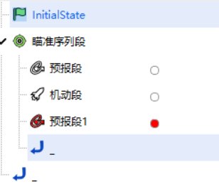
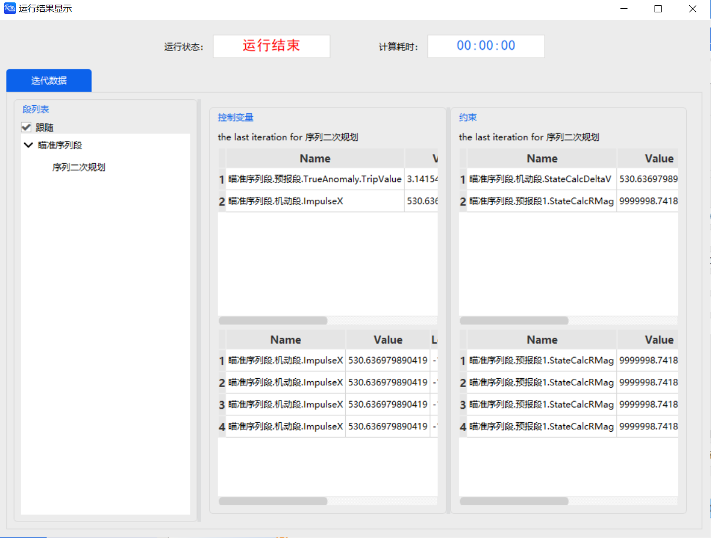
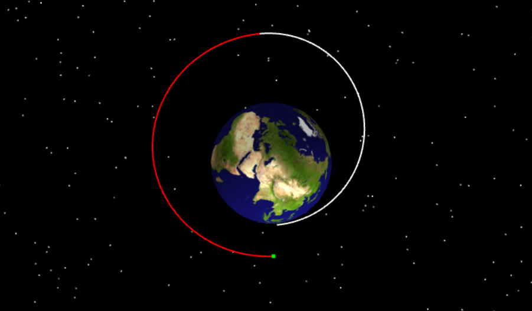

# SQT 优化器案例

<PathViewer
  :relative-paths="files"
/>

## 案例想定

本案例将介绍使用 SQT 优化器通过一次有限推力提升卫星的近地点。

## 任务控制序列说明

为了将一个半径为 6778 km 的停泊轨道提升为近地点半径为 10000 km 的目标轨道，我们需要构建以下任务控制序列：

- 一个 **初始段**：定义半径为 6778 km 的初始停泊轨道；
- 一个 **瞄准序列段**：瞄准目标轨道；
- 一个 **预报段**：用于将航天器初始轨道传播至达到某个真近点；
- 一个 **机动段**：一个脉冲机动使航天器进入目标轨道；
- 一个 **预报段**：用于将轨道传播，直到它到达近地点。

## 创建任务场景

1. 运行 ATK 软件，选择上方【开始】工具栏，点击 <kbd>新建</kbd>，创建一个想定文件“SQT”。

2. 在【ATK: 新建想定向导】对话框中设置【开始历元】与【结束历元】：

   | 开始历元 (UTCG_MM)      | 结束历元 (UTCG_MM)       |
   | ----------------------- | ------------------------ |
   | 2026-04-02 00:00:00.000 | 2026-04-03 00:00:00.000 |

3. 点击 <kbd>确定</kbd> 完成场景创建。

## 插入卫星

1. 点击【开始】工具栏下的 <kbd>插入</kbd>，打开【插入对象】对话框。

2. 选择【卫星】对象，再选择【插入默认类型】方式，点击 <kbd>插入...</kbd>，将对象插入场景。

## 定义初始轨道参数

1. 双击卫星对象，进入【属性】设置界面。

2. 点击【轨道预报器】下拉框，选择【机动规划】。如果任务控制序列已经有默认的初始段，则直接进行定义，否则点击 <kbd>新增</kbd> 添加一个“初始段”，将其命名为“InitialState”。

3. 选中“InitialState”序列，点击【坐标系】右侧的 <kbd>...</kbd>，打开【选择坐标系】对话框，然后在左侧栏中选择【地球】，在右侧栏中选择【ICRF】坐标系，点击 <kbd>确定</kbd>。

4. 点击【坐标类型】下拉框，选择【轨道根数】，对轨道根数进行设置：

   | 轨道根数   | 数值    |
   | ---------- | ------- |
   | 半长轴     | 6778 km |
   | 偏心率     | 0.4     |
   | 轨道倾角   | 45 deg  |
   | 升交点赤经 | 0 deg   |
   | 近拱点角距 | 0 deg   |
   | 真近点角   | 0 deg   |

5. 点击右下角的 <kbd>应用</kbd>，完成初始轨道参数设置。

## 设置瞄准序列段

1. **定义瞄准序列段**

   - 点击 <kbd>新增</kbd> 添加一个【瞄准序列段】。

   - 在瞄准序列段下依次新增第一个【预报段】、一个【机动段】、第二个【预报段】。

2. **第一个预报段设置**

   - 删除原有停止条件，新建停止条件为：真近点角，触发值为“170”，其余参数保持默认。

3. **机动段设置**

   - 右键点击机动段，选择【约束配置…】，双击选择【机动量 - 速度增量】作为目标变量，点击 <kbd>确定</kbd>。

   - 点击【机动类型】下拉框，选择【脉冲】；点击【推力坐标轴】右侧的 <kbd>...</kbd>，选择【VNC】坐标；勾选【直角坐标】复选框。

   - 点击【速度增量 Vx】文字段后方的勾选图标，将其勾选为 **设计变量** 。

4. **第二个预报段设置**

   - 右键点击该预报段，选择【约束配置…】，双击选择【球坐标根数 - 球半径模】作为目标变量，点击 <kbd>确定</kbd>。

   - 删除原有停止条件，新建停止条件为：近拱点，其余参数保持默认。

5. **瞄准序列段设置**

   选中瞄准序列段，删除原有瞄准器，点击【配置】—<kbd>新建</kbd>，选择【序列二次规划】，点击 <kbd>确定</kbd>；双击【配置 - 序列二次规划】栏目，进入瞄准器设置界面。

   - 分别点击【控制变量】和【约束】方框中【应用】栏下的复选框，勾选使用的变量和约束。

     | 控制变量              | 约束            |
     | --------------------- | --------------- |
     | ImpulseX              | StateCalcDeltaV |
     | TrueAnomaly.TripValue | StateCalcRMag   |

   - 选中“StateCalcDeltaV”，设置参数如下，其余参数保持默认。

     | 控制变量 | 约束                      |
     | -------- | ------------------------- |
     | 最小值   | -1.10000000000000e+20 m/s |
     | 最大值   | -1.10000000000000e+20 m/s |
     | 期望值   | 0                         |
     | 类型     | 最小化                    |

   - 选中“StateCalcRMag”，设置参数如下，其余参数保持默认。

     | 控制变量 | 约束       |
     | -------- | ---------- |
     | 最小值   | 10000000 m |
     | 最大值   | 10000000 m |
     | 期望值   | 0          |
     | 类型     | 约束       |

   - 点击 <kbd>确定</kbd>。

## 运行任务控制序列

当整个任务控制序列构建完毕后，可以点击【预报段】和【机动段】右侧的白框选择颜色，完整任务控制序列如图所示：

1. **运行结果显示**

   - 点击 <kbd>运行</kbd>，任务控制序列开始计算。可以点击 <kbd>显示</kbd>，查看运行结果。

   

2. **三维视图显示**

   点击上方【视图】工具栏下的 <kbd>三维视图</kbd>，通过操作时间轴，可以查看轨道形状。

   

