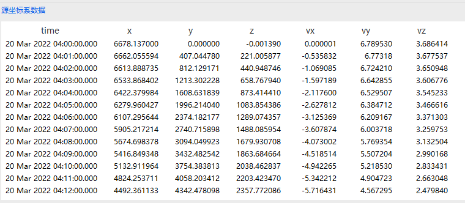
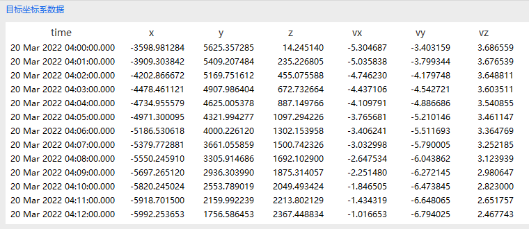
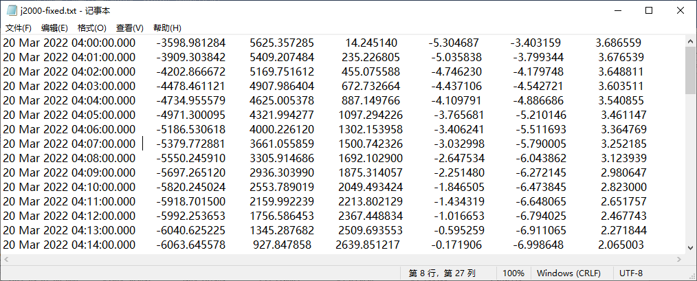
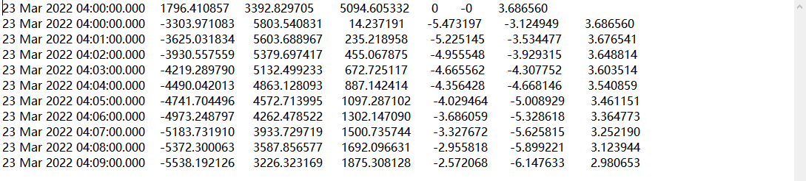

# Batch Coordinate Transformation Example

<PathViewer
  :relative-paths="files"
/>

## Batch Coordinate Transformation

After creating the scenario, enter the initial interface. Click <kbd>Tools</kbd> in the upper part of the ATK interface, then click the <kbd>Batch Coordinate Transformation</kbd> button to enter the **Batch Coordinate Transformation** interface. You can perform the following operations: **Earth J2000 Mean Equator Inertial Coordinates to Earth-fixed Coordinates** and **Earth-fixed Coordinates to ENU Coordinates**.

## Earth J2000 Mean Equator Inertial Coordinates to Earth-fixed Coordinates

### Calculation Mode Selection

1. Open the Batch Coordinate Transformation interface, select **Import File Type** — **TXT File**;

2. Click the <kbd>…</kbd> button and select the Earth J2000 Mean Equator Inertial file <PathCopy :entry="j2000CoordFile" />, with the format as shown below:

After import, the J2000 Earth Inertial coordinates will be displayed in the **Source Coordinate System Data** box.

### Time Options

**Time Options** — by default, **UTC Time** is checked. In the **Time Format** drop-down list, the specific time formats are shown in parentheses. Select UTCG as the time format; the first 4 columns of the imported source file are used as time values. BJT time format occupies 2 columns, while JDate occupies only 1 column. When switching time formats, the source data is read according to the selected format.

Check **Relative Time** — only the first column of the source file is taken as time. The relative initial time can be edited in the text box below; default: `1993-01-01 00:00:00.00`.

::: warning Time Options Note
This example still uses UTC time.
:::

### Transformation Parameters Selection

1. Select **Time**, **Position**, and **Velocity** as transformation parameters;

2. **Length Unit** — select km, **Time Unit** — select s.

When the selected parameters change, the source data is read accordingly. Position x, y, z each occupy 1 column; velocity vx, vy, vz each occupy 1 column; time occupies 1–4 columns. If the imported file has fewer columns than the total required, data cannot be read. When selecting Time and Velocity, if Time occupies 4 columns, then columns 5, 6, and 7 correspond to vx, vy, vz respectively.

### Source Coordinate System Selection

The source coordinate system can be selected via **New** or **Select**, or from the drop-down list of commonly used coordinate systems. The default is **Earth Fixed**, but here select **Earth J2000 Mean Equator Inertial**, which corresponds to the imported file `J2000Coord.txt`.

### Target Coordinate System Selection

Select **Target Coordinate System** — **Earth Fixed**. The target coordinate system can be selected via **New** or **Select**, or from the drop-down list of commonly used coordinate systems; default is **Earth Fixed**.

### Coordinate Transformation

Click <kbd>Compute</kbd>, and the **Target Coordinate System Data** will display the transformed Earth-fixed coordinates, as shown below:

### Export File Type

1. Select **Export File Type** — **TXT File**;

2. Click <kbd>Export</kbd>, choose a path; the data file format is TXT, and the exported file format and column units follow the same settings as the **Target Coordinate System Data**.

## Earth-fixed Coordinates to ENU Coordinates

### Calculation Mode Selection

1. Open the Batch Coordinate Transformation interface, select **Import File Type** — **TXT File**;

2. Click the <kbd>…</kbd> button and select the Earth-fixed coordinate file <PathCopy :entry="ecfFile" />, with the format as shown below:

After import, the data will be displayed in the **Source Coordinate System Data** box.

### Time Options

Check **Epoch Time** and set the time format as .

### Transformation Parameters Selection

1. Select **Time**, **Position**, and **Velocity** as transformation parameters;

2. **Length Unit** — km, **Time Unit** — s.

### Source Coordinate System Selection

The source coordinate system corresponds to the imported file `ECF.txt`; select **Source Coordinate System** — **Earth Fixed**.

### Target Coordinate System Selection

1. Select **Target Coordinate System** — **ENU (East-North-Up)**;

2. In the pop-up dialog, enter the following values for Longitude (°), Latitude (°), and Altitude (m):

| Item      | Value | Unit |
|-----------|-------|------|
| Longitude | 0     | deg  |
| Latitude  | 0     | deg  |
| Altitude  | 0     | m    |

### Coordinate Transformation

Click <kbd>Compute</kbd> to convert to ENU coordinates.

### Export File Type

1. Select **Export File Type** — **TXT File**;

2. Click <kbd>Export</kbd>, choose a path; the data file format is TXT, and the exported file format and column units follow the same settings as the **Target Coordinate System Data**.

