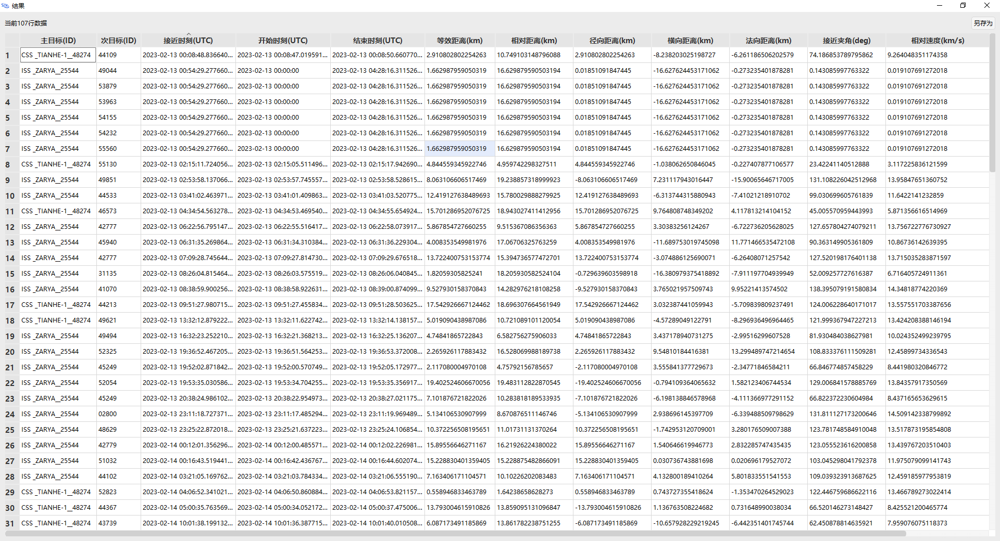
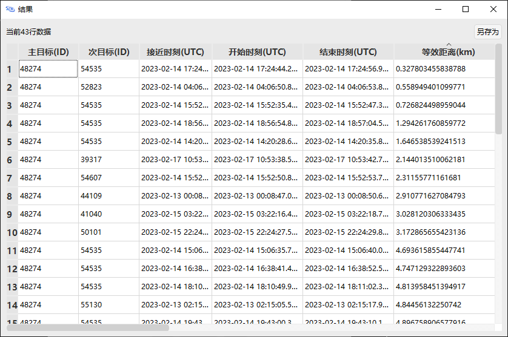

<PathViewer
  :relative-paths="files"
/>

# Conjunction Analysis Example

The Conjunction Analysis tool can analyze and assess the likelihood of close approaches between a target and other objects in space, obtaining the time of closest approach, as well as the relative position, velocity, and other information at that moment.

## Scenario Description

In this example, an existing **Target TLE Database** is used to perform conjunction analysis on a single primary target or multiple primary targets. The format of the **Target TLE Database** is shown below.

There are four ways to add primary targets:

1. **Select Satellite from Scenario Object** — the primary target comes from a satellite inserted into the scenario, which has already been propagated.

2. **Select Missile/Rocket from Scenario Object** — the primary target comes from a missile/rocket inserted into the scenario, which has already been propagated.

3. **Enter Target International Designator** — the primary target comes from the **Target TLE Database**.

4. **Traverse Database Targets** — performs pair‑wise conjunction analysis for all targets in the database.

This example will cover the first and third methods, using China's **Tianhe-1** satellite (SSC 48274) and Russia's **Zarya** satellite (SSC 25544) as primary targets for conjunction analysis.

## Conjunction Analysis Based on Scenario Object Selection

1. **Create the Scenario Object**

   Run ATK.exe and click <kbd>Create a new scenario file</kbd>.

   In the **New Scenario Wizard** dialog, set the scenario **Name** to **CAT_TLE20230213**.

   Set the scenario time period as:

   | Start Epoch (UTCG)          | End Epoch (UTCG)          |
   | --------------------------- | ------------------------- |
   | 13 Feb 2023 00:00:00.000 | 18 Feb 2023 00:00:00.000 |

   Click <kbd>OK</kbd> to complete the scenario creation.

   ::: warning Scenario Time Note
   The scenario time period affects the subsequent conjunction analysis results.
   :::

2. **Insert and Propagate the Target Satellites**

   Click the <kbd>Insert</kbd> button to open the **Insert Object** page.

   Select **Scenario Object** — **Satellite**, and **Insertion Method** — **From TLE File**.

   Click <kbd>Insert…</kbd> to open the **Insert Satellite Object** page.

   Under **Data Source**, click <kbd>Select File</kbd> and select the target TLE file <PathCopy :entry="tleFile" />.

   To insert satellite 25544: In the **Search** section, enter `25544` in the **SSC Number** field, click <kbd>Search</kbd>, select the satellite with SSC 25544 from the list, and click <kbd>Insert</kbd>. Satellite 25544 is then inserted successfully.

   Repeat the above to insert satellite 48274.

3. **Open the Satellite Conjunction Analysis Tool**

   Click <kbd>Tools</kbd> in the ATK interface, then select <kbd>Conjunction Analysis</kbd>.

   Click <kbd>Refresh</kbd> to reset the tool.

4. **Select SSC 48274 as the Primary Target**

   In **Select Primary Target**, choose **Select Satellite from Scenario Object** from the drop‑down list.

   Click to select satellite 48274.

5. **Select the Target TLE Database**

   Click **Target TLE Database** — <kbd>Select…</kbd>.

   Select the **Target TLE Database** file <PathCopy :entry="tleFile" />.

6. **Exclude Targets from the TLE Database**

   Click **Excluded Target SSC Numbers** — <kbd>Set…</kbd>.

   In the **Excluded Target SSC Numbers** field, enter target SSC `48274`.

   Click <kbd>Add</kbd>, then select satellite 48274.

   After entering the excluded targets, click <kbd>OK</kbd>. You will return to the **Conjunction Analysis** page.

7. **Set the Analysis Time Interval**

   In **Analysis Time Interval**, the **Start Epoch** and **End Epoch** default to **Use Scenario Interval** (checked).

8. **Set the Conjunction Constraints**

   Set **Conjunction Constraints** — **Relative Range Threshold** to 20 km. When the distance between a satellite in the TLE database and the primary target is less than the **Relative Range Threshold**, it will be displayed in the calculation results.

9. **Advanced Settings**

   Click <kbd>Advanced Settings…</kbd> to open the **Advanced Settings** page.

   Set the **Filters**. The **Filters** use the default settings; the **Method** is **Analytical** with the following parameters:

   | Name                         | Value    | Unit |
   | ---------------------------- | -------- | ---- |
   | Orbit Epoch Expiration Limit | 2592000  | s    |
   | Apogee/Perigee Limit         | 50000    | m    |
   | Orbital Path                 | 100000   | m    |
   | Time                         | 30000    | m    |

   Set the **Equivalent Distance Warning Thresholds**. The default values are:

   | Name                           | Value | Unit |
   | ------------------------------ | ----- | ---- |
   | Yellow Warning                 | 200   | m    |
   | Red Warning                    | 50    | m    |
   | Equivalent Distance Coefficient (k) | 10 | —    |

   Click <kbd>OK</kbd>.

10. **Compute Results**

    Click <kbd>Compute</kbd> to obtain the simulation results.

    A partial view of the conjunction analysis results is shown below:

    

    The results include (for events satisfying the constraints): **Time of Closest Approach**, **Equivalent Distance**, **Relative Range**, **Radial Distance**, **Transverse Distance**, **Normal Distance**, **Approach Angle**, and **Relative Velocity**. There are 43 rows of data with a relative range threshold below 20 km.

11. **Multi‑Target Conjunction Analysis**

    Select both satellites 48274 and 25544, and exclude both 48274 and 25544 from the TLE database.

    Keep other settings unchanged and click <kbd>Compute</kbd>. The multi‑target conjunction analysis results show 107 rows of data. Click on **Time of Closest Approach (UTC)** to sort the events by the closest approach time to the simulation epoch, as shown below:

    

    You can also click on **Secondary Target (ID)**, **Equivalent Distance**, etc., to sort the results. If you close the results window, you can reopen it by clicking <kbd>Results…</kbd> at the bottom of the **Conjunction Analysis** page.

## Conjunction Analysis Using Target International Designator

1. **Select SSC 48274 as the Primary Target**

   Before inserting the **Primary Target**, ensure the database has been loaded into the **Target Catalog Database**.

   In **Select Primary Target**, choose **Enter Target International Designator** from the drop‑down list.

   Enter `48274` in the **Target International Designator** field, click <kbd>Add</kbd>, and then select satellite 48274.

2. **Compute Results**

   Keep all other settings unchanged and click <kbd>Compute</kbd>.

   ::: warning Excluded Targets Note
   In this section, you do not need to exclude any targets. If you previously excluded satellites 48274 and 25544, go to the **Exclude Targets** page, select them, and click <kbd>Delete</kbd>.
   :::

   In the **Results** page, click on **Equivalent Distance (km)**.

   A partial view of the results is shown below:

   

   The simulation results contain 43 rows of data, sorted by **Equivalent Distance**.

3. **Multi‑Target Conjunction Analysis**

   Perform conjunction analysis for satellites 25544 and 48274 respectively against other satellites in the TLE database.

   Enter `25544` in the **Target International Designator** field, click <kbd>Add</kbd>, and repeat to add `48274`.

   Select both satellites 25544 and 48274.

   Click <kbd>Compute</kbd> to get the results.

   Click on **Equivalent Distance (km)** to sort by equivalent distance, as shown below:

   

## Related Documentation

- [Conjunction Analysis Tool](../5.专业使用指南/07-接近分析.md)

