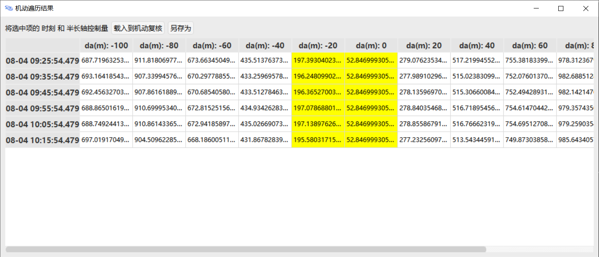
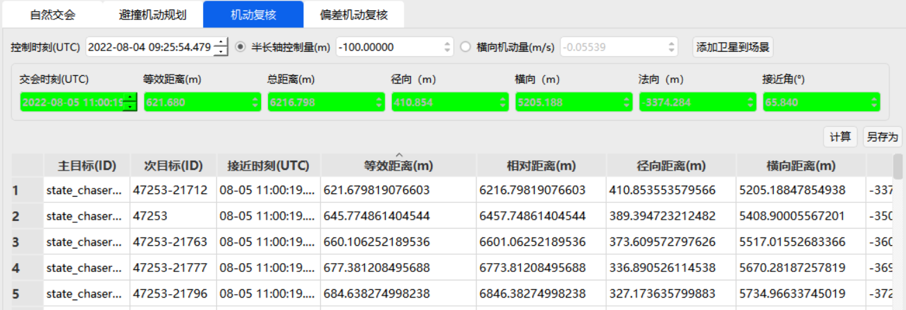
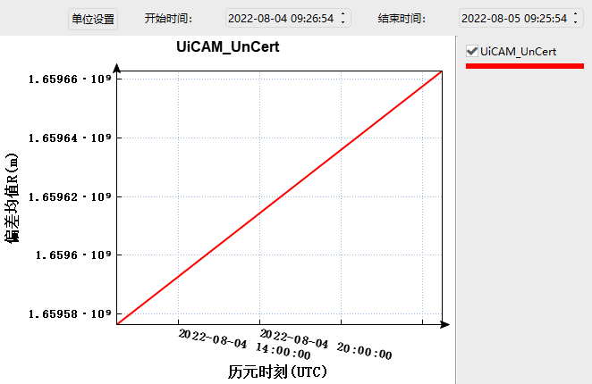

# Collision Avoidance

<PathViewer
  :relative-paths="files"
/>

## Scenario Description

This example scenario covers multi‑revolution collision avoidance analysis for a spacecraft against a single high‑priority space object and against a multi‑target catalog. It includes:

1. Building a spacecraft collision avoidance maneuver assessment model based on precise ephemeris and relative orbital dynamics, covering natural conjunction analysis, maneuver planning analysis, and maneuver verification;

2. Considering the impact of multi‑revolution periodic approaches between the spacecraft and space objects on avoidance effectiveness, and finding the optimal control solution within the tracking and control revolutions by optimizing the control variables, to avoid re‑occurrence of collision risk shortly after the maneuver;

3. Performing maneuver verification to improve avoidance effectiveness and ensure operational safety.

## Basic Setup

Launch ATK.exe, click <kbd>Tools</kbd> - <kbd>Collision Avoidance</kbd> to open the **Orbit Control Safety Analysis** interface.

### Scenario Target Data Configuration

1. Satellite Ephemeris: The satellite can be selected from the scenario or from an ephemeris file.

   - **Mode** set to **Select from Ephemeris**. Click the  button on the right side of the **Ephemeris File** data box to load the precise ephemeris file of the in‑orbit spacecraft <PathCopy :entry="stateChaserFile" /> from the **CAM** folder. This selects the spacecraft ephemeris data in central format from **2022-08-02 23:00** to **2022-08-08 12:00**;

   - From the drop‑down menu select **UTC/BJT** - <kbd>UTC</kbd> time format.

2. Target Ephemeris: The target can be selected from the scenario or from an ephemeris file.

   - Check <kbd>Use</kbd> to enable collision avoidance calculation with the specified space object;

   - **Mode** set to **Select from Ephemeris**. Click the  button on the right side of the **Ephemeris File** data box to load the target precise ephemeris file <PathCopy :entry="stateTargetFile" />. This selects the target ephemeris data in central format from **2022-07-31 14:26** to **2022-08-08 14:26**;

   - From the drop‑down menu select **UTC/Beijing Time** - <kbd>UTC</kbd> time format.

3. Target Database

   - Check <kbd>Use TLE</kbd>, click <kbd>Select…</kbd> to use TLE data for collision avoidance calculations against all other space objects in the database;

   - Select and load the TLE‑format data file <PathCopy :entry="tleFile" />, which contains all space object catalog numbers collected by **SpaceTrack** as of August 5, 2022. After loading, uncheck <kbd>Use TLE</kbd> — it will be re‑enabled during the **Maneuver Verification** step;

   - Click <kbd>Set</kbd>, enter the target numbers to be excluded, click <kbd>Add</kbd> to add them to the list, and click <kbd>OK</kbd> to save. **SSC** is the five‑digit international space object number;

   - To remove an object, select its SSC number in the list, click <kbd>Delete</kbd>, then click <kbd>OK</kbd> to save and exit.

### Avoidance Condition Filtering

1. **Set Constraint Conditions**

   - In the **Conjunction Analysis Threshold** field, enter the analysis threshold value **100000m**. The results will only display data with distances less than this threshold;

   - According to the relative motion state between the spacecraft and the space object, and the requirements for computation speed and accuracy, select the **Nonlinear Equations** option (suitable for long‑duration multi‑revolution analysis) from the **Relative Orbit Propagation Model** section, based on the options in the table below:

     | Name               | Algorithm                                | Application Scenario                                           |
     | ------------------ | ---------------------------------------- | -------------------------------------------------------------- |
     | Linear Equations   | C-W Equations                            | Relative orbit model; lower accuracy but faster computation    |
     | Nonlinear Equations| Analytical nonlinear relative motion eq. | Higher accuracy than C-W but slower computation               |
     | Analytical Absolute | Vinti method                            | Absolute orbit model; highest accuracy, best for long‑term relative motion |

2. **Advanced Settings**

   - Under **Advanced Settings**, select **Filters**. Based on mission requirements, first check **Orbit Epoch Expiration Limit** and **Apogee/Perigee Limit**;

   - Set the specific values as shown below.

     ::: warning Note on Numerical Settings
     You can change the units to adjust the values.
     :::

     | Name                         | Value    | Unit |
     | ---------------------------- | -------- | ---- |
     | Orbit Epoch Expiration Limit | 2592000  | s    |
     | Apogee/Perigee Limit         | 50000    | m    |

   - Click to select **Equivalent Distance Warning Thresholds** in **Advanced Settings**;

   - According to mission requirements, set the <kbd>Yellow Warning</kbd> and <kbd>Red Warning</kbd> values as shown in the table below, then click <kbd>OK</kbd>.

     | Name                         | Value | Unit |
     | ---------------------------- | ----- | ---- |
     | Yellow Warning               | 200   | m    |
     | Red Warning                  | 50    | m    |
     | Equivalent Distance Coefficient | 10 | —    |

## Natural Conjunction Conditions

Following the above steps, the data configuration and avoidance condition filtering for all spacecraft and space objects are completed on the main interface.

1. Select the **Natural Conjunction** tab and click the <kbd>Compute</kbd> button on the right side to obtain the time and distance information for each close approach between the primary and secondary targets;

2. After computation, the upper panel displays the information corresponding to the **Minimum Equivalent Distance** under natural conjunction conditions:

   | Parameter               | Value                   | Unit |
   | ----------------------- | ----------------------- | ---- |
   | Conjunction Time        | 2022-08-05 09:25:54.479 | —    |
   | Minimum Equivalent Dist.| 52.847                  | m    |
   | Relative Range          | 412.342                 | m    |
   | Radial Distance         | 52.847                  | m    |
   | Transverse Distance     | 343.419                 | m    |
   | Normal Distance         | -222.030                | m    |
   | Approach Angle          | 65.715                  | °    |

3. Click <kbd>Save As</kbd> to save all computed data.

## Maneuver Planning Analysis

Select the **Collision Avoidance Maneuver Planning** tab. Based on the spacecraft tracking and control schedule and the natural conjunction time of the minimum equivalent distance, plan the avoidance maneuver one day ahead. Enter the control time parameters as follows:

| Parameter                      | Value                   |
| ------------------------------ | ----------------------- |
| Control Time Lower Limit (UTC) | 2022-08-04 09:25:54.479 |
| Control Time Upper Limit (UTC) | 2022-08-04 10:25:54.479 |

According to the spacecraft platform maneuver capability and orbit maintenance constraints, enter the semi‑major axis control parameters as follows:

| Parameter                     | Value |
| ----------------------------- | ----- |
| Semi‑major Axis Lower Limit (m) | -100 |
| Semi‑major Axis Upper Limit (m) | 100  |

Based on the above inputs, perform collision avoidance maneuver planning analysis.

1. **Traversal Analysis**

   - Select **Traversal Analysis** for maneuver planning. Check the <kbd>Time Planning</kbd> option and set the <kbd>Time Step</kbd> to **600s**;

   - Check <kbd>Control Amount Planning</kbd> and set the <kbd>Semi‑major Axis Control Step</kbd> to **20m**;

   - Click <kbd>Compute</kbd>;

   - After computation, click <kbd>Results</kbd> to view the traversal analysis results;

     

   - Select the desired **Semi‑major Axis Control Amount** at the required time, right‑click and choose <kbd>View Details</kbd> to see the secondary detailed results;

   - Based on the results, filter for the control time **2022-08-04 09:25:54.479**, with the corresponding **Semi‑major Axis Control Amount** of **-100.00000m**;

   - Select this data and click <kbd>Load to Maneuver Verification</kbd>.

2. **Optimization Analysis**

   - Select **Optimization Analysis** for maneuver planning. Enter the <kbd>Avoidance Threshold</kbd> as **200m**;

   - Click <kbd>Compute</kbd>;

   - The optimal equivalent distance and corresponding information are obtained:

     | Parameter               | Value                   |
     | ----------------------- | ----------------------- |
     | Control Time            | 2022-08-04 10:01:41.009 |
     | Semi‑major Axis Control | -20.229m                |
     | Conjunction Time        | 2022-08-05 09:25:54.291 |
     | Equivalent Distance     | 200m                    |
     | Total Range             | 2000m                   |
     | Radial                  | 59.150m                 |
     | Transverse              | -1678.662m              |
     | Normal                  | 1085.631m               |

   - After computation, click <kbd>Results</kbd> to view the optimization analysis results;

   - Based on the optimal data, click <kbd>Load to Maneuver Verification</kbd>.

## Maneuver Verification

1. **Load to Maneuver Verification**

   - In the **Traversal Analysis** under **Collision Avoidance Maneuver Planning**, after loading the selected data to maneuver verification, go to the **Maneuver Verification** tab;

   - Verify whether the <kbd>Control Time</kbd> **2022-08-04 09:25:54.479** with the corresponding <kbd>Semi‑major Axis Control Amount</kbd> **-100.00000m** is a feasible avoidance strategy. Check the <kbd>Use TLE</kbd> button to see if the maneuver results cause collisions with other objects;

   - Click <kbd>Compute</kbd>.

2. **Result Display**

   - Click **Equivalent Distance (m)** to sort the results. According to the calculation, this strategy satisfies the avoidance constraints over multiple orbital revolutions before and after the maneuver;

     

   - Click <kbd>Save As</kbd> to save all computed data.

## Deviation Maneuver Verification

1. **Load to Deviation Maneuver Verification**

   - After maneuver planning analysis, click <kbd>Deviation Maneuver Verification</kbd> to load into the **Deviation Maneuver Verification** tab;

   - Verify the data. Check whether the <kbd>Control Time</kbd> **2022-08-04 09:25:54.479** with the corresponding <kbd>Semi‑major Axis Control Amount</kbd> **-100.000m** is a feasible avoidance strategy.

2. **Semi‑major Axis Deviation Estimation**

   - Click <kbd>Semi‑major Axis Deviation Estimation</kbd>. Estimate based on the specific spacecraft performance; default input values are given in the table below:

     | Name                          | Mean | Std Dev 3σ |
     | ----------------------------- | ---- | ---------- |
     | Engine Thrust (N)             | 100  | 3          |
     | Spacecraft Mass (kg)          | 100  | 0.3        |
     | Burn Duration (sec)           | 1    | 0.03       |
     | Thrust Azimuth (deg)          | 0    | 0.003      |
     | Thrust Elevation (deg)        | 0    | 0.003      |

   - Click <kbd>Compute</kbd> in the **Semi‑major Axis Deviation Estimation** page; the result for **Semi‑major Axis Std Dev 3σ (m)** is **76.7844598057339**;

   - Close this page; the computed **Semi‑major Axis Std Dev 3σ** value is automatically loaded into the input box for <kbd>Semi‑major Axis Std Dev 3σ (m)</kbd> on the **Deviation Maneuver Verification** page.

3. **Control Deviation Prediction**

   - Click <kbd>Compute</kbd> on the **Deviation Maneuver Verification** page. After computation, click <kbd>Save As</kbd> to store the data in TXT format;

   - Based on the deviation maneuver verification results, click <kbd>Control Deviation Prediction</kbd>. Set the **Prediction Duration** to **86400s** and the **Prediction Step** to **60s**;

   - Click <kbd>Compute</kbd> on the **Control Deviation Prediction** page to directly generate the corresponding **Plot** and **Table** for detailed deviation prediction;

   - Click <kbd>Plot</kbd> to view the deviation prediction plot;

     

   - Select the appropriate **X‑axis** and **Y‑axis** as needed:

     | X‑axis                     | Y‑axis                     |
     | -------------------------- | -------------------------- |
     | Epoch Time (UTC)           | Epoch Time (UTC)           |
     | Deviation Mean R (m)       | Deviation Mean R (m)       |
     | Deviation Mean T (m)       | Deviation Mean T (m)       |
     | Deviation Mean N (m)       | Deviation Mean N (m)       |
     | Deviation Std Dev R_3σ (m) | Deviation Std Dev R_3σ (m) |
     | Deviation Std Dev T_3σ (m) | Deviation Std Dev T_3σ (m) |
     | Deviation Std Dev N_3σ (m) | Deviation Std Dev N_3σ (m) |

4. **View and Save Results**

   - Click <kbd>Table</kbd> to view the specific values of the control deviation prediction. To re‑predict, re‑enter the values to regenerate the plot and table;

   - Click <kbd>Save As</kbd> to save all computed data.

