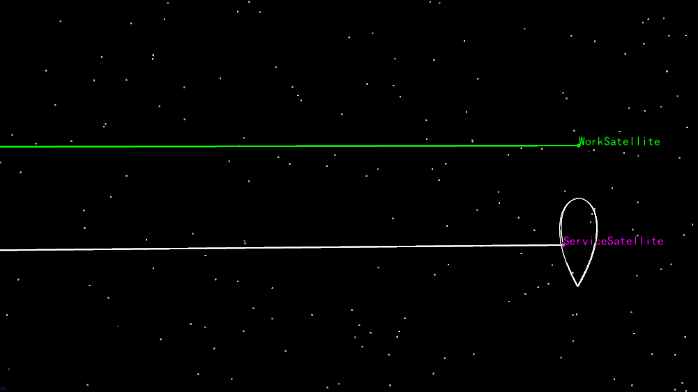

# RPO Example

Through the secondary development Connect mode, create an RPO teardrop fly-around example. The specific details are the same as "Example 3-12 - RPO Example". ATK must remain open. The specific command categories include:

1. Connecting to ATK.
2. Creating a new scenario and setting its properties.
3. Creating the target satellite and setting its properties.
4. Creating the servicer satellite and setting its properties.
5. Inserting the RPO segment and configuring the orbit propagator.
6. Teardrop fly-around segment parameters.
7. Running the mission.
8. Viewing report data.
9. Saving the scenario and disconnecting from ATK.

## Script Demonstration

### Connecting to ATK

```mixcode
{C:1, 与 ATK 进行连接}
conID = atkOpen()
```

### Creating a New Scenario and Setting Its Properties

```mixcode
{C:2, 创建任务场景}
atkConnect(conID, {S:New}, {S:/ Scenario Teardrop})
{C:设置仿真时间段}
atkConnect(conID, {S:SetAnalysisTimePeriod}, {S:* "2007-03-08 00:00:00.000" "2007-03-13 00:00:00.000"})
{C:初始化仿真}
atkConnect(conID, {S:Animate}, {S:* Reset})
```

### Creating the Target Satellite and Setting Its Properties

```mixcode
{C:3, 创建工作星卫星对象}
atkConnect(conID, {S:New}, {S:/ Satellite WorkSatellite})
{C:设置相关参数}
atkConnect(conID, {S:SetState}, {S:*/Satellite/WorkSatellite Classical HPOP "2007-03-08 00:00:00.000" "2007-03-13 00:00:00.000" 60 J2000 "2007-03-08 00:00:00.000" 42164000 0 0 0 0 0})
```

### Creating the Servicer Satellite and Setting Its Properties

```mixcode
{C:4, 创建服务星卫星对象}
atkConnect(conID, {S:New}, {S:/ Satellite ServiceSatellite})
{C:设置轨道预报器为机动规划}
atkConnect(conID, {S:Astrogator}, {S:*/Satellite/ServiceSatellite SetProp})

{C:设置 Keplerian 坐标类型的轨道根数}
atkConnect(conID, {S:Astrogator}, {S:*/Satellite/ServiceSatellite SetValue MainSequence.SegmentList.Initial_State.InitialState.Keplerian.sma 6700000 m})
atkConnect(conID, {S:Astrogator}, {S:*/Satellite/ServiceSatellite SetValue MainSequence.SegmentList.Initial_State.InitialState.Keplerian.ecc 0})
atkConnect(conID, {S:Astrogator}, {S:*/Satellite/ServiceSatellite SetValue MainSequence.SegmentList.Initial_State.InitialState.Keplerian.inc 0})
atkConnect(conID, {S:Astrogator}, {S:*/Satellite/ServiceSatellite SetValue MainSequence.SegmentList.Initial_State.InitialState.Keplerian.RAAN 0})
atkConnect(conID, {S:Astrogator}, {S:*/Satellite/ServiceSatellite SetValue MainSequence.SegmentList.Initial_State.InitialState.Keplerian.w 0})
atkConnect(conID, {S:Astrogator}, {S:*/Satellite/ServiceSatellite SetValue MainSequence.SegmentList.Initial_State.InitialState.Keplerian.TA 0})
```

### Inserting the RPO Segment and Configuring the Orbit Propagator

```mixcode
{C:5, 插入 RPO 段}
atkConnect(conID, {S:Astrogator}, {S:*/Satellite/ServiceSatellite InsertSegment MainSequence.SegmentList.- RPOTearDrop})
{C:高级设置：设置轨道预报器的参数}
atkConnect(conID, {S:Astrogator}, {S:*/Satellite/ServiceSatellite SetValue MainSequence.SegmentList.RPOTearDrop.CenterBody "Earth"})
atkConnect(conID, {S:Astrogator}, {S:*/Satellite/ServiceSatellite SetValue MainSequence.SegmentList.RPOTearDrop.GravityModel "WGS84"})
atkConnect(conID, {S:Astrogator}, {S:*/Satellite/ServiceSatellite SetValue MainSequence.SegmentList.RPOTearDrop.ThreeBodyGravity "Sun, Moon"})
atkConnect(conID, {S:Astrogator}, {S:*/Satellite/ServiceSatellite SetValue MainSequence.SegmentList.RPOTearDrop.ThreeBodyModel "Point-Mass Model"})
{C:开启大气阻力摄动并选择大气模型}
atkConnect(conID, {S:Astrogator}, {S:*/Satellite/ServiceSatellite SetValue MainSequence.SegmentList.RPOTearDrop.AtmosphericDrag "On"})
atkConnect(conID, {S:Astrogator}, {S:*/Satellite/ServiceSatellite SetValue MainSequence.SegmentList.RPOTearDrop.AtmosphericModel "NRLMSISE00"})
{C:开启太阳光压}
atkConnect(conID, {S:Astrogator}, {S:*/Satellite/ServiceSatellite SetValue MainSequence.SegmentList.RPOTearDrop.SolarPressure "On"})
```

### Teardrop Fly-Around Segment Parameters

```mixcode
{C:6, 设置水滴绕飞段参数}
atkConnect(conID, {S:Astrogator}, {S:*/Satellite/ServiceSatellite SetValue MainSequence.SegmentList.RPOTearDrop.NumCircles 5})
atkConnect(conID, {S:Astrogator}, {S:*/Satellite/ServiceSatellite SetValue MainSequence.SegmentList.RPOTearDrop.StartDistance -300})
atkConnect(conID, {S:Astrogator}, {S:*/Satellite/ServiceSatellite SetValue MainSequence.SegmentList.RPOTearDrop.ManeuverDistance -800})
atkConnect(conID, {S:Astrogator}, {S:*/Satellite/ServiceSatellite SetValue MainSequence.SegmentList.RPOTearDrop.WaitTime 21600}) {C:等待时间为21600秒}
{C:设置真近点角变化量最大值}
atkConnect(conID, {S:Astrogator}, {S:*/Satellite/ServiceSatellite SetValue MainSequence.SegmentList.RPOTearDrop.MaxDeltaTrueAnomaly 5})
{C:设置求解算法为"序列二次规划"}
atkConnect(conID, {S:Astrogator}, {S:*/Satellite/ServiceSatellite SetValue MainSequence.SegmentList.RPOTearDrop.SolveMethod 2})
{C:设置参考航天器为工作星}
atkConnect(conID, {S:Reference},  {S:*/Satellite/ServiceSatellite SetRefSatellite */Satellite/WorkSatellite})
atkConnect(conID, {S:Astrogator}, {S:*/Satellite/ServiceSatellite SetValue MainSequence.SegmentList.RPOTearDrop.Reference "Satellite/WorkSatellite"})
```

### Running the Mission

```mixcode
{C:7, 运行任务控制序列}
atkConnect(conID, {S:Astrogator}, {S:*/Satellite/ServiceSatellite RunMCS})
atkConnect(conID, {S:Animate}, {S:* Reset})
atkConnect(conID, {S:Astrogator}, {S:*/Satellite/ServiceSatellite ApplyAllProfileChanges})
```

### Viewing Report Data

```mixcode
{C:8, 打印查看报告数据}
atkConnect(conID, {S:Report_RM}, {S:*/Satellite/ServiceSatellite Style "Position" TimePeriod "8 Mar 2007 00:00:00.000" "13 Mar 2007 00:00:00.000"})
```

### Saving the Scenario and Disconnecting from ATK

```mixcode
{C:9, 保存文件并断开连接}
atkConnect(conID, {S:Save}, {S:/ *})
atkClose(conID)
```

## Report Data Results

The result of this example is: successfully performing a teardrop fly-around. The result is shown below:



## Complete Script

```mixcode
{C:1, 连接ATK}
conID = atkOpen()

{C:2, 创建一个名为 "Teardrop" 的新任务场景}
atkConnect(conID, {S:New}, {S:/ Scenario Teardrop})
{C:设置仿真时间段}
atkConnect(conID, {S:SetAnalysisTimePeriod}, {S:* "2007-03-08 00:00:00.000" "2007-03-13 00:00:00.000"})
{C:初始化仿真}
atkConnect(conID, {S:Animate}, {S:* Reset})

{C:3, 创建工作星卫星对象}
atkConnect(conID, {S:New}, {S:/ Satellite WorkSatellite})
{C:设置相关参数}
atkConnect(conID, {S:SetState}, {S:*/Satellite/WorkSatellite Classical HPOP "2007-03-08 00:00:00.000" "2007-03-13 00:00:00.000" 60 J2000 "2007-03-08 00:00:00.000" 42164000 0 0 0 0 0})

{C:4, 创建服务星卫星对象}
atkConnect(conID, {S:New}, {S:/ Satellite ServiceSatellite})
{C:设置轨道预报器为机动规划}
atkConnect(conID, {S:Astrogator}, {S:*/Satellite/ServiceSatellite SetProp})

{C:设置 Keplerian 坐标类型的轨道根数}
atkConnect(conID, {S:Astrogator}, {S:*/Satellite/ServiceSatellite SetValue MainSequence.SegmentList.Initial_State.InitialState.Keplerian.sma 6700000 m})
atkConnect(conID, {S:Astrogator}, {S:*/Satellite/ServiceSatellite SetValue MainSequence.SegmentList.Initial_State.InitialState.Keplerian.ecc 0})
atkConnect(conID, {S:Astrogator}, {S:*/Satellite/ServiceSatellite SetValue MainSequence.SegmentList.Initial_State.InitialState.Keplerian.inc 0})
atkConnect(conID, {S:Astrogator}, {S:*/Satellite/ServiceSatellite SetValue MainSequence.SegmentList.Initial_State.InitialState.Keplerian.RAAN 0})
atkConnect(conID, {S:Astrogator}, {S:*/Satellite/ServiceSatellite SetValue MainSequence.SegmentList.Initial_State.InitialState.Keplerian.w 0})
atkConnect(conID, {S:Astrogator}, {S:*/Satellite/ServiceSatellite SetValue MainSequence.SegmentList.Initial_State.InitialState.Keplerian.TA 0})

{C:5, 插入 RPO 段}
atkConnect(conID, {S:Astrogator}, {S:*/Satellite/ServiceSatellite InsertSegment MainSequence.SegmentList.- RPOTearDrop})
{C:高级设置：设置轨道预报器的参数}
atkConnect(conID, {S:Astrogator}, {S:*/Satellite/ServiceSatellite SetValue MainSequence.SegmentList.RPOTearDrop.CenterBody "Earth"})
atkConnect(conID, {S:Astrogator}, {S:*/Satellite/ServiceSatellite SetValue MainSequence.SegmentList.RPOTearDrop.GravityModel "WGS84"})
atkConnect(conID, {S:Astrogator}, {S:*/Satellite/ServiceSatellite SetValue MainSequence.SegmentList.RPOTearDrop.ThreeBodyGravity "Sun, Moon"})
atkConnect(conID, {S:Astrogator}, {S:*/Satellite/ServiceSatellite SetValue MainSequence.SegmentList.RPOTearDrop.ThreeBodyModel "Point-Mass Model"})
{C:开启大气阻力摄动并选择大气模型}
atkConnect(conID, {S:Astrogator}, {S:*/Satellite/ServiceSatellite SetValue MainSequence.SegmentList.RPOTearDrop.AtmosphericDrag "On"})
atkConnect(conID, {S:Astrogator}, {S:*/Satellite/ServiceSatellite SetValue MainSequence.SegmentList.RPOTearDrop.AtmosphericModel "NRLMSISE00"})
{C:开启太阳光压}
atkConnect(conID, {S:Astrogator}, {S:*/Satellite/ServiceSatellite SetValue MainSequence.SegmentList.RPOTearDrop.SolarPressure "On"})

{C:6, 设置水滴绕飞段参数}
atkConnect(conID, {S:Astrogator}, {S:*/Satellite/ServiceSatellite SetValue MainSequence.SegmentList.RPOTearDrop.NumCircles 5})
atkConnect(conID, {S:Astrogator}, {S:*/Satellite/ServiceSatellite SetValue MainSequence.SegmentList.RPOTearDrop.StartDistance -300})
atkConnect(conID, {S:Astrogator}, {S:*/Satellite/ServiceSatellite SetValue MainSequence.SegmentList.RPOTearDrop.ManeuverDistance -800})
atkConnect(conID, {S:Astrogator}, {S:*/Satellite/ServiceSatellite SetValue MainSequence.SegmentList.RPOTearDrop.WaitTime 21600})
{C:设置真近点角变化量最大值}
atkConnect(conID, {S:Astrogator}, {S:*/Satellite/ServiceSatellite SetValue MainSequence.SegmentList.RPOTearDrop.MaxDeltaTrueAnomaly 5})
{C:设置求解算法为"序列二次规划"}
atkConnect(conID, {S:Astrogator}, {S:*/Satellite/ServiceSatellite SetValue MainSequence.SegmentList.RPOTearDrop.SolveMethod 2})
{C:设置参考航天器为工作星}
atkConnect(conID, {S:Reference},  {S:*/Satellite/ServiceSatellite SetRefSatellite */Satellite/WorkSatellite})
atkConnect(conID, {S:Astrogator}, {S:*/Satellite/ServiceSatellite SetValue MainSequence.SegmentList.RPOTearDrop.Reference "Satellite/WorkSatellite"})

{C:7, 运行任务控制序列}
atkConnect(conID, {S:Astrogator}, {S:*/Satellite/ServiceSatellite RunMCS})
atkConnect(conID, {S:Animate}, {S:* Reset})
atkConnect(conID, {S:Astrogator}, {S:*/Satellite/ServiceSatellite ApplyAllProfileChanges})

{C:8, 打印查看报告数据}
atkConnect(conID, {S:Report_RM}, {S:*/Satellite/ServiceSatellite Style "Position" TimePeriod "8 Mar 2007 00:00:00.000" "13 Mar 2007 00:00:00.000"})

{C:9, 保存文件并断开连接}
atkConnect(conID, {S:Save}, {S:/ *})
atkClose(conID)
```