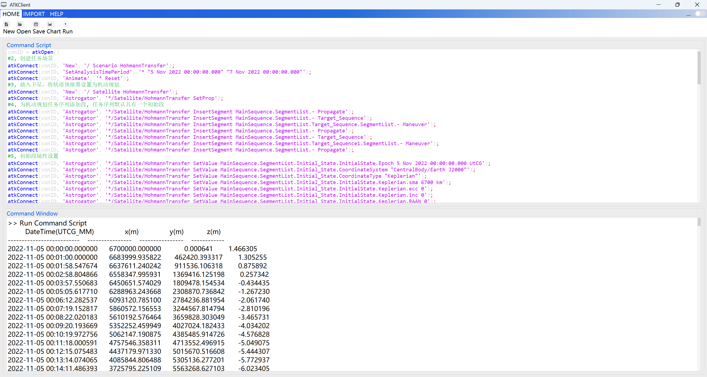

# Hohmann Transfer

Through the secondary development Connect mode, create a Hohmann transfer scenario. ATK must remain open. The specific command categories include:

1. Connecting to ATK.
2. Creating a new scenario and setting its properties.
3. Creating a new satellite and setting its properties.
4. Creating a new maneuver planning mission sequence and setting its properties.
5. Running the maneuver planning sequence.
6. Viewing report data.
7. Saving the scenario and disconnecting from ATK.

## Script Demonstration

### Connecting to ATK

<mix-code lang="python">
# 1, Connect to ATK
conID = atkOpen()
</mix-code>

### Creating a New Scenario and Setting Its Properties

<mix-code lang="python">
# 2, Create the scenario
atkConnect(conID, 'New', '/ Scenario HohmannTransfer')
atkConnect(conID, 'SetAnalysisTimePeriod', '* "5 Nov 2022 00:00:00.000" "7 Nov 2022 00:00:00.000"')
atkConnect(conID, 'Animate', '* Reset')
</mix-code>

### Creating a New Satellite and Setting Its Properties

<mix-code lang="python">
# 3, Insert a satellite and set the orbit propagator to Maneuver Planning
atkConnect(conID, 'New', '/ Satellite HohmannTransfer')
atkConnect(conID, 'Astrogator', '*/Satellite/HohmannTransfer SetProp')
</mix-code>

### Creating a New Maneuver Planning Mission Sequence and Setting Its Properties

<mix-code lang="python">
# 4, Add segments to the Maneuver Planning sequence; it has one initial segment by default
atkConnect(conID, 'Astrogator', '*/Satellite/HohmannTransfer InsertSegment MainSequence.SegmentList.- Propagate')
atkConnect(conID, 'Astrogator', '*/Satellite/HohmannTransfer InsertSegment MainSequence.SegmentList.- Target_Sequence')
atkConnect(conID, 'Astrogator', '*/Satellite/HohmannTransfer InsertSegment MainSequence.SegmentList.Target_Sequence.SegmentList.- Maneuver')
atkConnect(conID, 'Astrogator', '*/Satellite/HohmannTransfer InsertSegment MainSequence.SegmentList.- Propagate')
atkConnect(conID, 'Astrogator', '*/Satellite/HohmannTransfer InsertSegment MainSequence.SegmentList.- Target_Sequence')
atkConnect(conID, 'Astrogator', '*/Satellite/HohmannTransfer InsertSegment MainSequence.SegmentList.Target_Sequence1.SegmentList.- Maneuver')
atkConnect(conID, 'Astrogator', '*/Satellite/HohmannTransfer InsertSegment MainSequence.SegmentList.- Propagate')

# 5, Initial segment property settings
atkConnect(conID, 'Astrogator', '*/Satellite/HohmannTransfer SetValue MainSequence.SegmentList.Initial_State.InitialState.Epoch 5 Nov 2022 00:00:00.000 UTCG')
atkConnect(conID, 'Astrogator', '*/Satellite/HohmannTransfer SetValue MainSequence.SegmentList.Initial_State.CoordinateSystem "CentralBody/Earth J2000"')
atkConnect(conID, 'Astrogator', '*/Satellite/HohmannTransfer SetValue MainSequence.SegmentList.Initial_State.CoordinateType "Keplerian"')
atkConnect(conID, 'Astrogator', '*/Satellite/HohmannTransfer SetValue MainSequence.SegmentList.Initial_State.InitialState.Keplerian.sma 6700 km')
atkConnect(conID, 'Astrogator', '*/Satellite/HohmannTransfer SetValue MainSequence.SegmentList.Initial_State.InitialState.Keplerian.ecc 0')
atkConnect(conID, 'Astrogator', '*/Satellite/HohmannTransfer SetValue MainSequence.SegmentList.Initial_State.InitialState.Keplerian.inc 0')
atkConnect(conID, 'Astrogator', '*/Satellite/HohmannTransfer SetValue MainSequence.SegmentList.Initial_State.InitialState.Keplerian.RAAN 0')
atkConnect(conID, 'Astrogator', '*/Satellite/HohmannTransfer SetValue MainSequence.SegmentList.Initial_State.InitialState.Keplerian.w 0')
atkConnect(conID, 'Astrogator', '*/Satellite/HohmannTransfer SetValue MainSequence.SegmentList.Initial_State.InitialState.Keplerian.TA 0')

# 6, First propagation segment property settings
atkConnect(conID, 'Astrogator', '*/Satellite/HohmannTransfer SetValue MainSequence.SegmentList.Propagate.SegmentColor -16776961')
atkConnect(conID, 'Astrogator', '*/Satellite/HohmannTransfer SetValue MainSequence.SegmentList.Propagate.CentralBodyCode 2')
atkConnect(conID, 'Astrogator', '*/Satellite/HohmannTransfer SetValue MainSequence.SegmentList.Propagate.ForceModel.Gravity.GravModel JGM3')
atkConnect(conID, 'Astrogator', '*/Satellite/HohmannTransfer SetValue MainSequence.SegmentList.Propagate.ForceModel.Drag.UseDrag true')
atkConnect(conID, 'Astrogator', '*/Satellite/HohmannTransfer SetValue MainSequence.SegmentList.Propagate.ForceModel.SRP.UseSRP true')
atkConnect(conID, 'Astrogator', '*/Satellite/HohmannTransfer SetValue MainSequence.SegmentList.Propagate.ForceModel.ThirdBodies.Moon.UseGravity true')
atkConnect(conID, 'Astrogator', '*/Satellite/HohmannTransfer SetValue MainSequence.SegmentList.Propagate.ForceModel.ThirdBodies.Sun.UseGravity true')
atkConnect(conID, 'Astrogator', '*/Satellite/HohmannTransfer SetValue MainSequence.SegmentList.Propagate.StoppingConditions Duration')
atkConnect(conID, 'Astrogator', '*/Satellite/HohmannTransfer SetValue MainSequence.SegmentList.Propagate.StoppingConditions.Duration.TripValue 7200 sec')

# 7, First target sequence segment and its maneuver segment property settings
atkConnect(conID, 'Astrogator', '*/Satellite/HohmannTransfer SetValue MainSequence.SegmentList.Target_Sequence.SegmentList.Maneuver.SegmentColor 4278212095')
# Set maneuver segment properties, including maneuver type, thrust axes, target variables, and design variables
atkConnect(conID, 'Astrogator', '*/Satellite/HohmannTransfer SetValue MainSequence.SegmentList.Target_Sequence.SegmentList.Maneuver.Results "Radius Of Apoapsis"')
atkConnect(conID, 'Astrogator', '*/Satellite/HohmannTransfer SetValue MainSequence.SegmentList.Target_Sequence.SegmentList.Maneuver.ImpulsiveMnvr.ThrustAxes "Satellite/HohmannTransfer VNC"')
atkConnect(conID, 'Astrogator', '*/Satellite/HohmannTransfer SetValue MainSequence.SegmentList.Target_Sequence.SegmentList.Maneuver.ImpulsiveMnvr.CoordType Cartesian')
atkConnect(conID, 'Astrogator', '*/Satellite/HohmannTransfer AddMCSSegmentControl MainSequence.SegmentList.Target_Sequence.SegmentList.Maneuver ImpulsiveMnvr.Cartesian.X')
# Add a differential correction targeter to the target sequence segment
atkConnect(conID, 'Astrogator', '*/Satellite/HohmannTransfer SetValue MainSequence.SegmentList.Target_Sequence.Profiles Differential_Corrector')
# Configure the control variable properties of the differential correction targeter
atkConnect(conID, 'Astrogator', '*/Satellite/HohmannTransfer SetMCSControlValue MainSequence.SegmentList.Target_Sequence.Profiles.Differential_Corrector Maneuver ImpulsiveMnvr.Cartesian.X Active true')
atkConnect(conID, 'Astrogator', '*/Satellite/HohmannTransfer SetMCSControlValue MainSequence.SegmentList.Target_Sequence.Profiles.Differential_Corrector Maneuver ImpulsiveMnvr.Cartesian.X MaxStep 100')
atkConnect(conID, 'Astrogator', '*/Satellite/HohmannTransfer SetMCSControlValue MainSequence.SegmentList.Target_Sequence.Profiles.Differential_Corrector Maneuver ImpulsiveMnvr.Cartesian.X Pert 0.1')
atkConnect(conID, 'Astrogator', '*/Satellite/HohmannTransfer SetMCSControlValue MainSequence.SegmentList.Target_Sequence.Profiles.Differential_Corrector Maneuver ImpulsiveMnvr.Cartesian.X Scale 1')
# Configure the constraint properties of the differential correction targeter
atkConnect(conID, 'Astrogator', '*/Satellite/HohmannTransfer SetValue MainSequence.SegmentList.Target_Sequence.SegmentList.Maneuver.Results "Radius Of Apoapsis"')
atkConnect(conID, 'Astrogator', '*/Satellite/HohmannTransfer SetMCSConstraintValue MainSequence.SegmentList.Target_Sequence.Profiles.Differential_Corrector Maneuver StateCalcRadiusOfApoapsis Active true')
atkConnect(conID, 'Astrogator', '*/Satellite/HohmannTransfer SetMCSConstraintValue MainSequence.SegmentList.Target_Sequence.Profiles.Differential_Corrector Maneuver StateCalcRadiusOfApoapsis Desired 42238 km')
atkConnect(conID, 'Astrogator', '*/Satellite/HohmannTransfer SetMCSConstraintValue MainSequence.SegmentList.Target_Sequence.Profiles.Differential_Corrector Maneuver StateCalcRadiusOfApoapsis Tolerance 100 m')
atkConnect(conID, 'Astrogator', '*/Satellite/HohmannTransfer SetMCSConstraintValue MainSequence.SegmentList.Target_Sequence.Profiles.Differential_Corrector Maneuver StateCalcRadiusOfApoapsis Scale 1 m')
atkConnect(conID, 'Astrogator', '*/Satellite/HohmannTransfer SetMCSConstraintValue MainSequence.SegmentList.Target_Sequence.Profiles.Differential_Corrector Maneuver StateCalcRadiusOfApoapsis Weight 1')

# 8, Second propagation segment property settings
atkConnect(conID, 'Astrogator', '*/Satellite/HohmannTransfer SetValue MainSequence.SegmentList.Propagate1.SegmentColor -16711936')
atkConnect(conID, 'Astrogator', '*/Satellite/HohmannTransfer SetValue MainSequence.SegmentList.Propagate1.CentralBodyCode 2')
atkConnect(conID, 'Astrogator', '*/Satellite/HohmannTransfer SetValue MainSequence.SegmentList.Propagate1.ForceModel.Gravity.GravModel JGM3')
atkConnect(conID, 'Astrogator', '*/Satellite/HohmannTransfer SetValue MainSequence.SegmentList.Propagate1.ForceModel.Drag.UseDrag true')
atkConnect(conID, 'Astrogator', '*/Satellite/HohmannTransfer SetValue MainSequence.SegmentList.Propagate1.ForceModel.SRP.UseSRP true')
atkConnect(conID, 'Astrogator', '*/Satellite/HohmannTransfer SetValue MainSequence.SegmentList.Propagate1.ForceModel.ThirdBodies.Moon.UseGravity true')
atkConnect(conID, 'Astrogator', '*/Satellite/HohmannTransfer SetValue MainSequence.SegmentList.Propagate1.ForceModel.ThirdBodies.Sun.UseGravity true')
atkConnect(conID, 'Astrogator', '*/Satellite/HohmannTransfer SetValue MainSequence.SegmentList.Propagate1.StoppingConditions Apoapsis')
# atkConnect(conID, 'Astrogator', '*/Satellite/HohmannTransfer SetValue MainSequence.SegmentList.Propagate1.StoppingConditions.Apoapsis.TripValue 0');

# 9, Second target sequence segment and its maneuver segment property settings
atkConnect(conID, 'Astrogator', '*/Satellite/HohmannTransfer SetValue MainSequence.SegmentList.Target_Sequence1.SegmentList.Maneuver.SegmentColor 4278212095')
# Set maneuver segment properties, including maneuver type, thrust axes, target variables, and design variables
atkConnect(conID, 'Astrogator', '*/Satellite/HohmannTransfer SetValue MainSequence.SegmentList.Target_Sequence1.SegmentList.Maneuver.Results "Eccentricity"')
atkConnect(conID, 'Astrogator', '*/Satellite/HohmannTransfer SetValue MainSequence.SegmentList.Target_Sequence1.SegmentList.Maneuver.ImpulsiveMnvr.ThrustAxes "Satellite/HohmannTransfer VNC"')
atkConnect(conID, 'Astrogator', '*/Satellite/HohmannTransfer SetValue MainSequence.SegmentList.Target_Sequence1.SegmentList.Maneuver.ImpulsiveMnvr.CoordType Cartesian')
atkConnect(conID, 'Astrogator', '*/Satellite/HohmannTransfer AddMCSSegmentControl MainSequence.SegmentList.Target_Sequence1.SegmentList.Maneuver ImpulsiveMnvr.Cartesian.X')
# Add a differential correction targeter to the target sequence segment
atkConnect(conID, 'Astrogator', '*/Satellite/HohmannTransfer SetValue MainSequence.SegmentList.Target_Sequence1.Profiles Differential_Corrector')
# Configure the control variable properties of the differential correction targeter
atkConnect(conID, 'Astrogator', '*/Satellite/HohmannTransfer SetMCSControlValue MainSequence.SegmentList.Target_Sequence1.Profiles.Differential_Corrector Maneuver ImpulsiveMnvr.Cartesian.X Active true')
atkConnect(conID, 'Astrogator', '*/Satellite/HohmannTransfer SetMCSControlValue MainSequence.SegmentList.Target_Sequence1.Profiles.Differential_Corrector Maneuver ImpulsiveMnvr.Cartesian.X MaxStep 100')
atkConnect(conID, 'Astrogator', '*/Satellite/HohmannTransfer SetMCSControlValue MainSequence.SegmentList.Target_Sequence1.Profiles.Differential_Corrector Maneuver ImpulsiveMnvr.Cartesian.X Pert 0.1')
atkConnect(conID, 'Astrogator', '*/Satellite/HohmannTransfer SetMCSControlValue MainSequence.SegmentList.Target_Sequence1.Profiles.Differential_Corrector Maneuver ImpulsiveMnvr.Cartesian.X Scale 1')
# Configure the constraint properties of the differential correction targeter
atkConnect(conID, 'Astrogator', '*/Satellite/HohmannTransfer SetValue MainSequence.SegmentList.Target_Sequence1.SegmentList.Maneuver.Results "Eccentricity"')
atkConnect(conID, 'Astrogator', '*/Satellite/HohmannTransfer SetMCSConstraintValue MainSequence.SegmentList.Target_Sequence1.Profiles.Differential_Corrector Maneuver StateCalcEccentricity Active true')
atkConnect(conID, 'Astrogator', '*/Satellite/HohmannTransfer SetMCSConstraintValue MainSequence.SegmentList.Target_Sequence1.Profiles.Differential_Corrector Maneuver StateCalcEccentricity Desired 0')
atkConnect(conID, 'Astrogator', '*/Satellite/HohmannTransfer SetMCSConstraintValue MainSequence.SegmentList.Target_Sequence1.Profiles.Differential_Corrector Maneuver StateCalcEccentricity Tolerance 0.001')
atkConnect(conID, 'Astrogator', '*/Satellite/HohmannTransfer SetMCSConstraintValue MainSequence.SegmentList.Target_Sequence1.Profiles.Differential_Corrector Maneuver StateCalcEccentricity Scale 1')
atkConnect(conID, 'Astrogator', '*/Satellite/HohmannTransfer SetMCSConstraintValue MainSequence.SegmentList.Target_Sequence1.Profiles.Differential_Corrector Maneuver StateCalcEccentricity Weight 1')

# 10, Third propagation segment property settings
atkConnect(conID, 'Astrogator', '*/Satellite/HohmannTransfer SetValue MainSequence.SegmentList.Propagate2.SegmentColor -65536')
atkConnect(conID, 'Astrogator', '*/Satellite/HohmannTransfer SetValue MainSequence.SegmentList.Propagate2.CentralBodyCode 2')
atkConnect(conID, 'Astrogator', '*/Satellite/HohmannTransfer SetValue MainSequence.SegmentList.Propagate2.ForceModel.Gravity.GravModel JGM3')
atkConnect(conID, 'Astrogator', '*/Satellite/HohmannTransfer SetValue MainSequence.SegmentList.Propagate2.ForceModel.Drag.UseDrag true')
atkConnect(conID, 'Astrogator', '*/Satellite/HohmannTransfer SetValue MainSequence.SegmentList.Propagate2.ForceModel.SRP.UseSRP true')
atkConnect(conID, 'Astrogator', '*/Satellite/HohmannTransfer SetValue MainSequence.SegmentList.Propagate2.ForceModel.ThirdBodies.Moon.UseGravity true')
atkConnect(conID, 'Astrogator', '*/Satellite/HohmannTransfer SetValue MainSequence.SegmentList.Propagate2.ForceModel.ThirdBodies.Sun.UseGravity true')
atkConnect(conID, 'Astrogator', '*/Satellite/HohmannTransfer SetValue MainSequence.SegmentList.Propagate2.StoppingConditions Duration')
atkConnect(conID, 'Astrogator', '*/Satellite/HohmannTransfer SetValue MainSequence.SegmentList.Propagate2.StoppingConditions.Duration.TripValue 172800 sec')
</mix-code>

### Running the Maneuver Planning Sequence

<mix-code lang="python">
# 11, Run the mission control sequence
atkConnect(conID, 'Astrogator', '*/Satellite/HohmannTransfer RunMCS')
atkConnect(conID, 'Animate', '* Reset')
atkConnect(conID, 'Astrogator', '*/Satellite/HohmannTransfer ApplyAllProfileChanges')
</mix-code>

### Viewing Report Data

<mix-code lang="python">
# 12, View the report data
atkConnect(conID, 'Report_RM', '*/Satellite/HohmannTransfer Style "Position" TimePeriod "5 Nov 2022 00:00:00.000" "7 Nov 2022 00:00:00.000"')
</mix-code>

### Saving the Scenario and Disconnecting from ATK

<mix-code lang="python">
# 13, Save the scenario
atkConnect(conID, 'Save', '/ *')
atkClose(conID)
</mix-code>

## Report Data Results

The complete mission sequence created by the script is shown below:

The report data results are shown below:

## Complete Script

<mix-code lang="python">
# 1, Connect to ATK
conID = atkOpen()

# 2, Create the scenario
atkConnect(conID, 'New', '/ Scenario HohmannTransfer')
atkConnect(conID, 'SetAnalysisTimePeriod', '* "5 Nov 2022 00:00:00.000" "7 Nov 2022 00:00:00.000"')
atkConnect(conID, 'Animate', '* Reset')

# 3, Insert a satellite and set the orbit propagator to Maneuver Planning
atkConnect(conID, 'New', '/ Satellite HohmannTransfer')
atkConnect(conID, 'Astrogator', '*/Satellite/HohmannTransfer SetProp')

# 4, Add segments to the Maneuver Planning sequence; it has one initial segment by default
atkConnect(conID, 'Astrogator', '*/Satellite/HohmannTransfer InsertSegment MainSequence.SegmentList.- Propagate')
atkConnect(conID, 'Astrogator', '*/Satellite/HohmannTransfer InsertSegment MainSequence.SegmentList.- Target_Sequence')
atkConnect(conID, 'Astrogator', '*/Satellite/HohmannTransfer InsertSegment MainSequence.SegmentList.Target_Sequence.SegmentList.- Maneuver')
atkConnect(conID, 'Astrogator', '*/Satellite/HohmannTransfer InsertSegment MainSequence.SegmentList.- Propagate')
atkConnect(conID, 'Astrogator', '*/Satellite/HohmannTransfer InsertSegment MainSequence.SegmentList.- Target_Sequence')
atkConnect(conID, 'Astrogator', '*/Satellite/HohmannTransfer InsertSegment MainSequence.SegmentList.Target_Sequence1.SegmentList.- Maneuver')
atkConnect(conID, 'Astrogator', '*/Satellite/HohmannTransfer InsertSegment MainSequence.SegmentList.- Propagate')

# 5, Initial segment property settings
atkConnect(conID, 'Astrogator', '*/Satellite/HohmannTransfer SetValue MainSequence.SegmentList.Initial_State.InitialState.Epoch 5 Nov 2022 00:00:00.000 UTCG')
atkConnect(conID, 'Astrogator', '*/Satellite/HohmannTransfer SetValue MainSequence.SegmentList.Initial_State.CoordinateSystem "CentralBody/Earth J2000"')
atkConnect(conID, 'Astrogator', '*/Satellite/HohmannTransfer SetValue MainSequence.SegmentList.Initial_State.CoordinateType "Keplerian"')
atkConnect(conID, 'Astrogator', '*/Satellite/HohmannTransfer SetValue MainSequence.SegmentList.Initial_State.InitialState.Keplerian.sma 6700 km')
atkConnect(conID, 'Astrogator', '*/Satellite/HohmannTransfer SetValue MainSequence.SegmentList.Initial_State.InitialState.Keplerian.ecc 0')
atkConnect(conID, 'Astrogator', '*/Satellite/HohmannTransfer SetValue MainSequence.SegmentList.Initial_State.InitialState.Keplerian.inc 0')
atkConnect(conID, 'Astrogator', '*/Satellite/HohmannTransfer SetValue MainSequence.SegmentList.Initial_State.InitialState.Keplerian.RAAN 0')
atkConnect(conID, 'Astrogator', '*/Satellite/HohmannTransfer SetValue MainSequence.SegmentList.Initial_State.InitialState.Keplerian.w 0')
atkConnect(conID, 'Astrogator', '*/Satellite/HohmannTransfer SetValue MainSequence.SegmentList.Initial_State.InitialState.Keplerian.TA 0')

# 6, First propagation segment property settings
atkConnect(conID, 'Astrogator', '*/Satellite/HohmannTransfer SetValue MainSequence.SegmentList.Propagate.SegmentColor -16776961')
atkConnect(conID, 'Astrogator', '*/Satellite/HohmannTransfer SetValue MainSequence.SegmentList.Propagate.CentralBodyCode 2')
atkConnect(conID, 'Astrogator', '*/Satellite/HohmannTransfer SetValue MainSequence.SegmentList.Propagate.ForceModel.Gravity.GravModel JGM3')
atkConnect(conID, 'Astrogator', '*/Satellite/HohmannTransfer SetValue MainSequence.SegmentList.Propagate.ForceModel.Drag.UseDrag true')
atkConnect(conID, 'Astrogator', '*/Satellite/HohmannTransfer SetValue MainSequence.SegmentList.Propagate.ForceModel.SRP.UseSRP true')
atkConnect(conID, 'Astrogator', '*/Satellite/HohmannTransfer SetValue MainSequence.SegmentList.Propagate.ForceModel.ThirdBodies.Moon.UseGravity true')
atkConnect(conID, 'Astrogator', '*/Satellite/HohmannTransfer SetValue MainSequence.SegmentList.Propagate.ForceModel.ThirdBodies.Sun.UseGravity true')
atkConnect(conID, 'Astrogator', '*/Satellite/HohmannTransfer SetValue MainSequence.SegmentList.Propagate.StoppingConditions Duration')
atkConnect(conID, 'Astrogator', '*/Satellite/HohmannTransfer SetValue MainSequence.SegmentList.Propagate.StoppingConditions.Duration.TripValue 7200 sec')

# 7, First target sequence segment and its maneuver segment property settings
atkConnect(conID, 'Astrogator', '*/Satellite/HohmannTransfer SetValue MainSequence.SegmentList.Target_Sequence.SegmentList.Maneuver.SegmentColor 4278212095')
atkConnect(conID, 'Astrogator', '*/Satellite/HohmannTransfer SetValue MainSequence.SegmentList.Target_Sequence.SegmentList.Maneuver.Results "Radius Of Apoapsis"')
atkConnect(conID, 'Astrogator', '*/Satellite/HohmannTransfer SetValue MainSequence.SegmentList.Target_Sequence.SegmentList.Maneuver.ImpulsiveMnvr.ThrustAxes "Satellite/HohmannTransfer VNC"')
atkConnect(conID, 'Astrogator', '*/Satellite/HohmannTransfer SetValue MainSequence.SegmentList.Target_Sequence.SegmentList.Maneuver.ImpulsiveMnvr.CoordType Cartesian')
atkConnect(conID, 'Astrogator', '*/Satellite/HohmannTransfer AddMCSSegmentControl MainSequence.SegmentList.Target_Sequence.SegmentList.Maneuver ImpulsiveMnvr.Cartesian.X')
atkConnect(conID, 'Astrogator', '*/Satellite/HohmannTransfer SetValue MainSequence.SegmentList.Target_Sequence.Profiles Differential_Corrector')
atkConnect(conID, 'Astrogator', '*/Satellite/HohmannTransfer SetMCSControlValue MainSequence.SegmentList.Target_Sequence.Profiles.Differential_Corrector Maneuver ImpulsiveMnvr.Cartesian.X Active true')
atkConnect(conID, 'Astrogator', '*/Satellite/HohmannTransfer SetMCSControlValue MainSequence.SegmentList.Target_Sequence.Profiles.Differential_Corrector Maneuver ImpulsiveMnvr.Cartesian.X MaxStep 100')
atkConnect(conID, 'Astrogator', '*/Satellite/HohmannTransfer SetMCSControlValue MainSequence.SegmentList.Target_Sequence.Profiles.Differential_Corrector Maneuver ImpulsiveMnvr.Cartesian.X Pert 0.1')
atkConnect(conID, 'Astrogator', '*/Satellite/HohmannTransfer SetMCSControlValue MainSequence.SegmentList.Target_Sequence.Profiles.Differential_Corrector Maneuver ImpulsiveMnvr.Cartesian.X Scale 1')
atkConnect(conID, 'Astrogator', '*/Satellite/HohmannTransfer SetValue MainSequence.SegmentList.Target_Sequence.SegmentList.Maneuver.Results "Radius Of Apoapsis"')
atkConnect(conID, 'Astrogator', '*/Satellite/HohmannTransfer SetMCSConstraintValue MainSequence.SegmentList.Target_Sequence.Profiles.Differential_Corrector Maneuver StateCalcRadiusOfApoapsis Active true')
atkConnect(conID, 'Astrogator', '*/Satellite/HohmannTransfer SetMCSConstraintValue MainSequence.SegmentList.Target_Sequence.Profiles.Differential_Corrector Maneuver StateCalcRadiusOfApoapsis Desired 42238 km')
atkConnect(conID, 'Astrogator', '*/Satellite/HohmannTransfer SetMCSConstraintValue MainSequence.SegmentList.Target_Sequence.Profiles.Differential_Corrector Maneuver StateCalcRadiusOfApoapsis Tolerance 100 m')
atkConnect(conID, 'Astrogator', '*/Satellite/HohmannTransfer SetMCSConstraintValue MainSequence.SegmentList.Target_Sequence.Profiles.Differential_Corrector Maneuver StateCalcRadiusOfApoapsis Scale 1 m')
atkConnect(conID, 'Astrogator', '*/Satellite/HohmannTransfer SetMCSConstraintValue MainSequence.SegmentList.Target_Sequence.Profiles.Differential_Corrector Maneuver StateCalcRadiusOfApoapsis Weight 1')

# 8, Second propagation segment property settings
atkConnect(conID, 'Astrogator', '*/Satellite/HohmannTransfer SetValue MainSequence.SegmentList.Propagate1.SegmentColor -16711936')
atkConnect(conID, 'Astrogator', '*/Satellite/HohmannTransfer SetValue MainSequence.SegmentList.Propagate1.CentralBodyCode 2')
atkConnect(conID, 'Astrogator', '*/Satellite/HohmannTransfer SetValue MainSequence.SegmentList.Propagate1.ForceModel.Gravity.GravModel JGM3')
atkConnect(conID, 'Astrogator', '*/Satellite/HohmannTransfer SetValue MainSequence.SegmentList.Propagate1.ForceModel.Drag.UseDrag true')
atkConnect(conID, 'Astrogator', '*/Satellite/HohmannTransfer SetValue MainSequence.SegmentList.Propagate1.ForceModel.SRP.UseSRP true')
atkConnect(conID, 'Astrogator', '*/Satellite/HohmannTransfer SetValue MainSequence.SegmentList.Propagate1.ForceModel.ThirdBodies.Moon.UseGravity true')
atkConnect(conID, 'Astrogator', '*/Satellite/HohmannTransfer SetValue MainSequence.SegmentList.Propagate1.ForceModel.ThirdBodies.Sun.UseGravity true')
atkConnect(conID, 'Astrogator', '*/Satellite/HohmannTransfer SetValue MainSequence.SegmentList.Propagate1.StoppingConditions Apoapsis')

# 9, Second target sequence segment and its maneuver segment property settings
atkConnect(conID, 'Astrogator', '*/Satellite/HohmannTransfer SetValue MainSequence.SegmentList.Target_Sequence1.SegmentList.Maneuver.SegmentColor 4278212095')
atkConnect(conID, 'Astrogator', '*/Satellite/HohmannTransfer SetValue MainSequence.SegmentList.Target_Sequence1.SegmentList.Maneuver.Results "Eccentricity"')
atkConnect(conID, 'Astrogator', '*/Satellite/HohmannTransfer SetValue MainSequence.SegmentList.Target_Sequence1.SegmentList.Maneuver.ImpulsiveMnvr.ThrustAxes "Satellite/HohmannTransfer VNC"')
atkConnect(conID, 'Astrogator', '*/Satellite/HohmannTransfer SetValue MainSequence.SegmentList.Target_Sequence1.SegmentList.Maneuver.ImpulsiveMnvr.CoordType Cartesian')
atkConnect(conID, 'Astrogator', '*/Satellite/HohmannTransfer AddMCSSegmentControl MainSequence.SegmentList.Target_Sequence1.SegmentList.Maneuver ImpulsiveMnvr.Cartesian.X')
atkConnect(conID, 'Astrogator', '*/Satellite/HohmannTransfer SetValue MainSequence.SegmentList.Target_Sequence1.Profiles Differential_Corrector')
atkConnect(conID, 'Astrogator', '*/Satellite/HohmannTransfer SetMCSControlValue MainSequence.SegmentList.Target_Sequence1.Profiles.Differential_Corrector Maneuver ImpulsiveMnvr.Cartesian.X Active true')
atkConnect(conID, 'Astrogator', '*/Satellite/HohmannTransfer SetMCSControlValue MainSequence.SegmentList.Target_Sequence1.Profiles.Differential_Corrector Maneuver ImpulsiveMnvr.Cartesian.X MaxStep 100')
atkConnect(conID, 'Astrogator', '*/Satellite/HohmannTransfer SetMCSControlValue MainSequence.SegmentList.Target_Sequence1.Profiles.Differential_Corrector Maneuver ImpulsiveMnvr.Cartesian.X Pert 0.1')
atkConnect(conID, 'Astrogator', '*/Satellite/HohmannTransfer SetMCSControlValue MainSequence.SegmentList.Target_Sequence1.Profiles.Differential_Corrector Maneuver ImpulsiveMnvr.Cartesian.X Scale 1')
atkConnect(conID, 'Astrogator', '*/Satellite/HohmannTransfer SetValue MainSequence.SegmentList.Target_Sequence1.SegmentList.Maneuver.Results "Eccentricity"')
atkConnect(conID, 'Astrogator', '*/Satellite/HohmannTransfer SetMCSConstraintValue MainSequence.SegmentList.Target_Sequence1.Profiles.Differential_Corrector Maneuver StateCalcEccentricity Active true')
atkConnect(conID, 'Astrogator', '*/Satellite/HohmannTransfer SetMCSConstraintValue MainSequence.SegmentList.Target_Sequence1.Profiles.Differential_Corrector Maneuver StateCalcEccentricity Desired 0')
atkConnect(conID, 'Astrogator', '*/Satellite/HohmannTransfer SetMCSConstraintValue MainSequence.SegmentList.Target_Sequence1.Profiles.Differential_Corrector Maneuver StateCalcEccentricity Tolerance 0.001')
atkConnect(conID, 'Astrogator', '*/Satellite/HohmannTransfer SetMCSConstraintValue MainSequence.SegmentList.Target_Sequence1.Profiles.Differential_Corrector Maneuver StateCalcEccentricity Scale 1')
atkConnect(conID, 'Astrogator', '*/Satellite/HohmannTransfer SetMCSConstraintValue MainSequence.SegmentList.Target_Sequence1.Profiles.Differential_Corrector Maneuver StateCalcEccentricity Weight 1')

# 10, Third propagation segment property settings
atkConnect(conID, 'Astrogator', '*/Satellite/HohmannTransfer SetValue MainSequence.SegmentList.Propagate2.SegmentColor -65536')
atkConnect(conID, 'Astrogator', '*/Satellite/HohmannTransfer SetValue MainSequence.SegmentList.Propagate2.CentralBodyCode 2')
atkConnect(conID, 'Astrogator', '*/Satellite/HohmannTransfer SetValue MainSequence.SegmentList.Propagate2.ForceModel.Gravity.GravModel JGM3')
atkConnect(conID, 'Astrogator', '*/Satellite/HohmannTransfer SetValue MainSequence.SegmentList.Propagate2.ForceModel.Drag.UseDrag true')
atkConnect(conID, 'Astrogator', '*/Satellite/HohmannTransfer SetValue MainSequence.SegmentList.Propagate2.ForceModel.SRP.UseSRP true')
atkConnect(conID, 'Astrogator', '*/Satellite/HohmannTransfer SetValue MainSequence.SegmentList.Propagate2.ForceModel.ThirdBodies.Moon.UseGravity true')
atkConnect(conID, 'Astrogator', '*/Satellite/HohmannTransfer SetValue MainSequence.SegmentList.Propagate2.ForceModel.ThirdBodies.Sun.UseGravity true')
atkConnect(conID, 'Astrogator', '*/Satellite/HohmannTransfer SetValue MainSequence.SegmentList.Propagate2.StoppingConditions Duration')
atkConnect(conID, 'Astrogator', '*/Satellite/HohmannTransfer SetValue MainSequence.SegmentList.Propagate2.StoppingConditions.Duration.TripValue 172800 sec')

# 11, Run the mission control sequence
atkConnect(conID, 'Astrogator', '*/Satellite/HohmannTransfer RunMCS')
atkConnect(conID, 'Animate', '* Reset')
atkConnect(conID, 'Astrogator', '*/Satellite/HohmannTransfer ApplyAllProfileChanges')

# 12, View the report data
atkConnect(conID, 'Report_RM', '*/Satellite/HohmannTransfer Style "Position" TimePeriod "5 Nov 2022 00:00:00.000" "7 Nov 2022 00:00:00.000"')

# 13, Save the scenario
atkConnect(conID, 'Save', '/ *')
atkClose(conID)
</mix-code>