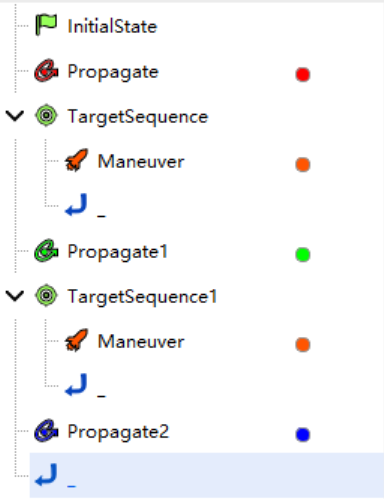
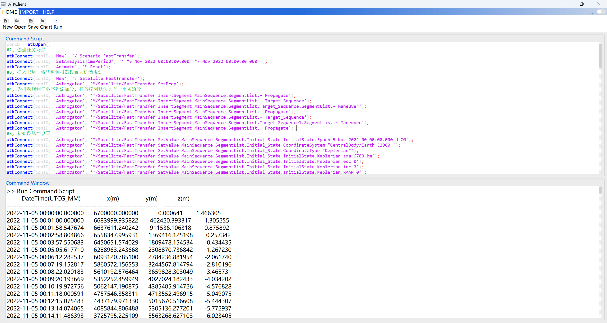

# LEO to GEO Fast Transfer Orbit

Through the secondary development Connect mode, create a fast orbit transfer scenario from low Earth orbit (LEO) to geostationary orbit (GEO). ATK must remain open. The specific command categories include:

1. Connecting to ATK.
2. Creating a new scenario and setting its properties.
3. Creating a new satellite and setting its properties.
4. Creating a new maneuver planning mission sequence and setting its properties.
5. Running the maneuver planning sequence.
6. Viewing report data.
7. Saving the scenario and disconnecting from ATK.

## Script Demonstration

### Connecting to ATK

```mixcode
{C:1, 与 ATK 进行连接}
conID = atkOpen()
```

### Creating a New Scenario and Setting Its Properties

```mixcode
{C:2, 创建任务场景}
atkConnect(conID, {S:New}, {S:/ Scenario FastTransfer})
atkConnect(conID, {S:SetAnalysisTimePeriod}, {S:* "5 Nov 2022 00:00:00.000" "7 Nov 2022 00:00:00.000"})
atkConnect(conID, {S:Animate}, {S:* Reset})
```

### Creating a New Satellite and Setting Its Properties

```mixcode
{C:3, 插入卫星，将轨道预报器设置为机动规划}
atkConnect(conID, {S:New}, {S:/ Satellite FastTransfer})
atkConnect(conID, {S:Astrogator}, {S:*/Satellite/FastTransfer SetProp})
```

### Creating a New Maneuver Planning Mission Sequence and Setting Its Properties

```mixcode
{C:4, 为机动规划任务序列添加段, 任务序列默认具有一个初始段}
atkConnect(conID, {S:Astrogator}, {S:*/Satellite/FastTransfer InsertSegment MainSequence.SegmentList.- Propagate})
atkConnect(conID, {S:Astrogator}, {S:*/Satellite/FastTransfer InsertSegment MainSequence.SegmentList.- Target_Sequence})
atkConnect(conID, {S:Astrogator}, {S:*/Satellite/FastTransfer InsertSegment MainSequence.SegmentList.Target_Sequence.SegmentList.- Maneuver})
atkConnect(conID, {S:Astrogator}, {S:*/Satellite/FastTransfer InsertSegment MainSequence.SegmentList.- Propagate})
atkConnect(conID, {S:Astrogator}, {S:*/Satellite/FastTransfer InsertSegment MainSequence.SegmentList.- Target_Sequence})
atkConnect(conID, {S:Astrogator}, {S:*/Satellite/FastTransfer InsertSegment MainSequence.SegmentList.Target_Sequence1.SegmentList.- Maneuver})
atkConnect(conID, {S:Astrogator}, {S:*/Satellite/FastTransfer InsertSegment MainSequence.SegmentList.- Propagate})

{C:5, 初始段属性设置}
atkConnect(conID, {S:Astrogator}, {S:*/Satellite/FastTransfer SetValue MainSequence.SegmentList.Initial_State.InitialState.Epoch 5 Nov 2022 00:00:00.000 UTCG})
atkConnect(conID, {S:Astrogator}, {S:*/Satellite/FastTransfer SetValue MainSequence.SegmentList.Initial_State.CoordinateSystem "CentralBody/Earth J2000"})
atkConnect(conID, {S:Astrogator}, {S:*/Satellite/FastTransfer SetValue MainSequence.SegmentList.Initial_State.CoordinateType "Keplerian"})
atkConnect(conID, {S:Astrogator}, {S:*/Satellite/FastTransfer SetValue MainSequence.SegmentList.Initial_State.InitialState.Keplerian.sma 6700 km})
atkConnect(conID, {S:Astrogator}, {S:*/Satellite/FastTransfer SetValue MainSequence.SegmentList.Initial_State.InitialState.Keplerian.ecc 0})
atkConnect(conID, {S:Astrogator}, {S:*/Satellite/FastTransfer SetValue MainSequence.SegmentList.Initial_State.InitialState.Keplerian.inc 0})
atkConnect(conID, {S:Astrogator}, {S:*/Satellite/FastTransfer SetValue MainSequence.SegmentList.Initial_State.InitialState.Keplerian.RAAN 0})
atkConnect(conID, {S:Astrogator}, {S:*/Satellite/FastTransfer SetValue MainSequence.SegmentList.Initial_State.InitialState.Keplerian.w 0})
atkConnect(conID, {S:Astrogator}, {S:*/Satellite/FastTransfer SetValue MainSequence.SegmentList.Initial_State.InitialState.Keplerian.TA 0})

{C:6, 第一个预报段属性设置}
atkConnect(conID, {S:Astrogator}, {S:*/Satellite/FastTransfer SetValue MainSequence.SegmentList.Propagate.SegmentColor -16776961})
atkConnect(conID, {S:Astrogator}, {S:*/Satellite/FastTransfer SetValue MainSequence.SegmentList.Propagate.CentralBodyCode 2})
atkConnect(conID, {S:Astrogator}, {S:*/Satellite/FastTransfer SetValue MainSequence.SegmentList.Propagate.ForceModel.Gravity.GravModel JGM3})
atkConnect(conID, {S:Astrogator}, {S:*/Satellite/FastTransfer SetValue MainSequence.SegmentList.Propagate.ForceModel.Drag.UseDrag true})
atkConnect(conID, {S:Astrogator}, {S:*/Satellite/FastTransfer SetValue MainSequence.SegmentList.Propagate.ForceModel.SRP.UseSRP true})
atkConnect(conID, {S:Astrogator}, {S:*/Satellite/FastTransfer SetValue MainSequence.SegmentList.Propagate.ForceModel.ThirdBodies.Moon.UseGravity true})
atkConnect(conID, {S:Astrogator}, {S:*/Satellite/FastTransfer SetValue MainSequence.SegmentList.Propagate.ForceModel.ThirdBodies.Sun.UseGravity true})
atkConnect(conID, {S:Astrogator}, {S:*/Satellite/FastTransfer SetValue MainSequence.SegmentList.Propagate.StoppingConditions Duration})
atkConnect(conID, {S:Astrogator}, {S:*/Satellite/FastTransfer SetValue MainSequence.SegmentList.Propagate.StoppingConditions.Duration.TripValue 7200 sec})

{C:7, 第一个瞄准序列段及其机动段属性设置}
atkConnect(conID, {S:Astrogator}, {S:*/Satellite/FastTransfer SetValue MainSequence.SegmentList.Target_Sequence.SegmentList.Maneuver.SegmentColor 4278212095})
{C:设置机动段属性，包括机动类型、推力坐标系、目标变量、设计变量}
atkConnect(conID, {S:Astrogator}, {S:*/Satellite/FastTransfer SetValue MainSequence.SegmentList.Target_Sequence.SegmentList.Maneuver.Results "Radius Of Apoapsis"})
atkConnect(conID, {S:Astrogator}, {S:*/Satellite/FastTransfer SetValue MainSequence.SegmentList.Target_Sequence.SegmentList.Maneuver.ImpulsiveMnvr.ThrustAxes "Satellite/FastTransfer VNC"})
atkConnect(conID, {S:Astrogator}, {S:*/Satellite/FastTransfer SetValue MainSequence.SegmentList.Target_Sequence.SegmentList.Maneuver.ImpulsiveMnvr.CoordType Cartesian})
atkConnect(conID, {S:Astrogator}, {S:*/Satellite/FastTransfer AddMCSSegmentControl MainSequence.SegmentList.Target_Sequence.SegmentList.Maneuver ImpulsiveMnvr.Cartesian.X})
{C:为瞄准序列段添加微分修正瞄准器}
atkConnect(conID, {S:Astrogator}, {S:*/Satellite/FastTransfer SetValue MainSequence.SegmentList.Target_Sequence.Profiles Differential_Corrector})
{C:配置微分修正瞄准器的控制变量属性}
atkConnect(conID, {S:Astrogator}, {S:*/Satellite/FastTransfer SetMCSControlValue MainSequence.SegmentList.Target_Sequence.Profiles.Differential_Corrector Maneuver ImpulsiveMnvr.Cartesian.X Active true})
atkConnect(conID, {S:Astrogator}, {S:*/Satellite/FastTransfer SetMCSControlValue MainSequence.SegmentList.Target_Sequence.Profiles.Differential_Corrector Maneuver ImpulsiveMnvr.Cartesian.X MaxStep 100})
atkConnect(conID, {S:Astrogator}, {S:*/Satellite/FastTransfer SetMCSControlValue MainSequence.SegmentList.Target_Sequence.Profiles.Differential_Corrector Maneuver ImpulsiveMnvr.Cartesian.X Pert 0.1})
atkConnect(conID, {S:Astrogator}, {S:*/Satellite/FastTransfer SetMCSControlValue MainSequence.SegmentList.Target_Sequence.Profiles.Differential_Corrector Maneuver ImpulsiveMnvr.Cartesian.X Scale 1})
{C:配置微分修正瞄准器的约束条件属性}
atkConnect(conID, {S:Astrogator}, {S:*/Satellite/FastTransfer SetValue MainSequence.SegmentList.Target_Sequence.SegmentList.Maneuver.Results "Radius Of Apoapsis"})
atkConnect(conID, {S:Astrogator}, {S:*/Satellite/FastTransfer SetMCSConstraintValue MainSequence.SegmentList.Target_Sequence.Profiles.Differential_Corrector Maneuver StateCalcRadiusOfApoapsis Active true})
atkConnect(conID, {S:Astrogator}, {S:*/Satellite/FastTransfer SetMCSConstraintValue MainSequence.SegmentList.Target_Sequence.Profiles.Differential_Corrector Maneuver StateCalcRadiusOfApoapsis Desired 84328394 m})
atkConnect(conID, {S:Astrogator}, {S:*/Satellite/FastTransfer SetMCSConstraintValue MainSequence.SegmentList.Target_Sequence.Profiles.Differential_Corrector Maneuver StateCalcRadiusOfApoapsis Tolerance 100 m})
atkConnect(conID, {S:Astrogator}, {S:*/Satellite/FastTransfer SetMCSConstraintValue MainSequence.SegmentList.Target_Sequence.Profiles.Differential_Corrector Maneuver StateCalcRadiusOfApoapsis Scale 1 m})
atkConnect(conID, {S:Astrogator}, {S:*/Satellite/FastTransfer SetMCSConstraintValue MainSequence.SegmentList.Target_Sequence.Profiles.Differential_Corrector Maneuver StateCalcRadiusOfApoapsis Weight 1})

{C:8, 第二个预报段属性设置}
atkConnect(conID, {S:Astrogator}, {S:*/Satellite/FastTransfer SetValue MainSequence.SegmentList.Propagate1.SegmentColor -16711936})
atkConnect(conID, {S:Astrogator}, {S:*/Satellite/FastTransfer SetValue MainSequence.SegmentList.Propagate1.CentralBodyCode 2})
atkConnect(conID, {S:Astrogator}, {S:*/Satellite/FastTransfer SetValue MainSequence.SegmentList.Propagate1.ForceModel.Gravity.GravModel JGM3})
atkConnect(conID, {S:Astrogator}, {S:*/Satellite/FastTransfer SetValue MainSequence.SegmentList.Propagate1.ForceModel.Drag.UseDrag true})
atkConnect(conID, {S:Astrogator}, {S:*/Satellite/FastTransfer SetValue MainSequence.SegmentList.Propagate1.ForceModel.SRP.UseSRP true})
atkConnect(conID, {S:Astrogator}, {S:*/Satellite/FastTransfer SetValue MainSequence.SegmentList.Propagate1.ForceModel.ThirdBodies.Moon.UseGravity true})
atkConnect(conID, {S:Astrogator}, {S:*/Satellite/FastTransfer SetValue MainSequence.SegmentList.Propagate1.ForceModel.ThirdBodies.Sun.UseGravity true})
atkConnect(conID, {S:Astrogator}, {S:*/Satellite/FastTransfer SetValue MainSequence.SegmentList.Propagate1.StoppingConditions RMagnitude})
atkConnect(conID, {S:Astrogator}, {S:*/Satellite/FastTransfer SetValue MainSequence.SegmentList.Propagate1.StoppingConditions.RMagnitude.TripValue 42164197 m})

{C:9, 第二个瞄准序列段及其机动段属性设置}
atkConnect(conID, {S:Astrogator}, {S:*/Satellite/FastTransfer SetValue MainSequence.SegmentList.Target_Sequence1.SegmentList.Maneuver.SegmentColor 4278212095})
{C:设置机动段属性，包括机动类型、推力坐标系、目标变量、设计变量}
atkConnect(conID, {S:Astrogator}, {S:*/Satellite/FastTransfer SetValue MainSequence.SegmentList.Target_Sequence1.SegmentList.Maneuver.Results "Eccentricity"})
atkConnect(conID, {S:Astrogator}, {S:*/Satellite/FastTransfer SetValue MainSequence.SegmentList.Target_Sequence1.SegmentList.Maneuver.ImpulsiveMnvr.ThrustAxes "Satellite/FastTransfer VNC"})
atkConnect(conID, {S:Astrogator}, {S:*/Satellite/FastTransfer SetValue MainSequence.SegmentList.Target_Sequence1.SegmentList.Maneuver.ImpulsiveMnvr.CoordType Cartesian})
atkConnect(conID, {S:Astrogator}, {S:*/Satellite/FastTransfer AddMCSSegmentControl MainSequence.SegmentList.Target_Sequence1.SegmentList.Maneuver ImpulsiveMnvr.Cartesian.X})
atkConnect(conID, {S:Astrogator}, {S:*/Satellite/FastTransfer AddMCSSegmentControl MainSequence.SegmentList.Target_Sequence1.SegmentList.Maneuver ImpulsiveMnvr.Cartesian.Z})
{C:为瞄准序列段添加微分修正瞄准器}
atkConnect(conID, {S:Astrogator}, {S:*/Satellite/FastTransfer SetValue MainSequence.SegmentList.Target_Sequence1.Profiles Differential_Corrector})
{C:配置微分修正瞄准器的控制变量属性}
atkConnect(conID, {S:Astrogator}, {S:*/Satellite/FastTransfer SetMCSControlValue MainSequence.SegmentList.Target_Sequence1.Profiles.Differential_Corrector Maneuver ImpulsiveMnvr.Cartesian.X Active true})
atkConnect(conID, {S:Astrogator}, {S:*/Satellite/FastTransfer SetMCSControlValue MainSequence.SegmentList.Target_Sequence1.Profiles.Differential_Corrector Maneuver ImpulsiveMnvr.Cartesian.X MaxStep 300})
atkConnect(conID, {S:Astrogator}, {S:*/Satellite/FastTransfer SetMCSControlValue MainSequence.SegmentList.Target_Sequence1.Profiles.Differential_Corrector Maneuver ImpulsiveMnvr.Cartesian.X Pert 0.1})
atkConnect(conID, {S:Astrogator}, {S:*/Satellite/FastTransfer SetMCSControlValue MainSequence.SegmentList.Target_Sequence1.Profiles.Differential_Corrector Maneuver ImpulsiveMnvr.Cartesian.X Scale 1})
atkConnect(conID, {S:Astrogator}, {S:*/Satellite/FastTransfer SetMCSControlValue MainSequence.SegmentList.Target_Sequence1.Profiles.Differential_Corrector Maneuver ImpulsiveMnvr.Cartesian.Z Active true})
atkConnect(conID, {S:Astrogator}, {S:*/Satellite/FastTransfer SetMCSControlValue MainSequence.SegmentList.Target_Sequence1.Profiles.Differential_Corrector Maneuver ImpulsiveMnvr.Cartesian.Z MaxStep 300})
atkConnect(conID, {S:Astrogator}, {S:*/Satellite/FastTransfer SetMCSControlValue MainSequence.SegmentList.Target_Sequence1.Profiles.Differential_Corrector Maneuver ImpulsiveMnvr.Cartesian.Z Pert 0.1})
atkConnect(conID, {S:Astrogator}, {S:*/Satellite/FastTransfer SetMCSControlValue MainSequence.SegmentList.Target_Sequence1.Profiles.Differential_Corrector Maneuver ImpulsiveMnvr.Cartesian.Z Scale 1})
{C:配置微分修正瞄准器的约束条件属性}
atkConnect(conID, {S:Astrogator}, {S:*/Satellite/FastTransfer SetValue MainSequence.SegmentList.Target_Sequence1.SegmentList.Maneuver.Results "Eccentricity"})
atkConnect(conID, {S:Astrogator}, {S:*/Satellite/FastTransfer SetMCSConstraintValue MainSequence.SegmentList.Target_Sequence1.Profiles.Differential_Corrector Maneuver StateCalcEccentricity Active true})
atkConnect(conID, {S:Astrogator}, {S:*/Satellite/FastTransfer SetMCSConstraintValue MainSequence.SegmentList.Target_Sequence1.Profiles.Differential_Corrector Maneuver StateCalcEccentricity Desired 0})
atkConnect(conID, {S:Astrogator}, {S:*/Satellite/FastTransfer SetMCSConstraintValue MainSequence.SegmentList.Target_Sequence1.Profiles.Differential_Corrector Maneuver StateCalcEccentricity Tolerance 0.001})
atkConnect(conID, {S:Astrogator}, {S:*/Satellite/FastTransfer SetMCSConstraintValue MainSequence.SegmentList.Target_Sequence1.Profiles.Differential_Corrector Maneuver StateCalcEccentricity Scale 1})
atkConnect(conID, {S:Astrogator}, {S:*/Satellite/FastTransfer SetMCSConstraintValue MainSequence.SegmentList.Target_Sequence1.Profiles.Differential_Corrector Maneuver StateCalcEccentricity Weight 1})

{C:10, 第三个预报段属性设置}
atkConnect(conID, {S:Astrogator}, {S:*/Satellite/FastTransfer SetValue MainSequence.SegmentList.Propagate2.SegmentColor -65536})
atkConnect(conID, {S:Astrogator}, {S:*/Satellite/FastTransfer SetValue MainSequence.SegmentList.Propagate2.CentralBodyCode 2})
atkConnect(conID, {S:Astrogator}, {S:*/Satellite/FastTransfer SetValue MainSequence.SegmentList.Propagate2.ForceModel.Gravity.GravModel JGM3})
atkConnect(conID, {S:Astrogator}, {S:*/Satellite/FastTransfer SetValue MainSequence.SegmentList.Propagate2.ForceModel.Drag.UseDrag true})
atkConnect(conID, {S:Astrogator}, {S:*/Satellite/FastTransfer SetValue MainSequence.SegmentList.Propagate2.ForceModel.SRP.UseSRP true})
atkConnect(conID, {S:Astrogator}, {S:*/Satellite/FastTransfer SetValue MainSequence.SegmentList.Propagate2.ForceModel.ThirdBodies.Moon.UseGravity true})
atkConnect(conID, {S:Astrogator}, {S:*/Satellite/FastTransfer SetValue MainSequence.SegmentList.Propagate2.ForceModel.ThirdBodies.Sun.UseGravity true})
atkConnect(conID, {S:Astrogator}, {S:*/Satellite/FastTransfer SetValue MainSequence.SegmentList.Propagate2.StoppingConditions Duration})
atkConnect(conID, {S:Astrogator}, {S:*/Satellite/FastTransfer SetValue MainSequence.SegmentList.Propagate2.StoppingConditions.Duration.TripValue 172800 sec})
```

### Running the Maneuver Planning Sequence

```mixcode
{C:11, 机动规划运行}
atkConnect(conID, {S:Astrogator}, {S:*/Satellite/FastTransfer RunMCS})
atkConnect(conID, {S:Animate}, {S:* Reset})
atkConnect(conID, {S:Astrogator}, {S:*/Satellite/FastTransfer ApplyAllProfileChanges})
```

### Viewing Report Data

```mixcode
{C:12, 查看报告数据}
atkConnect(conID, {S:Report_RM}, {S:*/Satellite/FastTransfer Style "Position" TimePeriod "5 Nov 2022 00:00:00.000" "7 Nov 2022 00:00:00.000"})
```

### Saving the Scenario and Disconnecting from ATK

```mixcode
{C:13, 想定保存}
atkConnect(conID, {S:Save}, {S:/ *})
atkClose(conID)
```

## Report Data Results

The complete mission sequence created by the script is shown below:



The report data results are shown below:



## Complete Script

```mixcode
{C:1, 与 ATK 进行连接}
conID = atkOpen()

{C:2, 创建任务场景}
atkConnect(conID, {S:New}, {S:/ Scenario FastTransfer})
atkConnect(conID, {S:SetAnalysisTimePeriod}, {S:* "5 Nov 2022 00:00:00.000" "7 Nov 2022 00:00:00.000"})
atkConnect(conID, {S:Animate}, {S:* Reset})

{C:3, 插入卫星，将轨道预报器设置为机动规划}
atkConnect(conID, {S:New}, {S:/ Satellite FastTransfer})
atkConnect(conID, {S:Astrogator}, {S:*/Satellite/FastTransfer SetProp})

{C:4, 为机动规划任务序列添加段, 任务序列默认具有一个初始段}
atkConnect(conID, {S:Astrogator}, {S:*/Satellite/FastTransfer InsertSegment MainSequence.SegmentList.- Propagate})
atkConnect(conID, {S:Astrogator}, {S:*/Satellite/FastTransfer InsertSegment MainSequence.SegmentList.- Target_Sequence})
atkConnect(conID, {S:Astrogator}, {S:*/Satellite/FastTransfer InsertSegment MainSequence.SegmentList.Target_Sequence.SegmentList.- Maneuver})
atkConnect(conID, {S:Astrogator}, {S:*/Satellite/FastTransfer InsertSegment MainSequence.SegmentList.- Propagate})
atkConnect(conID, {S:Astrogator}, {S:*/Satellite/FastTransfer InsertSegment MainSequence.SegmentList.- Target_Sequence})
atkConnect(conID, {S:Astrogator}, {S:*/Satellite/FastTransfer InsertSegment MainSequence.SegmentList.Target_Sequence1.SegmentList.- Maneuver})
atkConnect(conID, {S:Astrogator}, {S:*/Satellite/FastTransfer InsertSegment MainSequence.SegmentList.- Propagate})

{C:5, 初始段属性设置}
atkConnect(conID, {S:Astrogator}, {S:*/Satellite/FastTransfer SetValue MainSequence.SegmentList.Initial_State.InitialState.Epoch 5 Nov 2022 00:00:00.000 UTCG})
atkConnect(conID, {S:Astrogator}, {S:*/Satellite/FastTransfer SetValue MainSequence.SegmentList.Initial_State.CoordinateSystem "CentralBody/Earth J2000"})
atkConnect(conID, {S:Astrogator}, {S:*/Satellite/FastTransfer SetValue MainSequence.SegmentList.Initial_State.CoordinateType "Keplerian"})
atkConnect(conID, {S:Astrogator}, {S:*/Satellite/FastTransfer SetValue MainSequence.SegmentList.Initial_State.InitialState.Keplerian.sma 6700 km})
atkConnect(conID, {S:Astrogator}, {S:*/Satellite/FastTransfer SetValue MainSequence.SegmentList.Initial_State.InitialState.Keplerian.ecc 0})
atkConnect(conID, {S:Astrogator}, {S:*/Satellite/FastTransfer SetValue MainSequence.SegmentList.Initial_State.InitialState.Keplerian.inc 0})
atkConnect(conID, {S:Astrogator}, {S:*/Satellite/FastTransfer SetValue MainSequence.SegmentList.Initial_State.InitialState.Keplerian.RAAN 0})
atkConnect(conID, {S:Astrogator}, {S:*/Satellite/FastTransfer SetValue MainSequence.SegmentList.Initial_State.InitialState.Keplerian.w 0})
atkConnect(conID, {S:Astrogator}, {S:*/Satellite/FastTransfer SetValue MainSequence.SegmentList.Initial_State.InitialState.Keplerian.TA 0})

{C:6, 第一个预报段属性设置}
atkConnect(conID, {S:Astrogator}, {S:*/Satellite/FastTransfer SetValue MainSequence.SegmentList.Propagate.SegmentColor -16776961})
atkConnect(conID, {S:Astrogator}, {S:*/Satellite/FastTransfer SetValue MainSequence.SegmentList.Propagate.CentralBodyCode 2})
atkConnect(conID, {S:Astrogator}, {S:*/Satellite/FastTransfer SetValue MainSequence.SegmentList.Propagate.ForceModel.Gravity.GravModel JGM3})
atkConnect(conID, {S:Astrogator}, {S:*/Satellite/FastTransfer SetValue MainSequence.SegmentList.Propagate.ForceModel.Drag.UseDrag true})
atkConnect(conID, {S:Astrogator}, {S:*/Satellite/FastTransfer SetValue MainSequence.SegmentList.Propagate.ForceModel.SRP.UseSRP true})
atkConnect(conID, {S:Astrogator}, {S:*/Satellite/FastTransfer SetValue MainSequence.SegmentList.Propagate.ForceModel.ThirdBodies.Moon.UseGravity true})
atkConnect(conID, {S:Astrogator}, {S:*/Satellite/FastTransfer SetValue MainSequence.SegmentList.Propagate.ForceModel.ThirdBodies.Sun.UseGravity true})
atkConnect(conID, {S:Astrogator}, {S:*/Satellite/FastTransfer SetValue MainSequence.SegmentList.Propagate.StoppingConditions Duration})
atkConnect(conID, {S:Astrogator}, {S:*/Satellite/FastTransfer SetValue MainSequence.SegmentList.Propagate.StoppingConditions.Duration.TripValue 7200 sec})

{C:7, 第一个瞄准序列段及其机动段属性设置}
atkConnect(conID, {S:Astrogator}, {S:*/Satellite/FastTransfer SetValue MainSequence.SegmentList.Target_Sequence.SegmentList.Maneuver.SegmentColor 4278212095})
atkConnect(conID, {S:Astrogator}, {S:*/Satellite/FastTransfer SetValue MainSequence.SegmentList.Target_Sequence.SegmentList.Maneuver.Results "Radius Of Apoapsis"})
atkConnect(conID, {S:Astrogator}, {S:*/Satellite/FastTransfer SetValue MainSequence.SegmentList.Target_Sequence.SegmentList.Maneuver.ImpulsiveMnvr.ThrustAxes "Satellite/FastTransfer VNC"})
atkConnect(conID, {S:Astrogator}, {S:*/Satellite/FastTransfer SetValue MainSequence.SegmentList.Target_Sequence.SegmentList.Maneuver.ImpulsiveMnvr.CoordType Cartesian})
atkConnect(conID, {S:Astrogator}, {S:*/Satellite/FastTransfer AddMCSSegmentControl MainSequence.SegmentList.Target_Sequence.SegmentList.Maneuver ImpulsiveMnvr.Cartesian.X})
atkConnect(conID, {S:Astrogator}, {S:*/Satellite/FastTransfer SetValue MainSequence.SegmentList.Target_Sequence.Profiles Differential_Corrector})
atkConnect(conID, {S:Astrogator}, {S:*/Satellite/FastTransfer SetMCSControlValue MainSequence.SegmentList.Target_Sequence.Profiles.Differential_Corrector Maneuver ImpulsiveMnvr.Cartesian.X Active true})
atkConnect(conID, {S:Astrogator}, {S:*/Satellite/FastTransfer SetMCSControlValue MainSequence.SegmentList.Target_Sequence.Profiles.Differential_Corrector Maneuver ImpulsiveMnvr.Cartesian.X MaxStep 100})
atkConnect(conID, {S:Astrogator}, {S:*/Satellite/FastTransfer SetMCSControlValue MainSequence.SegmentList.Target_Sequence.Profiles.Differential_Corrector Maneuver ImpulsiveMnvr.Cartesian.X Pert 0.1})
atkConnect(conID, {S:Astrogator}, {S:*/Satellite/FastTransfer SetMCSControlValue MainSequence.SegmentList.Target_Sequence.Profiles.Differential_Corrector Maneuver ImpulsiveMnvr.Cartesian.X Scale 1})
atkConnect(conID, {S:Astrogator}, {S:*/Satellite/FastTransfer SetValue MainSequence.SegmentList.Target_Sequence.SegmentList.Maneuver.Results "Radius Of Apoapsis"})
atkConnect(conID, {S:Astrogator}, {S:*/Satellite/FastTransfer SetMCSConstraintValue MainSequence.SegmentList.Target_Sequence.Profiles.Differential_Corrector Maneuver StateCalcRadiusOfApoapsis Active true})
atkConnect(conID, {S:Astrogator}, {S:*/Satellite/FastTransfer SetMCSConstraintValue MainSequence.SegmentList.Target_Sequence.Profiles.Differential_Corrector Maneuver StateCalcRadiusOfApoapsis Desired 84328394 m})
atkConnect(conID, {S:Astrogator}, {S:*/Satellite/FastTransfer SetMCSConstraintValue MainSequence.SegmentList.Target_Sequence.Profiles.Differential_Corrector Maneuver StateCalcRadiusOfApoapsis Tolerance 100 m})
atkConnect(conID, {S:Astrogator}, {S:*/Satellite/FastTransfer SetMCSConstraintValue MainSequence.SegmentList.Target_Sequence.Profiles.Differential_Corrector Maneuver StateCalcRadiusOfApoapsis Scale 1 m})
atkConnect(conID, {S:Astrogator}, {S:*/Satellite/FastTransfer SetMCSConstraintValue MainSequence.SegmentList.Target_Sequence.Profiles.Differential_Corrector Maneuver StateCalcRadiusOfApoapsis Weight 1})

{C:8, 第二个预报段属性设置}
atkConnect(conID, {S:Astrogator}, {S:*/Satellite/FastTransfer SetValue MainSequence.SegmentList.Propagate1.SegmentColor -16711936})
atkConnect(conID, {S:Astrogator}, {S:*/Satellite/FastTransfer SetValue MainSequence.SegmentList.Propagate1.CentralBodyCode 2})
atkConnect(conID, {S:Astrogator}, {S:*/Satellite/FastTransfer SetValue MainSequence.SegmentList.Propagate1.ForceModel.Gravity.GravModel JGM3})
atkConnect(conID, {S:Astrogator}, {S:*/Satellite/FastTransfer SetValue MainSequence.SegmentList.Propagate1.ForceModel.Drag.UseDrag true})
atkConnect(conID, {S:Astrogator}, {S:*/Satellite/FastTransfer SetValue MainSequence.SegmentList.Propagate1.ForceModel.SRP.UseSRP true})
atkConnect(conID, {S:Astrogator}, {S:*/Satellite/FastTransfer SetValue MainSequence.SegmentList.Propagate1.ForceModel.ThirdBodies.Moon.UseGravity true})
atkConnect(conID, {S:Astrogator}, {S:*/Satellite/FastTransfer SetValue MainSequence.SegmentList.Propagate1.ForceModel.ThirdBodies.Sun.UseGravity true})
atkConnect(conID, {S:Astrogator}, {S:*/Satellite/FastTransfer SetValue MainSequence.SegmentList.Propagate1.StoppingConditions RMagnitude})
atkConnect(conID, {S:Astrogator}, {S:*/Satellite/FastTransfer SetValue MainSequence.SegmentList.Propagate1.StoppingConditions.RMagnitude.TripValue 42164197 m})

{C:9, 第二个瞄准序列段及其机动段属性设置}
atkConnect(conID, {S:Astrogator}, {S:*/Satellite/FastTransfer SetValue MainSequence.SegmentList.Target_Sequence1.SegmentList.Maneuver.SegmentColor 4278212095})
atkConnect(conID, {S:Astrogator}, {S:*/Satellite/FastTransfer SetValue MainSequence.SegmentList.Target_Sequence1.SegmentList.Maneuver.Results "Eccentricity"})
atkConnect(conID, {S:Astrogator}, {S:*/Satellite/FastTransfer SetValue MainSequence.SegmentList.Target_Sequence1.SegmentList.Maneuver.ImpulsiveMnvr.ThrustAxes "Satellite/FastTransfer VNC"})
atkConnect(conID, {S:Astrogator}, {S:*/Satellite/FastTransfer SetValue MainSequence.SegmentList.Target_Sequence1.SegmentList.Maneuver.ImpulsiveMnvr.CoordType Cartesian})
atkConnect(conID, {S:Astrogator}, {S:*/Satellite/FastTransfer AddMCSSegmentControl MainSequence.SegmentList.Target_Sequence1.SegmentList.Maneuver ImpulsiveMnvr.Cartesian.X})
atkConnect(conID, {S:Astrogator}, {S:*/Satellite/FastTransfer AddMCSSegmentControl MainSequence.SegmentList.Target_Sequence1.SegmentList.Maneuver ImpulsiveMnvr.Cartesian.Z})
atkConnect(conID, {S:Astrogator}, {S:*/Satellite/FastTransfer SetValue MainSequence.SegmentList.Target_Sequence1.Profiles Differential_Corrector})
atkConnect(conID, {S:Astrogator}, {S:*/Satellite/FastTransfer SetMCSControlValue MainSequence.SegmentList.Target_Sequence1.Profiles.Differential_Corrector Maneuver ImpulsiveMnvr.Cartesian.X Active true})
atkConnect(conID, {S:Astrogator}, {S:*/Satellite/FastTransfer SetMCSControlValue MainSequence.SegmentList.Target_Sequence1.Profiles.Differential_Corrector Maneuver ImpulsiveMnvr.Cartesian.X MaxStep 300})
atkConnect(conID, {S:Astrogator}, {S:*/Satellite/FastTransfer SetMCSControlValue MainSequence.SegmentList.Target_Sequence1.Profiles.Differential_Corrector Maneuver ImpulsiveMnvr.Cartesian.X Pert 0.1})
atkConnect(conID, {S:Astrogator}, {S:*/Satellite/FastTransfer SetMCSControlValue MainSequence.SegmentList.Target_Sequence1.Profiles.Differential_Corrector Maneuver ImpulsiveMnvr.Cartesian.X Scale 1})
atkConnect(conID, {S:Astrogator}, {S:*/Satellite/FastTransfer SetMCSControlValue MainSequence.SegmentList.Target_Sequence1.Profiles.Differential_Corrector Maneuver ImpulsiveMnvr.Cartesian.Z Active true})
atkConnect(conID, {S:Astrogator}, {S:*/Satellite/FastTransfer SetMCSControlValue MainSequence.SegmentList.Target_Sequence1.Profiles.Differential_Corrector Maneuver ImpulsiveMnvr.Cartesian.Z MaxStep 300})
atkConnect(conID, {S:Astrogator}, {S:*/Satellite/FastTransfer SetMCSControlValue MainSequence.SegmentList.Target_Sequence1.Profiles.Differential_Corrector Maneuver ImpulsiveMnvr.Cartesian.Z Pert 0.1})
atkConnect(conID, {S:Astrogator}, {S:*/Satellite/FastTransfer SetMCSControlValue MainSequence.SegmentList.Target_Sequence1.Profiles.Differential_Corrector Maneuver ImpulsiveMnvr.Cartesian.Z Scale 1})
atkConnect(conID, {S:Astrogator}, {S:*/Satellite/FastTransfer SetValue MainSequence.SegmentList.Target_Sequence1.SegmentList.Maneuver.Results "Eccentricity"})
atkConnect(conID, {S:Astrogator}, {S:*/Satellite/FastTransfer SetMCSConstraintValue MainSequence.SegmentList.Target_Sequence1.Profiles.Differential_Corrector Maneuver StateCalcEccentricity Active true})
atkConnect(conID, {S:Astrogator}, {S:*/Satellite/FastTransfer SetMCSConstraintValue MainSequence.SegmentList.Target_Sequence1.Profiles.Differential_Corrector Maneuver StateCalcEccentricity Desired 0})
atkConnect(conID, {S:Astrogator}, {S:*/Satellite/FastTransfer SetMCSConstraintValue MainSequence.SegmentList.Target_Sequence1.Profiles.Differential_Corrector Maneuver StateCalcEccentricity Tolerance 0.001})
atkConnect(conID, {S:Astrogator}, {S:*/Satellite/FastTransfer SetMCSConstraintValue MainSequence.SegmentList.Target_Sequence1.Profiles.Differential_Corrector Maneuver StateCalcEccentricity Scale 1})
atkConnect(conID, {S:Astrogator}, {S:*/Satellite/FastTransfer SetMCSConstraintValue MainSequence.SegmentList.Target_Sequence1.Profiles.Differential_Corrector Maneuver StateCalcEccentricity Weight 1})

{C:10, 第三个预报段属性设置}
atkConnect(conID, {S:Astrogator}, {S:*/Satellite/FastTransfer SetValue MainSequence.SegmentList.Propagate2.SegmentColor -65536})
atkConnect(conID, {S:Astrogator}, {S:*/Satellite/FastTransfer SetValue MainSequence.SegmentList.Propagate2.CentralBodyCode 2})
atkConnect(conID, {S:Astrogator}, {S:*/Satellite/FastTransfer SetValue MainSequence.SegmentList.Propagate2.ForceModel.Gravity.GravModel JGM3})
atkConnect(conID, {S:Astrogator}, {S:*/Satellite/FastTransfer SetValue MainSequence.SegmentList.Propagate2.ForceModel.Drag.UseDrag true})
atkConnect(conID, {S:Astrogator}, {S:*/Satellite/FastTransfer SetValue MainSequence.SegmentList.Propagate2.ForceModel.SRP.UseSRP true})
atkConnect(conID, {S:Astrogator}, {S:*/Satellite/FastTransfer SetValue MainSequence.SegmentList.Propagate2.ForceModel.ThirdBodies.Moon.UseGravity true})
atkConnect(conID, {S:Astrogator}, {S:*/Satellite/FastTransfer SetValue MainSequence.SegmentList.Propagate2.ForceModel.ThirdBodies.Sun.UseGravity true})
atkConnect(conID, {S:Astrogator}, {S:*/Satellite/FastTransfer SetValue MainSequence.SegmentList.Propagate2.StoppingConditions Duration})
atkConnect(conID, {S:Astrogator}, {S:*/Satellite/FastTransfer SetValue MainSequence.SegmentList.Propagate2.StoppingConditions.Duration.TripValue 172800 sec})

{C:11, 机动规划运行}
atkConnect(conID, {S:Astrogator}, {S:*/Satellite/FastTransfer RunMCS})
atkConnect(conID, {S:Animate}, {S:* Reset})
atkConnect(conID, {S:Astrogator}, {S:*/Satellite/FastTransfer ApplyAllProfileChanges})

{C:12, 查看报告数据}
atkConnect(conID, {S:Report_RM}, {S:*/Satellite/FastTransfer Style "Position" TimePeriod "5 Nov 2022 00:00:00.000" "7 Nov 2022 00:00:00.000"})

{C:13, 想定保存}
atkConnect(conID, {S:Save}, {S:/ *})
atkClose(conID)
```