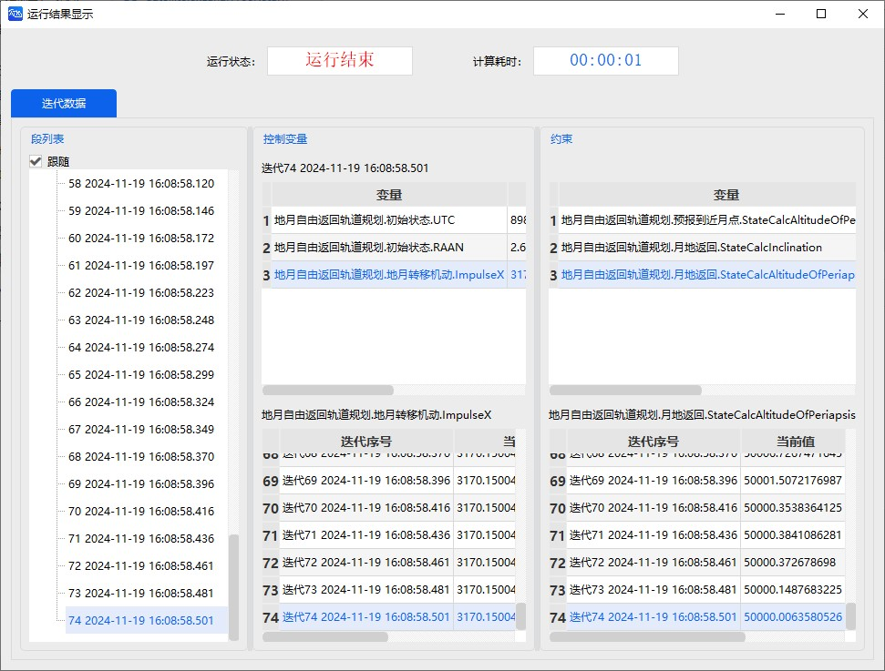
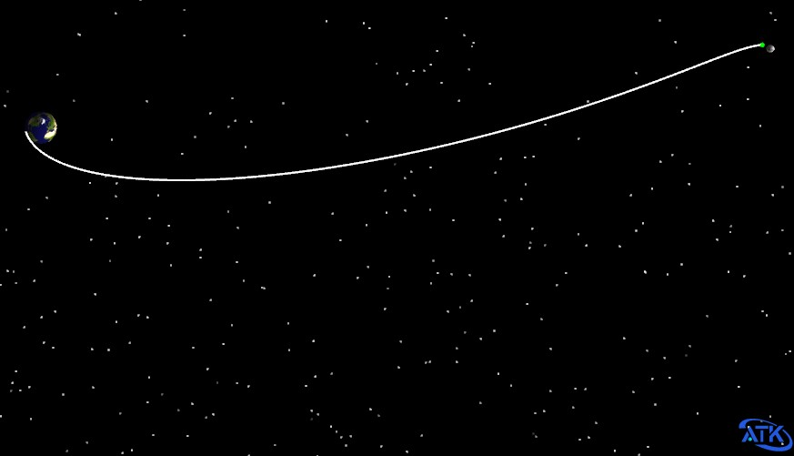

# Free-Return Lunar Transfer

Through the secondary development Connect mode, create a cislunar transfer scenario based on a free-return trajectory. ATK must remain open. The specific command categories include:

1. Connecting to ATK.
2. Creating a new scenario and setting its properties.
3. Creating a new satellite and setting its properties.
4. Creating a new free-return trajectory mission sequence and setting its properties.
5. Running the maneuver planning sequence.
6. Viewing run results.
7. Saving the scenario and disconnecting from ATK.

## Script Demonstration

### Connecting to ATK

```mixcode
{C:1, Connect to ATK}
conID = atkOpen()
```

### Creating a New Scenario and Setting Its Properties

```mixcode
{C:2, Create the scenario}
atkConnect(conID, {S:New}, {S:/ Scenario exLunarFreeReturn})
atkConnect(conID, {S:SetAnalysisTimePeriod}, {S:* "2028-06-24 16:24:55.000" "2028-06-30 02:00:00.000"})
atkConnect(conID, {S:Animate}, {S:* Reset})
```

### Creating a New Satellite and Setting Its Properties

```mixcode
{C:3, Insert a satellite and set the orbit propagator to Maneuver Planning}
atkConnect(conID, {S:New}, {S:/ Satellite exLunarFreeReturn})
atkConnect(conID, {S:Astrogator}, {S:*/Satellite/exLunarFreeReturn SetProp})
```

### Free-Return Trajectory Mission Sequence

```mixcode
{C:4, Target sequence segment}
{C:Delete the initial segment}
atkConnect(conID,{S:Astrogator}, {S:*/Satellite/exLunarFreeReturn DeleteSegment MainSequence.SegmentList.InitialState})
{C:Create a new target sequence segment}
atkConnect(conID, {S:Astrogator}, {S:*/Satellite/exLunarFreeReturn InsertSegment MainSequence.SegmentList.- Target_Sequence})
```

```mixcode
{C:5, Initial segment}
{C:Create a new initial segment}
atkConnect(conID, {S:Astrogator}, {S:*/Satellite/exLunarFreeReturn InsertSegment MainSequence.SegmentList.TargetSequence.SegmentList.- InitialState})
{C:Set the coordinate system to J2000}
atkConnect(conID, {S:Astrogator}, {S:*/Satellite/exLunarFreeReturn SetValue MainSequence.SegmentList.TargetSequence.SegmentList.InitialState.CoordinateSystem "CentralBody/Earth J2000"})
{C:Set the coordinate type to Orbital Elements}
atkConnect(conID, {S:Astrogator}, {S:*/Satellite/exLunarFreeReturn SetValue MainSequence.SegmentList.TargetSequence.SegmentList.InitialState.CoordinateType "Keplerian"})
{C:Set the six orbital elements}
atkConnect(conID, {S:Astrogator}, {S:*/Satellite/exLunarFreeReturn SetValue MainSequence.SegmentList.TargetSequence.SegmentList.InitialState.InitialState.Keplerian.sma 6548151 m})
atkConnect(conID, {S:Astrogator}, {S:*/Satellite/exLunarFreeReturn SetValue MainSequence.SegmentList.TargetSequence.SegmentList.InitialState.InitialState.Keplerian.ecc 0})
atkConnect(conID, {S:Astrogator}, {S:*/Satellite/exLunarFreeReturn SetValue MainSequence.SegmentList.TargetSequence.SegmentList.InitialState.InitialState.Keplerian.inc 21})
atkConnect(conID, {S:Astrogator}, {S:*/Satellite/exLunarFreeReturn SetValue MainSequence.SegmentList.TargetSequence.SegmentList.InitialState.InitialState.Keplerian.RAAN 149})
atkConnect(conID, {S:Astrogator}, {S:*/Satellite/exLunarFreeReturn SetValue MainSequence.SegmentList.TargetSequence.SegmentList.InitialState.InitialState.Keplerian.w 0})
atkConnect(conID, {S:Astrogator}, {S:*/Satellite/exLunarFreeReturn SetValue MainSequence.SegmentList.TargetSequence.SegmentList.InitialState.InitialState.Keplerian.TA 199})
{C:Set the orbit epoch}
atkConnect(conID, {S:Astrogator}, {S:*/Satellite/exLunarFreeReturn SetValue MainSequence.SegmentList.TargetSequence.SegmentList.InitialState.InitialState.Epoch "24 Jun 2028 16:25:59.184" UTCG})
```

```mixcode
{C:6, Maneuver segment}
{C:Add a maneuver segment after the initial segment}
atkConnect(conID, {S:Astrogator}, {S:*/Satellite/exLunarFreeReturn InsertSegment MainSequence.SegmentList.TargetSequence.SegmentList.- Maneuver})
{C:Set the maneuver type to Impulse}
atkConnect(conID, {S:Astrogator}, {S:*/Satellite/exLunarFreeReturn SetValue MainSequence.SegmentList.TargetSequence.SegmentList.Maneuver.MnvrType Impulsive})
{C:Set the thrust axes to VNC}
atkConnect(conID, {S:Astrogator}, {S:*/Satellite/exLunarFreeReturn SetValue MainSequence.SegmentList.TargetSequence.SegmentList.Maneuver.ImpulsiveMnvr.ThrustAxes "Satellite/exLunarFreeReturn VNC"})
{C:Set the coordinate type to Cartesian}
atkConnect(conID, {S:Astrogator}, {S:*/Satellite/exLunarFreeReturn SetValue MainSequence.SegmentList.TargetSequence.SegmentList.Maneuver.ImpulsiveMnvr.CoordType Cartesian})
{C:Set the delta-V}
atkConnect(conID, {S:Astrogator}, {S:*/Satellite/exLunarFreeReturn SetValue MainSequence.SegmentList.TargetSequence.SegmentList.Maneuver.ImpulsiveMnvr.Cartesian.X 3160})
atkConnect(conID, {S:Astrogator}, {S:*/Satellite/exLunarFreeReturn SetValue MainSequence.SegmentList.TargetSequence.SegmentList.Maneuver.ImpulsiveMnvr.Cartesian.Y 0})
atkConnect(conID, {S:Astrogator}, {S:*/Satellite/exLunarFreeReturn SetValue MainSequence.SegmentList.TargetSequence.SegmentList.Maneuver.ImpulsiveMnvr.Cartesian.Z 0})
```

```mixcode
{C:7, First propagation segment}
{C:Add a propagation segment after the maneuver segment}
atkConnect(conID, {S:Astrogator}, {S:*/Satellite/exLunarFreeReturn InsertSegment MainSequence.SegmentList.TargetSequence.SegmentList.- Propagate})
{C:Set the central body to Earth}
atkConnect(conID, {S:Astrogator}, {S:*/Satellite/exLunarFreeReturn SetValue MainSequence.SegmentList.TargetSequence.SegmentList.Propagate.CentralBodyCode 2})
{C:Set the gravity model to WGS84}
atkConnect(conID, {S:Astrogator}, {S:*/Satellite/exLunarFreeReturn SetValue MainSequence.SegmentList.TargetSequence.SegmentList.Propagate.ForceModel.Gravity.GravModel WGS84})
{C:Set the gravity degree to 20}
atkConnect(conID, {S:Astrogator}, {S:*/Satellite/exLunarFreeReturn SetValue MainSequence.SegmentList.TargetSequence.SegmentList.Propagate.ForceModel.Gravity.MaxDegree 20})
{C:Set the gravity order to 20}
atkConnect(conID, {S:Astrogator}, {S:*/Satellite/exLunarFreeReturn SetValue MainSequence.SegmentList.TargetSequence.SegmentList.Propagate.ForceModel.Gravity.MaxOrder 20})
{C:Uncheck atmospheric drag perturbation}
atkConnect(conID, {S:Astrogator}, {S:*/Satellite/exLunarFreeReturn SetValue MainSequence.SegmentList.TargetSequence.SegmentList.Propagate.ForceModel.Drag.UseDrag false})
{C:Check solar radiation pressure perturbation}
atkConnect(conID, {S:Astrogator}, {S:*/Satellite/exLunarFreeReturn SetValue MainSequence.SegmentList.TargetSequence.SegmentList.Propagate.ForceModel.SRP.UseSRP true})
{C:Third-body perturbation - Sun and Moon}
atkConnect(conID, {S:Astrogator}, {S:*/Satellite/exLunarFreeReturn SetValue MainSequence.SegmentList.TargetSequence.SegmentList.Propagate.ForceModel.ThirdBodies.Moon.UseGravity true})
atkConnect(conID, {S:Astrogator}, {S:*/Satellite/exLunarFreeReturn SetValue MainSequence.SegmentList.TargetSequence.SegmentList.Propagate.ForceModel.ThirdBodies.Sun.UseGravity true})
{C:Create a new stopping condition - Periapsis}
atkConnect(conID, {S:Astrogator}, {S:*/Satellite/exLunarFreeReturn SetValue MainSequence.SegmentList.TargetSequence.SegmentList.Propagate.StoppingConditions Periapsis})
{C:Set the stopping condition central body to Moon}
atkConnect(conID, {S:Astrogator}, {S:*/Satellite/exLunarFreeReturn SetValue MainSequence.SegmentList.TargetSequence.SegmentList.Propagate.StoppingConditions.Periapsis.CalcObjectAttributes.CentralBody Moon})
{C:Set the stopping condition repeat count to 1}
atkConnect(conID, {S:Astrogator}, {S:*/Satellite/exLunarFreeReturn SetValue MainSequence.SegmentList.TargetSequence.SegmentList.Propagate.StoppingConditions.Periapsis.RepeatCount 1})
```

```mixcode
{C:8, Second propagation segment}
{C:Add another propagation segment after the first propagation segment}
atkConnect(conID, {S:Astrogator}, {S:*/Satellite/exLunarFreeReturn InsertSegment MainSequence.SegmentList.TargetSequence.SegmentList.- Propagate})
{C:Set the central body to Earth}
atkConnect(conID, {S:Astrogator}, {S:*/Satellite/exLunarFreeReturn SetValue MainSequence.SegmentList.TargetSequence.SegmentList.Propagate1.CentralBodyCode 2})
{C:Set the gravity model to JGM3}
atkConnect(conID, {S:Astrogator}, {S:*/Satellite/exLunarFreeReturn SetValue MainSequence.SegmentList.TargetSequence.SegmentList.Propagate1.ForceModel.Gravity.GravModel JGM3})
{C:Set the gravity degree to 20}
atkConnect(conID, {S:Astrogator}, {S:*/Satellite/exLunarFreeReturn SetValue MainSequence.SegmentList.TargetSequence.SegmentList.Propagate1.ForceModel.Gravity.MaxDegree 20})
{C:Set the gravity order to 20}
atkConnect(conID, {S:Astrogator}, {S:*/Satellite/exLunarFreeReturn SetValue MainSequence.SegmentList.TargetSequence.SegmentList.Propagate1.ForceModel.Gravity.MaxOrder 20})
{C:Uncheck atmospheric drag perturbation}
atkConnect(conID, {S:Astrogator}, {S:*/Satellite/exLunarFreeReturn SetValue MainSequence.SegmentList.TargetSequence.SegmentList.Propagate1.ForceModel.Drag.UseDrag false})
{C:Check solar radiation pressure perturbation}
atkConnect(conID, {S:Astrogator}, {S:*/Satellite/exLunarFreeReturn SetValue MainSequence.SegmentList.TargetSequence.SegmentList.Propagate1.ForceModel.SRP.UseSRP true})
{C:Third-body perturbation - Sun and Moon}
atkConnect(conID, {S:Astrogator}, {S:*/Satellite/exLunarFreeReturn SetValue MainSequence.SegmentList.TargetSequence.SegmentList.Propagate.ForceModel.ThirdBodies.Moon.UseGravity true})
atkConnect(conID, {S:Astrogator}, {S:*/Satellite/exLunarFreeReturn SetValue MainSequence.SegmentList.TargetSequence.SegmentList.Propagate.ForceModel.ThirdBodies.Sun.UseGravity true})
{C:Create a new stopping condition - Periapsis}
atkConnect(conID, {S:Astrogator}, {S:*/Satellite/exLunarFreeReturn SetValue MainSequence.SegmentList.TargetSequence.SegmentList.Propagate1.StoppingConditions Periapsis})
{C:Set the stopping condition central body to Earth}
atkConnect(conID, {S:Astrogator}, {S:*/Satellite/exLunarFreeReturn SetValue MainSequence.SegmentList.TargetSequence.SegmentList.Propagate1.StoppingConditions.Periapsis.CalcObjectAttributes.CentralBody Earth})
{C:Set the stopping condition repeat count to 1}
atkConnect(conID, {S:Astrogator}, {S:*/Satellite/exLunarFreeReturn SetValue MainSequence.SegmentList.TargetSequence.SegmentList.Propagate1.StoppingConditions.Periapsis.RepeatCount 1})
```

```mixcode
{C:9, Check the variables or constraints of each segment}
{C:In the initial segment, check RAAN as a design variable}
atkConnect(conID, {S:Astrogator}, {S:*/Satellite/exLunarFreeReturn AddMCSSegmentControl MainSequence.SegmentList.TargetSequence.SegmentList.InitialState InitialState.Keplerian.RAAN})
{C:In the initial segment, check orbit epoch as a design variable}
atkConnect(conID, {S:Astrogator}, {S:*/Satellite/exLunarFreeReturn AddMCSSegmentControl MainSequence.SegmentList.TargetSequence.SegmentList.InitialState InitialState.Epoch})
{C:In the maneuver segment, check Vx as a design variable}
atkConnect(conID, {S:Astrogator}, {S:*/Satellite/exLunarFreeReturn AddMCSSegmentControl MainSequence.SegmentList.TargetSequence.SegmentList.Maneuver ImpulsiveMnvr.Cartesian.X})
{C:In the first propagation segment, select "Altitude of Periapsis" as the target variable}
atkConnect(conID, {S:Astrogator}, {S:*/Satellite/exLunarFreeReturn SetValue MainSequence.SegmentList.TargetSequence.SegmentList.Propagate.Results "AltitudeOfPeriapsis"})
{C:Set the "Central Body" of the first propagation segment target variable to "Moon"}
atkConnect(conID, {S:Astrogator}, {S:*/Satellite/exLunarFreeReturn SetValue MainSequence.SegmentList.TargetSequence.SegmentList.Propagate.Results.StateCalcAltitudeOfPeriapsis.CentralBody Moon})
{C:In the second propagation segment, select "Altitude of Periapsis" and inclination as target variables}
atkConnect(conID, {S:Astrogator}, {S:*/Satellite/exLunarFreeReturn SetValue MainSequence.SegmentList.TargetSequence.SegmentList.Propagate1.Results "AltitudeOfPeriapsis" "Inclination"})
{C:Set the "Central Body" of the second propagation segment target variables to "Earth"}
atkConnect(conID, {S:Astrogator}, {S:*/Satellite/exLunarFreeReturn SetValue MainSequence.SegmentList.TargetSequence.SegmentList.Propagate1.Results.StateCalcAltitudeOfPeriapsis.CentralBody Earth})
atkConnect(conID, {S:Astrogator}, {S:*/Satellite/exLunarFreeReturn SetValue MainSequence.SegmentList.TargetSequence.SegmentList.Propagate1.Results.StateCalcInclination.CentralBody Earth})
```

```mixcode
{C:10, Set the control variables and constraints under the targeter}
{C:Create a new differential correction}
atkConnect(conID, {S:Astrogator}, {S:*/Satellite/exLunarFreeReturn SetValue MainSequence.SegmentList.TargetSequence.Profiles Differential_Corrector})
{C:Maneuver segment Vx}
atkConnect(conID, {S:Astrogator}, {S:*/Satellite/exLunarFreeReturn SetMCSControlValue MainSequence.SegmentList.TargetSequence.Profiles.Differential_Corrector Maneuver ImpulsiveMnvr.Cartesian.X Active true})
{C:Initial segment UTC}
atkConnect(conID, {S:Astrogator}, {S:*/Satellite/exLunarFreeReturn SetMCSControlValue MainSequence.SegmentList.TargetSequence.Profiles.Differential_Corrector InitialState InitialState.Epoch Active true})
{C:Initial segment RAAN}
atkConnect(conID, {S:Astrogator}, {S:*/Satellite/exLunarFreeReturn SetMCSControlValue MainSequence.SegmentList.TargetSequence.Profiles.Differential_Corrector InitialState InitialState.Keplerian.RAAN Active true})
{C:First propagation segment altitude of periapsis}
atkConnect(conID, {S:Astrogator}, {S:*/Satellite/exLunarFreeReturn SetMCSConstraintValue MainSequence.SegmentList.TargetSequence.Profiles.Differential_Corrector Propagate "StateCalcAltitudeOfPeriapsis" Active true})
{C:Set the first propagation segment periapsis altitude expected value to 100000 m}
atkConnect(conID, {S:Astrogator}, {S:*/Satellite/exLunarFreeReturn SetMCSConstraintValue MainSequence.SegmentList.TargetSequence.Profiles.Differential_Corrector Propagate "StateCalcAltitudeOfPeriapsis" Desired 100000 m})
{C:Set the first propagation segment periapsis altitude convergence tolerance to 100 m}
atkConnect(conID, {S:Astrogator}, {S:*/Satellite/exLunarFreeReturn SetMCSConstraintValue MainSequence.SegmentList.TargetSequence.Profiles.Differential_Corrector Propagate "StateCalcAltitudeOfPeriapsis" Tolerance 100 m})
{C:Second propagation segment altitude of periapsis}
atkConnect(conID, {S:Astrogator}, {S:*/Satellite/exLunarFreeReturn SetMCSConstraintValue MainSequence.SegmentList.TargetSequence.Profiles.Differential_Corrector Propagate1 "StateCalcAltitudeOfPeriapsis" Active true})
{C:Set the second propagation segment periapsis altitude expected value to 50000 m}
atkConnect(conID, {S:Astrogator}, {S:*/Satellite/exLunarFreeReturn SetMCSConstraintValue MainSequence.SegmentList.TargetSequence.Profiles.Differential_Corrector Propagate1 "StateCalcAltitudeOfPeriapsis" Desired 50000 m})
{C:Set the second propagation segment periapsis altitude convergence tolerance to 100 m}
atkConnect(conID, {S:Astrogator}, {S:*/Satellite/exLunarFreeReturn SetMCSConstraintValue MainSequence.SegmentList.TargetSequence.Profiles.Differential_Corrector Propagate1 "StateCalcAltitudeOfPeriapsis" Tolerance 100 m})
{C:Second propagation segment inclination}
atkConnect(conID, {S:Astrogator}, {S:*/Satellite/exLunarFreeReturn SetMCSConstraintValue MainSequence.SegmentList.TargetSequence.Profiles.Differential_Corrector Propagate1 "StateCalcInclination" Active true})
{C:Set the second propagation segment inclination expected value to 43°}
atkConnect(conID, {S:Astrogator}, {S:*/Satellite/exLunarFreeReturn SetMCSConstraintValue MainSequence.SegmentList.TargetSequence.Profiles.Differential_Corrector Propagate1 "StateCalcInclination" Desired 43 deg})
{C:Set the second propagation segment inclination convergence tolerance to 0.1°}
atkConnect(conID, {S:Astrogator}, {S:*/Satellite/exLunarFreeReturn SetMCSConstraintValue MainSequence.SegmentList.TargetSequence.Profiles.Differential_Corrector Propagate1 "StateCalcInclination" Tolerance 0.1 deg})
```

### Running the Maneuver Planning Sequence

```mixcode
{C:11, Run the mission control sequence}
atkConnect(conID, {S:Astrogator}, {S:*/Satellite/exLunarFreeReturn RunMCS})
atkConnect(conID, {S:Animate}, {S:* Reset})
{C:This statement may be omitted for this case; it assigns the computed values back to the scenario for continued use, but this case has no subsequent computation}
{C:atkConnect(conID, 'Astrogator', '*/Satellite/exLunarFreeReturn ApplyAllProfileChanges');}
```

```mixcode
{C:12, Save the scenario}
atkConnect(conID, {S:Save}, {S:/ *})
```

```mixcode
{C:13, Disconnect from ATK}
atkClose(conID)
```

### Run Results Display



### 3D View Display




## Complete Script

```mixcode
{C:1, Connect to ATK}
conID = atkOpen()
{C:2, Create the scenario}
atkConnect(conID, {S:New}, {S:/ Scenario exLunarFreeReturn})
atkConnect(conID, {S:SetAnalysisTimePeriod}, {S:* "2028-06-24 16:24:55.000" "2028-06-30 02:00:00.000"})
atkConnect(conID, {S:Animate}, {S:* Reset})
{C:3, Insert a satellite and set the orbit propagator to Maneuver Planning}
atkConnect(conID, {S:New}, {S:/ Satellite exLunarFreeReturn})
atkConnect(conID, {S:Astrogator}, {S:*/Satellite/exLunarFreeReturn SetProp})
{C:4, Target sequence segment}
atkConnect(conID,{S:Astrogator}, {S:*/Satellite/exLunarFreeReturn DeleteSegment MainSequence.SegmentList.InitialState})
atkConnect(conID, {S:Astrogator}, {S:*/Satellite/exLunarFreeReturn InsertSegment MainSequence.SegmentList.- Target_Sequence})
{C:5, Initial segment}
atkConnect(conID, {S:Astrogator}, {S:*/Satellite/exLunarFreeReturn InsertSegment MainSequence.SegmentList.TargetSequence.SegmentList.- InitialState})
atkConnect(conID, {S:Astrogator}, {S:*/Satellite/exLunarFreeReturn SetValue MainSequence.SegmentList.TargetSequence.SegmentList.InitialState.CoordinateSystem "CentralBody/Earth J2000"})
atkConnect(conID, {S:Astrogator}, {S:*/Satellite/exLunarFreeReturn SetValue MainSequence.SegmentList.TargetSequence.SegmentList.InitialState.CoordinateType "Keplerian"})
atkConnect(conID, {S:Astrogator}, {S:*/Satellite/exLunarFreeReturn SetValue MainSequence.SegmentList.TargetSequence.SegmentList.InitialState.InitialState.Keplerian.sma 6548151 m})
atkConnect(conID, {S:Astrogator}, {S:*/Satellite/exLunarFreeReturn SetValue MainSequence.SegmentList.TargetSequence.SegmentList.InitialState.InitialState.Keplerian.ecc 0})
atkConnect(conID, {S:Astrogator}, {S:*/Satellite/exLunarFreeReturn SetValue MainSequence.SegmentList.TargetSequence.SegmentList.InitialState.InitialState.Keplerian.inc 21})
atkConnect(conID, {S:Astrogator}, {S:*/Satellite/exLunarFreeReturn SetValue MainSequence.SegmentList.TargetSequence.SegmentList.InitialState.InitialState.Keplerian.RAAN 149})
atkConnect(conID, {S:Astrogator}, {S:*/Satellite/exLunarFreeReturn SetValue MainSequence.SegmentList.TargetSequence.SegmentList.InitialState.InitialState.Keplerian.w 0})
atkConnect(conID, {S:Astrogator}, {S:*/Satellite/exLunarFreeReturn SetValue MainSequence.SegmentList.TargetSequence.SegmentList.InitialState.InitialState.Keplerian.TA 199})
atkConnect(conID, {S:Astrogator}, {S:*/Satellite/exLunarFreeReturn SetValue MainSequence.SegmentList.TargetSequence.SegmentList.InitialState.InitialState.Epoch "24 Jun 2028 16:25:59.184" UTCG})
{C:6, Maneuver segment}
atkConnect(conID, {S:Astrogator}, {S:*/Satellite/exLunarFreeReturn InsertSegment MainSequence.SegmentList.TargetSequence.SegmentList.- Maneuver})
atkConnect(conID, {S:Astrogator}, {S:*/Satellite/exLunarFreeReturn SetValue MainSequence.SegmentList.TargetSequence.SegmentList.Maneuver.MnvrType Impulsive})
atkConnect(conID, {S:Astrogator}, {S:*/Satellite/exLunarFreeReturn SetValue MainSequence.SegmentList.TargetSequence.SegmentList.Maneuver.ImpulsiveMnvr.ThrustAxes "Satellite/exLunarFreeReturn VNC"})
atkConnect(conID, {S:Astrogator}, {S:*/Satellite/exLunarFreeReturn SetValue MainSequence.SegmentList.TargetSequence.SegmentList.Maneuver.ImpulsiveMnvr.CoordType Cartesian})
atkConnect(conID, {S:Astrogator}, {S:*/Satellite/exLunarFreeReturn SetValue MainSequence.SegmentList.TargetSequence.SegmentList.Maneuver.ImpulsiveMnvr.Cartesian.X 3160})
atkConnect(conID, {S:Astrogator}, {S:*/Satellite/exLunarFreeReturn SetValue MainSequence.SegmentList.TargetSequence.SegmentList.Maneuver.ImpulsiveMnvr.Cartesian.Y 0})
atkConnect(conID, {S:Astrogator}, {S:*/Satellite/exLunarFreeReturn SetValue MainSequence.SegmentList.TargetSequence.SegmentList.Maneuver.ImpulsiveMnvr.Cartesian.Z 0})
{C:7, First propagation segment}
atkConnect(conID, {S:Astrogator}, {S:*/Satellite/exLunarFreeReturn InsertSegment MainSequence.SegmentList.TargetSequence.SegmentList.- Propagate})
atkConnect(conID, {S:Astrogator}, {S:*/Satellite/exLunarFreeReturn SetValue MainSequence.SegmentList.TargetSequence.SegmentList.Propagate.CentralBodyCode 2})
atkConnect(conID, {S:Astrogator}, {S:*/Satellite/exLunarFreeReturn SetValue MainSequence.SegmentList.TargetSequence.SegmentList.Propagate.ForceModel.Gravity.GravModel WGS84})
atkConnect(conID, {S:Astrogator}, {S:*/Satellite/exLunarFreeReturn SetValue MainSequence.SegmentList.TargetSequence.SegmentList.Propagate.ForceModel.Gravity.MaxDegree 20})
atkConnect(conID, {S:Astrogator}, {S:*/Satellite/exLunarFreeReturn SetValue MainSequence.SegmentList.TargetSequence.SegmentList.Propagate.ForceModel.Gravity.MaxOrder 20})
atkConnect(conID, {S:Astrogator}, {S:*/Satellite/exLunarFreeReturn SetValue MainSequence.SegmentList.TargetSequence.SegmentList.Propagate.ForceModel.Drag.UseDrag false})
atkConnect(conID, {S:Astrogator}, {S:*/Satellite/exLunarFreeReturn SetValue MainSequence.SegmentList.TargetSequence.SegmentList.Propagate.ForceModel.SRP.UseSRP true})
atkConnect(conID, {S:Astrogator}, {S:*/Satellite/exLunarFreeReturn SetValue MainSequence.SegmentList.TargetSequence.SegmentList.Propagate.ForceModel.ThirdBodies.Moon.UseGravity true})
atkConnect(conID, {S:Astrogator}, {S:*/Satellite/exLunarFreeReturn SetValue MainSequence.SegmentList.TargetSequence.SegmentList.Propagate.ForceModel.ThirdBodies.Sun.UseGravity true})
atkConnect(conID, {S:Astrogator}, {S:*/Satellite/exLunarFreeReturn SetValue MainSequence.SegmentList.TargetSequence.SegmentList.Propagate.StoppingConditions Periapsis})
atkConnect(conID, {S:Astrogator}, {S:*/Satellite/exLunarFreeReturn SetValue MainSequence.SegmentList.TargetSequence.SegmentList.Propagate.StoppingConditions.Periapsis.CalcObjectAttributes.CentralBody Moon})
atkConnect(conID, {S:Astrogator}, {S:*/Satellite/exLunarFreeReturn SetValue MainSequence.SegmentList.TargetSequence.SegmentList.Propagate.StoppingConditions.Periapsis.RepeatCount 1})
{C:8, Second propagation segment}
atkConnect(conID, {S:Astrogator}, {S:*/Satellite/exLunarFreeReturn InsertSegment MainSequence.SegmentList.TargetSequence.SegmentList.- Propagate})
atkConnect(conID, {S:Astrogator}, {S:*/Satellite/exLunarFreeReturn SetValue MainSequence.SegmentList.TargetSequence.SegmentList.Propagate1.CentralBodyCode 2})
atkConnect(conID, {S:Astrogator}, {S:*/Satellite/exLunarFreeReturn SetValue MainSequence.SegmentList.TargetSequence.SegmentList.Propagate1.ForceModel.Gravity.GravModel JGM3})
atkConnect(conID, {S:Astrogator}, {S:*/Satellite/exLunarFreeReturn SetValue MainSequence.SegmentList.TargetSequence.SegmentList.Propagate1.ForceModel.Gravity.MaxDegree 20})
atkConnect(conID, {S:Astrogator}, {S:*/Satellite/exLunarFreeReturn SetValue MainSequence.SegmentList.TargetSequence.SegmentList.Propagate1.ForceModel.Gravity.MaxOrder 20})
atkConnect(conID, {S:Astrogator}, {S:*/Satellite/exLunarFreeReturn SetValue MainSequence.SegmentList.TargetSequence.SegmentList.Propagate1.ForceModel.Drag.UseDrag false})
atkConnect(conID, {S:Astrogator}, {S:*/Satellite/exLunarFreeReturn SetValue MainSequence.SegmentList.TargetSequence.SegmentList.Propagate1.ForceModel.SRP.UseSRP true})
atkConnect(conID, {S:Astrogator}, {S:*/Satellite/exLunarFreeReturn SetValue MainSequence.SegmentList.TargetSequence.SegmentList.Propagate.ForceModel.ThirdBodies.Moon.UseGravity true})
atkConnect(conID, {S:Astrogator}, {S:*/Satellite/exLunarFreeReturn SetValue MainSequence.SegmentList.TargetSequence.SegmentList.Propagate.ForceModel.ThirdBodies.Sun.UseGravity true})
atkConnect(conID, {S:Astrogator}, {S:*/Satellite/exLunarFreeReturn SetValue MainSequence.SegmentList.TargetSequence.SegmentList.Propagate1.StoppingConditions Periapsis})
atkConnect(conID, {S:Astrogator}, {S:*/Satellite/exLunarFreeReturn SetValue MainSequence.SegmentList.TargetSequence.SegmentList.Propagate1.StoppingConditions.Periapsis.CalcObjectAttributes.CentralBody Earth})
atkConnect(conID, {S:Astrogator}, {S:*/Satellite/exLunarFreeReturn SetValue MainSequence.SegmentList.TargetSequence.SegmentList.Propagate1.StoppingConditions.Periapsis.RepeatCount 1})
{C:9, Check the variables or constraints of each segment}
atkConnect(conID, {S:Astrogator}, {S:*/Satellite/exLunarFreeReturn AddMCSSegmentControl MainSequence.SegmentList.TargetSequence.SegmentList.InitialState InitialState.Keplerian.RAAN})
atkConnect(conID, {S:Astrogator}, {S:*/Satellite/exLunarFreeReturn AddMCSSegmentControl MainSequence.SegmentList.TargetSequence.SegmentList.InitialState InitialState.Epoch})
atkConnect(conID, {S:Astrogator}, {S:*/Satellite/exLunarFreeReturn AddMCSSegmentControl MainSequence.SegmentList.TargetSequence.SegmentList.Maneuver ImpulsiveMnvr.Cartesian.X})
atkConnect(conID, {S:Astrogator}, {S:*/Satellite/exLunarFreeReturn SetValue MainSequence.SegmentList.TargetSequence.SegmentList.Propagate.Results "AltitudeOfPeriapsis"})
atkConnect(conID, {S:Astrogator}, {S:*/Satellite/exLunarFreeReturn SetValue MainSequence.SegmentList.TargetSequence.SegmentList.Propagate.Results.StateCalcAltitudeOfPeriapsis.CentralBody Moon})
atkConnect(conID, {S:Astrogator}, {S:*/Satellite/exLunarFreeReturn SetValue MainSequence.SegmentList.TargetSequence.SegmentList.Propagate1.Results "AltitudeOfPeriapsis" "Inclination"})
atkConnect(conID, {S:Astrogator}, {S:*/Satellite/exLunarFreeReturn SetValue MainSequence.SegmentList.TargetSequence.SegmentList.Propagate1.Results.StateCalcAltitudeOfPeriapsis.CentralBody Earth})
atkConnect(conID, {S:Astrogator}, {S:*/Satellite/exLunarFreeReturn SetValue MainSequence.SegmentList.TargetSequence.SegmentList.Propagate1.Results.StateCalcInclination.CentralBody Earth})
{C:10, Set the control variables and constraints under the targeter}
atkConnect(conID, {S:Astrogator}, {S:*/Satellite/exLunarFreeReturn SetValue MainSequence.SegmentList.TargetSequence.Profiles Differential_Corrector})
atkConnect(conID, {S:Astrogator}, {S:*/Satellite/exLunarFreeReturn SetMCSControlValue MainSequence.SegmentList.TargetSequence.Profiles.Differential_Corrector Maneuver ImpulsiveMnvr.Cartesian.X Active true})
atkConnect(conID, {S:Astrogator}, {S:*/Satellite/exLunarFreeReturn SetMCSControlValue MainSequence.SegmentList.TargetSequence.Profiles.Differential_Corrector InitialState InitialState.Epoch Active true})
atkConnect(conID, {S:Astrogator}, {S:*/Satellite/exLunarFreeReturn SetMCSControlValue MainSequence.SegmentList.TargetSequence.Profiles.Differential_Corrector InitialState InitialState.Keplerian.RAAN Active true})
atkConnect(conID, {S:Astrogator}, {S:*/Satellite/exLunarFreeReturn SetMCSConstraintValue MainSequence.SegmentList.TargetSequence.Profiles.Differential_Corrector Propagate "StateCalcAltitudeOfPeriapsis" Active true})
atkConnect(conID, {S:Astrogator}, {S:*/Satellite/exLunarFreeReturn SetMCSConstraintValue MainSequence.SegmentList.TargetSequence.Profiles.Differential_Corrector Propagate "StateCalcAltitudeOfPeriapsis" Desired 100000 m})
atkConnect(conID, {S:Astrogator}, {S:*/Satellite/exLunarFreeReturn SetMCSConstraintValue MainSequence.SegmentList.TargetSequence.Profiles.Differential_Corrector Propagate "StateCalcAltitudeOfPeriapsis" Tolerance 100 m})
atkConnect(conID, {S:Astrogator}, {S:*/Satellite/exLunarFreeReturn SetMCSConstraintValue MainSequence.SegmentList.TargetSequence.Profiles.Differential_Corrector Propagate1 "StateCalcAltitudeOfPeriapsis" Active true})
atkConnect(conID, {S:Astrogator}, {S:*/Satellite/exLunarFreeReturn SetMCSConstraintValue MainSequence.SegmentList.TargetSequence.Profiles.Differential_Corrector Propagate1 "StateCalcAltitudeOfPeriapsis" Desired 50000 m})
atkConnect(conID, {S:Astrogator}, {S:*/Satellite/exLunarFreeReturn SetMCSConstraintValue MainSequence.SegmentList.TargetSequence.Profiles.Differential_Corrector Propagate1 "StateCalcAltitudeOfPeriapsis" Tolerance 100 m})
atkConnect(conID, {S:Astrogator}, {S:*/Satellite/exLunarFreeReturn SetMCSConstraintValue MainSequence.SegmentList.TargetSequence.Profiles.Differential_Corrector Propagate1 "StateCalcInclination" Active true})
atkConnect(conID, {S:Astrogator}, {S:*/Satellite/exLunarFreeReturn SetMCSConstraintValue MainSequence.SegmentList.TargetSequence.Profiles.Differential_Corrector Propagate1 "StateCalcInclination" Desired 43 deg})
atkConnect(conID, {S:Astrogator}, {S:*/Satellite/exLunarFreeReturn SetMCSConstraintValue MainSequence.SegmentList.TargetSequence.Profiles.Differential_Corrector Propagate1 "StateCalcInclination" Tolerance 0.1 deg})
{C:11, Run the mission control sequence}
atkConnect(conID, {S:Astrogator}, {S:*/Satellite/exLunarFreeReturn RunMCS})
atkConnect(conID, {S:Animate}, {S:* Reset})
{C:12, Save the scenario}
atkConnect(conID, {S:Save}, {S:/ *})
{C:13, Disconnect from ATK}
atkClose(conID)
```