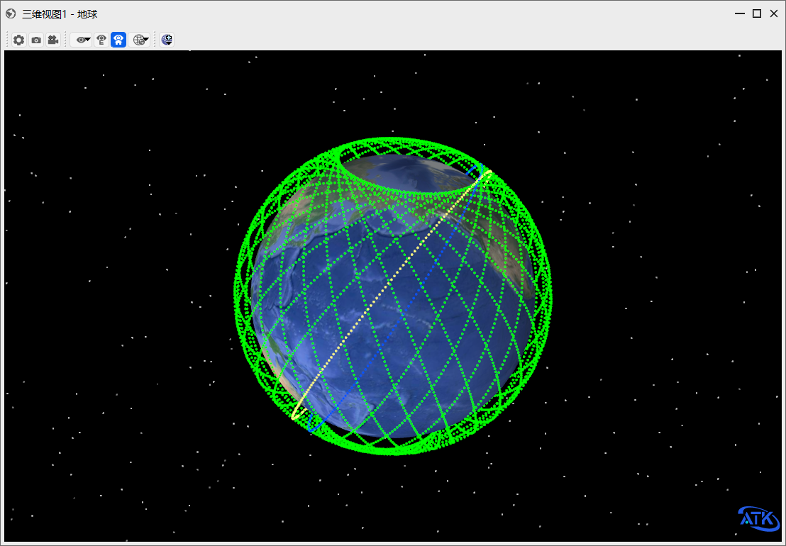

<PathViewer
  :relative-paths="files"
/>

# Large Constellation Design

## Scenario Description

This example envisions designing a low‑Earth orbit (LEO) large constellation with more than 7,000 satellites. The seed satellite has a circular orbit at an altitude of 700 km and an inclination of 65°. The constellation consists of 30 orbital planes, each containing 300 satellites, following a Walker constellation configuration.

## Constellation Configuration Description

This constellation is configured with 30 orbital planes, 250 satellites per plane, an orbital altitude of 700 km, and an inclination of 65°.

## Creating the Scenario

1. Create a new scenario. Run ATK.exe and click <kbd>Create a new scenario file</kbd> to create a scenario named **HugeConstellation**.

2. Set the simulation time. In the **ATK: New Scenario Wizard** dialog, set the time period:

| Start Epoch                | End Epoch                  |
| -------------------------- | -------------------------- |
| 2024-03-18 00:00:00.000 | 2024-03-19 00:00:00.000 |

3. Click <kbd>OK</kbd> to complete scenario creation.

## Creating the Large Constellation and Setting Orbital Parameters

1. In the toolbar, click <kbd>Insert</kbd> under <kbd>Start</kbd> to create a satellite cluster object. Select **Scenario Object** – **Satellite Cluster**, **Insertion Method** – **Insert Default Type**, click <kbd>Insert…</kbd>, then click <kbd>Close</kbd>.

2. Right‑click the created object **Satellite Cluster 1**, select <kbd>Properties</kbd> to open the satellite cluster parameter settings interface (upper section for Walker constellation parameters, lower section for grouping properties).

3. Walker constellation settings. Select **Two‑Body** as the orbit propagator.
   - Double‑click **Shell1** to enter the **Sub‑Constellation Parameter Editor**. Set the Walker constellation properties: **Number of Planes** to 30, **Number of Satellites per Plane** to 250, **Semi‑major Axis (km)** to 7078, **Inclination (deg)** to 65, leave others as default. Click <kbd>OK</kbd> to exit property settings.

   - Use grouping settings to define satellite display properties: You can either set the display for the entire constellation uniformly, or configure the display style for each orbital plane individually. Set all satellites to green, click the arrow to the left of Shell1 to expand all orbital planes, set Plane 1 to yellow, Plane 2 to blue, and uncheck **Show Labels for All Satellites**. Click <kbd>OK</kbd> to complete settings.

4. Run the scenario. Click <kbd>Start</kbd> to run the scenario. You will see Planes 1 and 2 in yellow and blue respectively, while other planes remain green by default. The final result is shown below.

## Results

The output of this example demonstrates that ATK has successfully generated a LEO Walker large constellation consisting of 30 orbital planes. Each plane contains 250 satellites, for a total constellation size of 7,500 satellites, meeting the "more than 7,000 satellites" requirement for the large constellation design.

