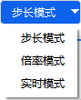

# Start

Click the **Start** menu to expand the function tool set. The function categories and descriptions are shown in the following table:

| Function Category | Icon | Function Item |
| ---- | ---- | ---- |
| **File Operations** | | New |
| | | Open |
| | | Close |
| | | Save |
| | | Save As |
| **Insert Object** | | Insert |
| | | Insert Default |
| **View** | | 2D View |
| | | 3D View |
| **Simulation Control** | | Reset |
| | | Decrease Speed |
| | | Reverse |
| | | Pause |
| | | Start |
| | | Increase Speed |
| | | Speed Input Box |
| | | Simulation Mode Dropdown |
| | | Step Mode Button |

## File Operations

### New

Click  to open the **ATK: New Scenario Wizard** dialog.

Follow the wizard prompts to select the central body of the scenario, and quickly complete the creation of a new scenario.

> For more information on creating a new scenario, refer to: [Creating a New Scenario](../02-场景管理/02-创建新场景.md)

### Open

Click  to open the default scenario file directory. Scenario files are saved in `.atk` format by default. Select the scenario file you wish to open to restore the previous scenario settings.

### Close

Click  to close the currently active scenario.

### Save

Click  to save changes to the current scenario.

### Save As

Click  to open the save directory dialog. You can enter a file name and choose a save format (`.atk`, `.xml`, `.txt` are supported), with `.atk` as the default. Save the current scenario as a new file.

## Insert Object

### Insert

> For details, please refer to: [Insert](./04-插入.md#插入)

### Insert Default

> For details, please refer to: [Insert Default](./04-插入.md#插入默认)

## View

### 2D View

Click  to open a new 2D View window.

> For detailed functional descriptions, please refer to [2D Visualization](../可视化/坐标系向量.md).

### 3D View

Click  to open a new 3D View window.

> For detailed functional descriptions, please refer to [3D Visualization](../可视化/客户端绘图.md).

## Simulation Step / Speed Input Box / Simulation Control

The Simulation Control module provides runtime control functions for the simulation process, including Start, Pause, Reset, playback speed adjustment, and step mode switching.

> For detailed instructions, please refer to [Running a Simulation](../04-仿真控制/仿真控件说明.md).