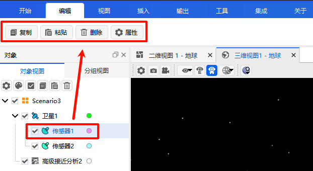
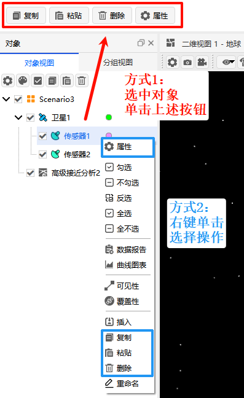

# Edit

Click the **Edit** menu to expand the following function tool set. By default, all functions are grayed out and unavailable. They become operational after you select an object in the left Object Browser window:

## General Operation Methods

After selecting an object, you can perform editing operations in either of the following ways:

- **Method 1**: Click the function icon in the toolbar.
- **Method 2**: Right‑click the object and select the corresponding operation from the context menu.

## Function Descriptions

| Function | Description |
| -------- | ----------- |
| **Copy** | Copies the selected object to the clipboard |
| **Paste** | Pastes the object from the clipboard to the current location |
| **Delete** | Removes the selected object |
| **Properties** | Views or modifies the property information of the selected object |