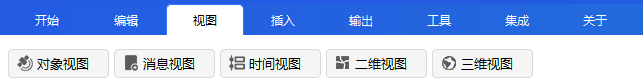
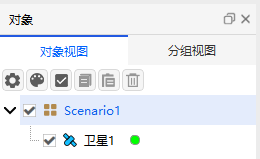
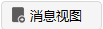
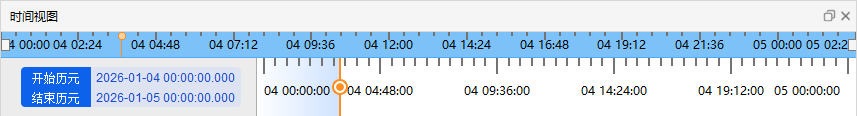
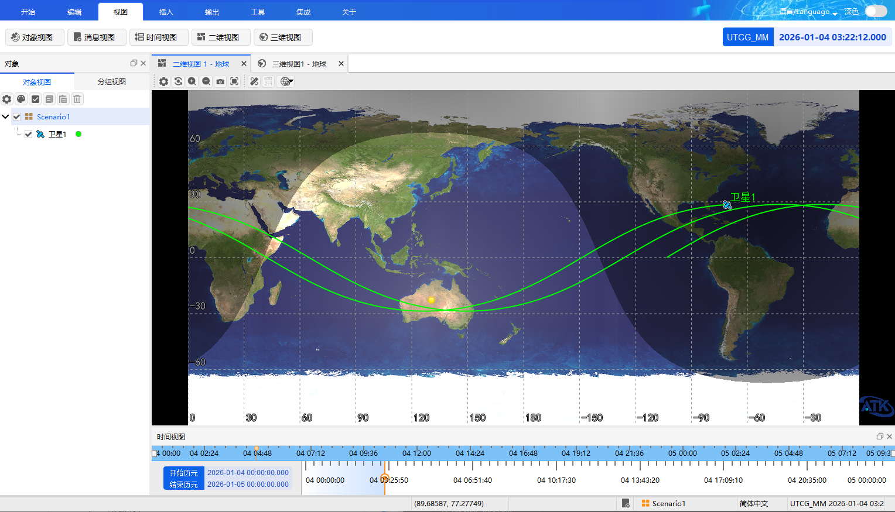

# View

The **View** menu options include five sub-menus: [Object Browser](#object-browser), [Message View](#message-view), [Timeline View](#timeline-view), [2D View](#2d-view), and [3D View](#3d-view).

## Object Browser

The Object Browser is used to visually display the objects in the current scenario.

**Show/Hide Object Window**
Click the  icon to display the object window on the left side of the view, showing all objects in the scenario. Click the icon again to hide the object window.

**Group Objects**
In the object window, you can use the **Group View** feature to manage objects in groups.

## Message View

The Message View is used to display software operation feedback information. During editing operations, relevant prompt messages will be shown in the **Message** window.

**Show/Hide Message Window**
Click the  icon to display the message window at the lower right side of the view, where you can view operation prompts and other information. Click the icon again to hide the message window.

## Timeline View

The Timeline View is used to display the start and end times of the scenario.

**Adjust Time Progress**
Hold and drag the yellow slider with the mouse to adjust the time progress. Release the mouse to set it to the current progress.

**Show/Hide Timeline View**
Click the  icon to hide the Timeline View. Click the icon again to redisplay it.

## 2D View

The 2D View is used to visually display the 2D motion state information of each object on the Earth's projection plane during the simulation.

**Open/New Window**
Click the  icon to view the 2D position information of objects in the scenario. Click the icon again to open an additional 2D View window.

**Default State**
After creating a new scenario, the 2D View is open by default.

## 3D View

The 3D View is used to visually display the 3D motion state information of each object during the simulation.

**Open/New Window**
Click the  icon to view the 3D display state of the Earth and other objects. Click the icon again to open an additional 3D View window.

**Default State**
After creating a new scenario, the 3D View is open by default.

