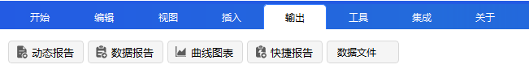
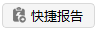

# Output

The **Output** menu is the core entry point for data viewing and exporting. It includes five sub-menus: [Dynamic Display](#dynamic-display), [Report](#report), [Chart](#chart), [Quick Report](#quick-report), and [Data File](#data-file).

The structure of this document is as follows:
- First, an introduction to **[Report Manager](#report-manager)**, which is the common configuration entry for [Dynamic Display](#dynamic-display), [Report](#report), and [Chart](#chart), covering general operations such as object selection, style management, and property editing.
- Then, a description of the features and usage of each of the five sub-menus:
  - [Dynamic Display](#dynamic-display): Real-time dynamic visualization.
  - [Report](#report): Static data summary.
  - [Chart](#chart): Visual curve analysis.
  - [Quick Report](#quick-report): Quick access to frequently used reports.
  - [Data File](#data-file): Ephemeris data export.

## Report Manager

Click the three buttons in the Output menu  to open the **Report Manager** window. This window is used to configure and generate output styles for [Dynamic Display](#dynamic-display), [Report](#report), and [Chart](#chart).

## Dynamic Display

Dynamic Display is used to show the status information of selected objects in real-time during **scenario runtime**.

### Access Methods

- Click the **Dynamic Display** sub-menu under the Output menu.
- Or, through the [Report Manager](#report-manager) window, set the **Report Type** to **Dynamic Display**, select an object and a style, then click Generate.

### Features

- Automatically refreshes in real-time as the simulation progresses.
- Suitable for observing continuous trends of objects.

---

## Report

Report is used to generate a static data summary of selected objects within a **specified time period**, presenting complete data records in a tabular format.

### Access Methods

- Click the **Report** sub-menu under the Output menu.
- Or, through the [Report Manager](#report-manager) window, set the **Report Type** to **Report**, select an object and a style, then click Generate.

### Quick Access

After the simulation finishes, you can also right-click an object in the Object Browser and select **Report** to quickly open the [Report Manager](#report-manager) window.

---

## Chart

Chart visualizes the data of selected objects during the simulation period in the form of curves, making it easy to compare and analyze data trends.

### Access Methods

- Click the **Chart** sub-menu under the Output menu.
- Or, through the [Report Manager](#report-manager) window, set the **Report Type** to **Chart**, select an object and a style, then click Generate.

### Quick Access

After the simulation finishes, you can also right-click an object in the Object Browser and select **Chart** to quickly open the [Report Manager](#report-manager) window.

### Chart Types

In the right panel of the [Report Manager](#report-manager) window, you can select either **2D Chart** or **3D Chart**.

---

## Quick Report

Quick Report is used to quickly display pre-configured text-based reports, providing fast access to frequently used reports.

### Initial Configuration

1. Click the **[Report](#report)** sub-menu under the Output menu to open the [Report Manager](#report-manager) window.
2. Select the object type and the specific object on the left panel.
3. In the **Report Type** drop-down on the right panel, select **Report** and choose a specific report style.
4. Click the <kbd>Add To Quick Report</kbd> button at the bottom of the window to complete the configuration.

### Usage

Once configured, you can directly click the  icon in the Output toolbar to quickly view the configured report content.

> [!NOTE]
> If you click the button without having configured a Quick Report, it will show an empty report.

---

## Data File

Data File is used to export ephemeris data of objects during simulation. It supports custom settings for ephemeris type, coordinate system, time range, step size, and output format.

### Operation Steps

1. **Access Settings**
   Click the <kbd>Data File</kbd> icon in the Output toolbar to open the **Generate Data File** dialog.

2. **Select Object**
   Click the <kbd>Select Object...</kbd> button, choose an object in the pop-up window, and click <kbd>OK</kbd>.

3. **Set File Type**
   - Set **External File Type** to **Ephemeris**.
   - Set **Ephemeris Type** to **STK Ephemeris**.

4. **Set Coordinate System**
   Click **Details** → **Coordinate System** drop-down to select from:
   - Fixed
   - J2000
   - ICRF

5. **Set Time Range**
   - Check **Use Scenario Interval** to use the scenario's start and end times.
   - Uncheck to manually set **Start Time** and **Stop Time**.

6. **Set Step Size**
   For **Step Size**, you can select **Use Ephemeris Steps** or use a custom step size.

7. **Export File**
   Click <kbd>Output File</kbd> → <kbd>Export...</kbd>, set the file name, save type, and location to complete the export.