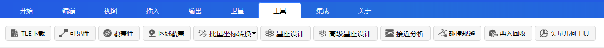

# Tools

The **Tools** menu includes the following tool modules: TLE Download, Access, Coverage, Regional Coverage, Batched Coordinates Transformation, Constellation Analysis, Constellation Design, Close Approach Analysis, Collision Avoidance, Reentry/Recovery, Vector Geometry Tool, and more. For details, please refer to the [Professional Usage Guide](../../../5-Professional-Usage-Guide/).

