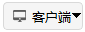

# Integration

The **Integration** menu provides a secondary development toolkit, which includes four sub-items: Connect Library, Client, Console, and UI Recorder.

1. Connect Library

Click the **Connect Library**  button to open the ATK connect folder path. You can select the appropriate content for secondary development based on your requirements.

2. Client

Click the **Client**  button to open the ATK Client dialog. You can configure parameters and perform secondary development as needed.

3. Console

Click the **Console**  button to open the ATK Console interface. You can use secondary development commands to control ATK software operations.

4. UI Recorder

Click the **UI Recorder**  button to open the ATK UI Recorder interface. Click the **Start Recode** button to begin recording your subsequent operations in ATK software. Click the **Stop Recode** button to finish recording. After recording, you can replay, save, load, clear, and perform other operations on the recorded session.