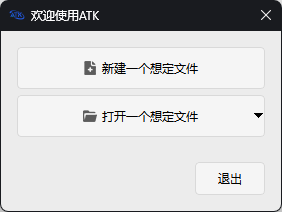

# Creating a New Scenario
## Creating a Scenario
There are two ways to create a new scenario:
- On the welcome screen that appears when the software starts, click <kbd>Create a New Scenario</kbd>.

  

- In the main software interface, click the **Home** menu and select the <kbd>New</kbd> button.

  