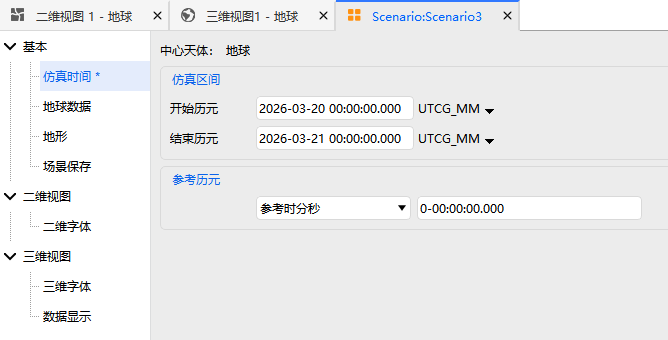

# Analysis Period

The analysis period is a core configuration item of ATK scenario properties. It is used to define the **time interval** and **reference epoch** for aerospace mission simulations, providing a unified time reference for simulation operations such as orbit computation and mission propagation.

## Simulation Interval

The simulation interval is used to precisely set the time span of the simulation mission, including two core parameters: **Start Epoch** and **Stop Epoch**, which together define the time range of the simulation analysis.

- **Start Epoch**: Sets the start time of the simulation mission, serving as the time origin for simulation computations.
- **Stop Epoch**: Sets the end time of the simulation mission, serving as the time endpoint for simulation computations.
- **Time Format Drop-down**: Freely select the time reference and display format for the start/stop epochs. Different formats suit different simulation scenarios. See [Epoch Format Descriptions](#历元格式说明) for details.

## Reference Epoch

The reference epoch serves as the comparative baseline for all time calculations within the scenario. The corresponding date and time are mapped to **zero epoch seconds**, forming the core basis for internal time conversions in the simulation.

The following 5 reference time modes can be selected via the drop-down list in the interface, accommodating different time calculation requirements:

- **Reference hms**: Defines the reference time in `HH:MM:SS` format. Intuitive and easy to read, suitable for conventional simulation scenarios.
- **Reference s**: Defines the reference time in seconds, counted from the specified epoch. Suitable for high-precision time-step calculations within the simulation.
- **Reference UTCG**: Defines the reference time in Coordinated Universal Time (UTC) format, the universal time reference for aerospace missions.
- **Reference BJT**: Defines the reference time in Beijing Time (UTC+8), suitable for domestic aerospace missions and ground system interaction scenarios.
- **Reference TDT**: Defines the reference time in Terrestrial Dynamic Time, suitable for high-precision orbital mechanics calculations and ephemeris solutions.

## Epoch Format Descriptions

ATK supports a variety of mainstream aerospace time formats. Different formats correspond to different time references and display rules, allowing flexible selection based on the simulation mission type. Detailed descriptions of each format are as follows:

| Format Name   | Full Name / Description                                                                                    | Application Scenarios                          |
| :------------ | :--------------------------------------------------------------------------------------------------------- | :--------------------------------------------- |
| **UTCG_MM**   | UTC Coordinated Universal Time, format: `YYYY-MM-DD HH:MM:SS`                                              | High-precision ground observation, mission scheduling |
| **UTCG**      | UTC Coordinated Universal Time, format: `DD MMM YYYY HH:MM:SS`                                             | Routine mission time recording, reporting       |
| **BJT**       | Beijing Time (UTC+8), display format consistent with UTC                                                   | Domestic ground systems, user interaction       |
| **BDT**       | BeiDou Time, maintaining a 33-second offset from International Atomic Time (TAI)                           | BeiDou navigation system-related simulations    |
| **BDTG**      | BeiDou Time (with date format), suitable for full-mission timeline annotation for BeiDou systems           | BeiDou mission-specific time reference          |
| **GPS**       | GPS Time, starting from 1980-01-06, displayed as week number + seconds                                     | GPS satellite orbit, navigation simulations     |
| **GPSG**      | GPS Time (with date format), combining GPS time reference with conventional date display                   | GPS mission integrated time management          |
| **TDTG**      | Terrestrial Dynamic Time (formerly known as "Earth Time")                                                 | High-precision orbital mechanics, ephemeris calculations |
| **JDate**     | Julian Date, representing time as a continuous day count                                                  | Astronomical calculations, long-term orbit propagation |
| **ModJDate**  | Modified Julian Date, defined as JDate minus 2400000.5                                                    | Aerospace mission long-term time series analysis |
| **EpSec**     | Epoch Seconds, cumulative seconds counted from the user-specified reference epoch                          | Internal simulation time steps, real-time calculations |