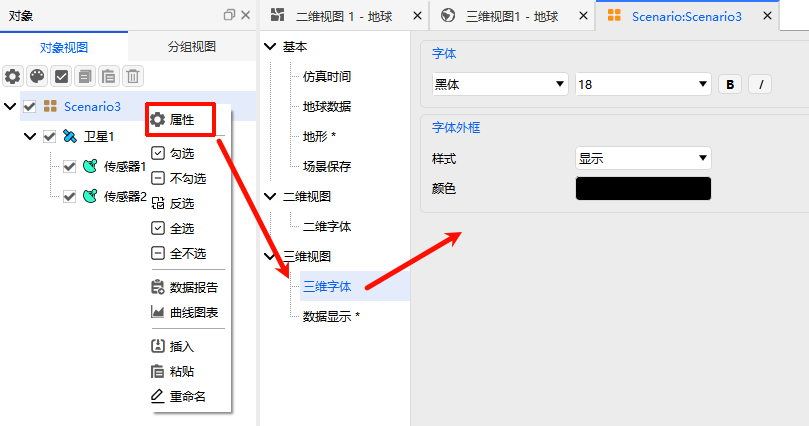

# 3D Fonts

The 3D Fonts configuration page is a core settings module for ATK 3D view visualization. It is specifically designed to customize the font display effects in the 3D graphics window. Through fine-tuned adjustments to font and outline parameters, it enhances the legibility of various text annotations and information prompts in 3D scenes, adapting to the display requirements of complex 3D simulation scenarios.

## Font Configuration

Full-dimensional customization of text fonts in the 3D view is supported, accommodating different display styles and visual requirements. The configuration items are described as follows:

- **Font**: Freely select the desired font from the local system font library to meet different annotation style requirements.
- **Size**: Set the font display size in **points**, which can be flexibly adjusted according to the zoom level of the 3D view.
- **Style**: Supports selecting **Bold**, **Italic**, or a combination of both for a **Bold + Italic** style to highlight key text information.

## Text Outline Configuration

To address the issue of text being obscured against complex 3D scene backgrounds, personalized text outline settings are provided to enhance the readability of text annotations. The configuration items are described as follows:

- **Style**: Two options are available — "None" disables the text outline, while "Show" enables it. When enabled, it effectively resolves the problem of text blending into the background in 3D scenes.
- **Color**: Click the color picker in the interface to customize the display color of the text outline. It is recommended to choose a color that contrasts well with the 3D scene background.

> [!TIP]
> The display effect of 3D fonts directly impacts the efficiency of information retrieval in 3D simulation scenes. You can flexibly adjust parameters based on the actual display conditions such as celestial body backgrounds and model colors in the scene to ensure that all text annotations remain clear and legible.