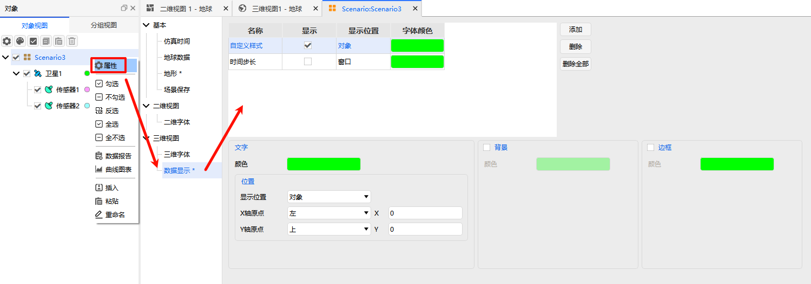
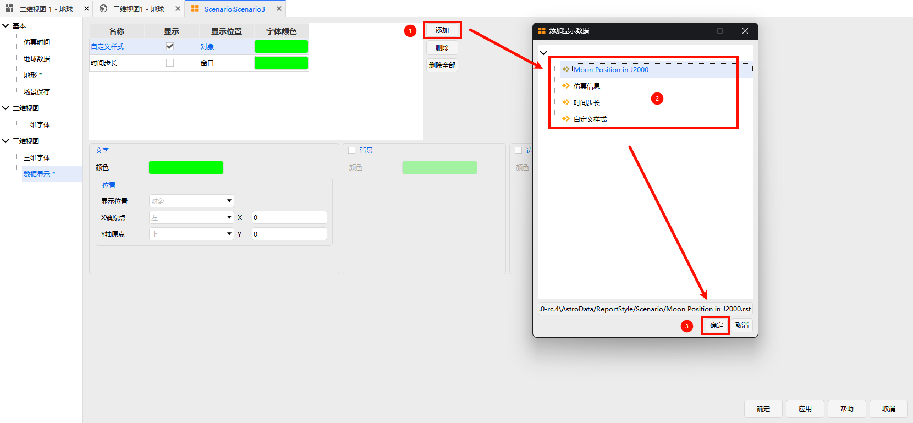
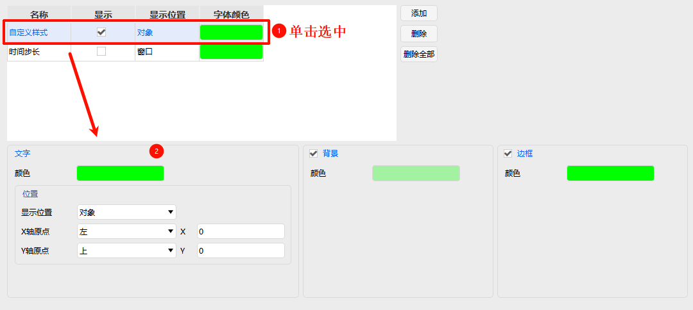

# Data Display

Data Display is a core visualization configuration module for ATK 3D views. It is used to manage and customize text-based monitoring information presented in real-time within the 3D view, such as spacecraft orbit parameters, mission operational status, epoch times, and more. It supports flexible layout and style configurations, enabling real-time visual monitoring of critical data during aerospace simulations.

## Adding Data Display Items

To add new critical data monitoring items in the 3D view, follow the steps below. Both system-predefined and user-defined data styles are supported:

1. Click the <kbd>Add</kbd> button in the configuration interface. The **Add Data Display** dialog will appear.
2. In the dialog, select the data style source (choose one of the two):
   - **Predefined Style**: Standard data display templates provided by the system, suitable for routine simulation monitoring needs.
   - **Custom Style**: Personalized data display styles pre-created by the user in **Report Management**, suitable for customized monitoring requirements.
3. After confirming the style selection, the data monitoring item will be automatically synchronized to the data display list, completing the addition.

## List Management

The data display list is an overview panel of all currently activated data monitoring items in the 3D view, clearly presenting the basic information and status of each monitoring item. It also supports single/batch deletion operations. The details are as follows:

- **Name**: The unique identifier name of the data monitoring item, facilitating quick identification of the data type.
- **Show**: Controls the display/hide state of the monitoring item in the 3D view via a checkbox, allowing temporary disabling without deletion.
- **Display Location**: Indicates the binding level of the data, divided into "Window" and "Specific Object" categories.
- **Font Color**: A real-time preview color swatch of the text display color for the monitoring item, allowing intuitive viewing of the color configuration.
- **Deletion Operations**:
  - **Single Deletion**: Select a data monitoring item in the list to be removed, then click the <kbd>Remove</kbd> button to delete it.
  - **Batch Deletion**: Click the <kbd>Remove All</kbd> button to clear all monitoring items in the current data display list in a single action.

## Data Style Configuration

After selecting any data monitoring item in the data display list, you can fine-tune its visual effects and display position in the configuration panel at the bottom of the interface. It is divided into two major modules: **Text Configuration** and **Decoration Configuration**. Adjustments can be previewed in real-time in the 3D view.

### Text Configuration

First check the "Show" option for the monitoring item, then customize the following parameters to precisely adjust the text display and position:

- **Color**: Click the color picker to set the display color of the text. It is recommended to choose a color that contrasts well with the 3D scene.
- **Position Mode**: Defines the binding and display rules for the text (choose one of the two):
  - **Window**: Text is fixed at specific pixel coordinates in the 3D view window and does not move with view zoom or scene rotation.
  - **Object**: Text is bound to specified simulation objects such as spacecraft or ground stations, moving and scaling with the object.
- **Alignment**: Sets the alignment rules of the text relative to the origin, independently configurable for the X and Y axes:
  - **X Origin**: Options include "Left", "Right", and "Center".
  - **Y Origin**: Options include "Top", "Bottom", and "Center".
- **Offset**: Precisely sets the coordinate offset of the text relative to the alignment origin by adjusting the X and Y values, enabling fine-grained position calibration.

### Decoration Configuration

To improve the legibility of text information in complex 3D scenes, background and border decorations can be added to the text. The configuration items are as follows:

- **Background**: When enabled, the **color** of the text background box can be customized. A solid color background blocks background interference and enhances text readability.
- **Border**: When enabled, the **border color** of the text background box can be configured, adding a visual outline to the background box to further highlight the text area.

> [!TIP]
> All configuration effects for Data Display can be previewed in real-time in the 3D view. It is recommended to flexibly adjust text styles, positions, and decoration effects based on the complexity of the simulation scene, background colors, and observation requirements to ensure critical data remains clear and readable. Additionally, you can use the "Show" checkbox to enable or disable different monitoring items flexibly according to the simulation phase.