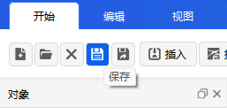

# Saving a Scenario
This document describes the **Save** and **Save As** operations for scenarios in the ATK software, including step-by-step procedures, saved content, and related configuration references to ensure that all scenario settings and object information are completely preserved.

## Save
1. Click the **Home** menu at the top of the software and select the <kbd>Save</kbd> button in the ribbon to quickly save all information of the current scenario.

2. Save rules:
   - When performing a save operation, the **scenario itself** and all **object information** it contains are saved simultaneously.
   - The default file extension for scenario files is `.atk`.
   - If the scenario has been saved before, the existing file will be overwritten directly; if it is a new unsaved scenario, the **Save** dialog will appear to prompt you to select a save location.

## Save As
1. Click the **Home** menu at the top of the software and select the <kbd>Save As</kbd> button in the ribbon to perform a Save As operation on the current scenario.

2. Save As rules:
   - When performing a Save As operation, the **Save As** dialog will appear, allowing you to **customize the save directory** and file name.
   - The saved content includes the **scenario itself** and all **object information** it contains, with the file extension still being `.atk`.
   - The Save As operation does not overwrite the original scenario file; it creates a brand new scenario file while the original file remains unchanged.

> For detailed configuration related to scenario saving, refer to: [Save Options](./03-场景属性配置/02-基本/04-场景保存配置.md)