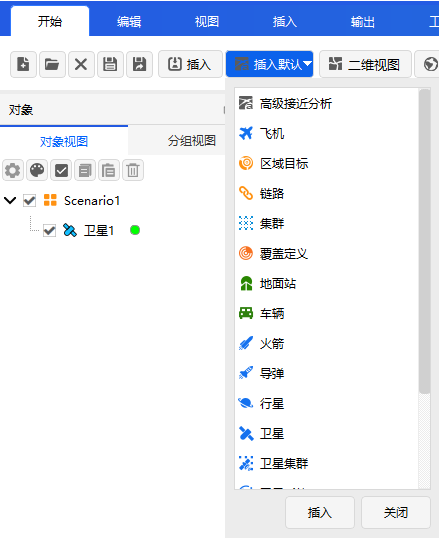

# Insert Default (Quick Insert)

**Insert Default** is the most commonly used quick object creation method in ATK, supporting pre-customized default objects, or directly using system default parameters in the insertion window for one-click rapid insertion of commonly used simulation objects.

## Method 1: Set Default Objects for One-Click Insertion
1. Click the  icon to open the **【Default Insert Object Settings】** dialog;
2. In the dialog, check the object types you wish to set as defaults, such as AdvCAT, Satellite, Facility, Ship, etc.;
3. After configuration, simply click the  icon to **one-click insert the preselected default objects**, without needing to repeatedly select the type.

## Method 2: Select Default Method in Insert Object Window
1. Open the **【Insert Object】** window and select the desired target object type from the list;
2. In the insertion method list, choose **「Insert Default Type」**;
3. Directly click the <kbd>Insert...</kbd> button, and the system will quickly complete the object addition using built-in default parameters.

