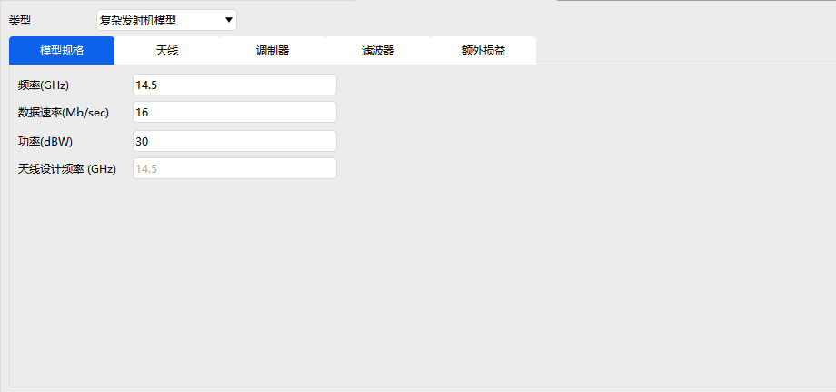

# Transmitter

Transmitter properties are used to configure signal transmission equipment, and include three modules: **Basic Properties, Constraints, and RF**.

---

## Basic Properties

Select the transmitter type and configure the corresponding transmit/transpond parameters:

- Simple Transmitter Model
- Medium Transmitter Model
- Complex Transmitter Model
- Simple Re-Transmitter Model
- Medium Re-Transmitter Model
- Complex Re-Transmitter Model

> - Simple, Medium, and Complex transmit/transpond models all support configuration of: **Model Specs, Modulator, Filter, and Additional Gains and Losses**.
> - The Complex model additionally includes **Antenna Parameters** settings.

---

## Constraints

- Basic Constraints and Temporal Constraints: same as in [Aircraft Property Settings](./飞机.md).
- Communications Constraints: same as in [Receiver Property Settings](./接收器.md).

---

## RF

The environment settings are the same as those in the RF section of [Aircraft Property Settings](./飞机.md) and are not repeated here.