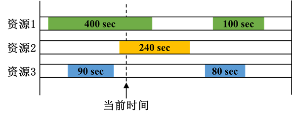

# Access Duration

## Definition

Counts the available coverage time of a single resource over the analysis object during the analysis period. At each moment, the access duration represents the length of the longest coverage arc that contains the current time. As shown in the figure below, the coverage arcs containing the current moment are 400 s and 240 s respectively; the longest arc length is taken as the access duration at that moment, so the Figure of Merit value at that moment is 400 s. When the value is 0, it indicates that the analysis object is not covered by any coverage resource at that moment.

::: tip Note
Coverage intervals from different resources are not merged when computing this metric.
:::

## Statistics

|       Name        |                                      Meaning                                      |
|:-----------------:|:---------------------------------------------------------------------------------:|
|    **Mean**       |                   The average duration of all access intervals over the analysis period.                  |
|   **Maximum**     |                     The maximum duration among all access intervals over the analysis period.                    |
|   **Minimum**     |                     The minimum duration among all access intervals over the analysis period.                    |
| **Percent Above** | Computes an access duration threshold such that the analysis object is in an access interval with duration at least that threshold for the specified percentage of time. |
|  **Std Deviation**|                   The standard deviation of all access interval durations over the analysis period.                  |
|    **Total**      |                   The sum of all access interval durations over the analysis period.                  |

::: tip Note
- **Mean**, **Maximum**, **Minimum**, **Std Deviation**, and **Total** are all computed based on the access intervals within the entire analysis period.
- **Percent Above** requires specifying a percentage level, and describes the proportion of time during which the access duration reaches a given threshold.
- **Total** is the cumulative sum of durations of all individual access intervals; overlapping intervals from different resources are not automatically merged.
- If the analysis object is never covered during the analysis period, the relevant statistics may be empty or handled according to the system's invalid‑value rules.
:::