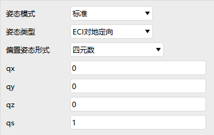
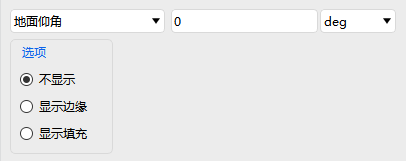

# Rocket

Rocket property settings include five modules: **Basic Properties, 2D Graphics, 3D Graphics, Constraints, and RF**. They are primarily used for launch trajectory and ascent phase simulation.

---

## Basic Properties

Includes three parts: **Trajectory, Attitude, and Ground Ellipses**.

### Trajectory

Supports two propagator types:

::: details Simple Ascent
- Launch Start/Stop Time, Step Size
- Launch Latitude, Longitude, Altitude
- Burnout Velocity, Latitude, Longitude, Altitude
:::

::: details STK Ephemeris
- Start/Stop Epoch
- Ephemeris file loading
- Option to override file times
:::

Ephemeris Transform Tool settings: Click <kbd>Import Data</kbd> to enter the Import Data page. Here you set the epoch (UTC), source coordinate system, trajectory type, and use the <kbd>Data Column</kbd> function to map columns from the imported file to the corresponding fields (relative time, position, velocity) by specifying column indices, resolving issues with mismatched column order. Additionally, the Ephemeris Transform Tool supports automatic parameter saving, so settings persist after restart.

### Attitude

Provides three attitude modes:

::: details Standard
Attitude type + Offset Attitude Form (Quaternion / Euler Angles / YPR)
:::

::: details Multi-Segment
Set multi-segment attitudes and quaternions by time intervals
:::

::: details STK File
Import external attitude files
:::

### Ground Ellipses

Settings are the same as in [Aircraft Property Settings](./飞机.md); not repeated here.

---

## 2D Graphics

Includes **Show, Ground Track, Contours, Range, Swath, and Ground Ellipses**.

### Swath

Select swath type and configure display:

- Ground Elevation, Vehicle Half Angle, Swath Half Width
- Ground Elevation Envelope, Vehicle Half Angle Envelope

Other items are the same as in [Aircraft Property Settings](./飞机.md).

---

## 3D Graphics

Includes **Model, Vector, Attitude Sphere, Orbit System, Proximity, Contours, Range, and Data Display**.

### Orbit System

- Select coordinate system
- Show toggle, custom color option and color settings

Other items are the same as in [Aircraft Property Settings](./飞机.md).

---

## Constraints

All constraint settings are the same as in [Aircraft Property Settings](./飞机.md).

---

## RF

Environment settings are the same as in [Aircraft Property Settings](./飞机.md).