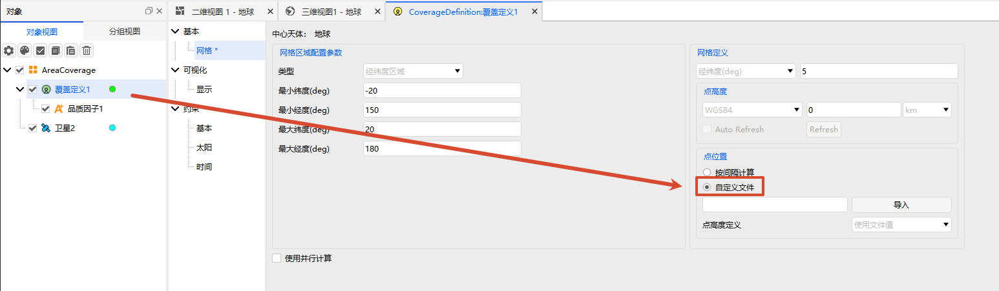
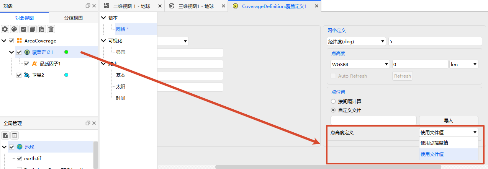

# Grid Point File Import Guide

This document describes how to import grid point files (`.pnt`), file specifications, and format requirements.

## Procedure

1. Right-click the [Coverage Definition] object and open its properties.

2. Switch to the [Grid] tab.

3. In [Point Locations], select "Custom Locations".

4. Click <kbd>Import</kbd> and select the `.pnt` file.



## File Specification

A `.pnt` file consists of two parts: **unit declarations** (optional) and **grid point data** (required):

```text :no-line-numbers
[LatLon Unit <value>]              ← Optional declaration
[Alt Unit <value>]                 ← Optional declaration
Begin PointList                 ← Data start marker (required)
    <Latitude> <Longitude> [Altitude]  ← One point per line, space-separated
    ...
End PointList                   ← Data end marker (required)
```

### Unit Declarations

Located before `Begin PointList`; may be omitted (default values are used if omitted).

| Keyword | Meaning | Allowed Values | Default |
|---------|---------|----------------|---------|
| `LatLon Unit` | Lat/Lon unit | `0` = radians, `1` = degrees | `1` (degrees) |
| `Alt Unit` | Altitude unit | `0` = meters, `1` = kilometers, `2` = decimeters, `3` = centimeters | `0` (meters) |

Example:

```text
LatLon Unit 1
Alt Unit 0
```

### Grid Point Data

- Must be wrapped by `Begin PointList` and `End PointList`.
- One point per line, format: `Latitude Longitude [Altitude]`, values separated by spaces.
- Altitude is **optional**; whether it takes effect is controlled by the [Point Altitude] option in the interface.



::: tip Lat/Lon Range Validation (v4.0.1-rc.2+)
Longitude range: **-180° ~ 360°**, Latitude range: **-90° ~ 90°**. Out-of-range data points will be skipped and a prompt will be shown.
:::

::: tip Numeric Format
Supports standard decimals (e.g., `39.3464`) and scientific notation (e.g., `3.9346423789e+01`).
:::

## Examples

### Coordinates Only (Minimal)

Unit declarations and altitude omitted; defaults are used.

```text title="grid.pnt"
Begin PointList
    39.3464    -60.2607
    39.6134    -66.2854
    39.8803    -73.8818
End PointList
```

### Coordinates + Altitude

Append altitude value per line (unit: meters). When using this format, set [Point Altitude] to "Use File Values" in the interface.

```text title="grid_with_alt.pnt"
Begin PointList
    39.3464    -60.2607    100.0
    39.6134    -66.2854    150.0
    39.8803    -73.8818    200.0
End PointList
```

### Scientific Notation + Unit Declarations

Includes unit declarations, coordinates in scientific notation, suitable for high-precision applications.

```text title="Sample.pnt"
LatLon Unit 1
Alt Unit 0

Begin PointList
    3.9346423789e+01    -6.0260748372e+01    0.0000000000e+00
    3.9613371741e+01    -6.6285429903e+01    0.0000000000e+00
    3.9880319688e+01    -7.3881767479e+01    0.0000000000e+00
End PointList
```

## Frequently Asked Questions

**Q: The point locations did not take effect after import?**

A: Check the [Point Altitude] setting in the interface. If the file does not contain altitude values, set it to "Use Default" or "Auto Compute", not "Use File Values".

**Q: Some data points were skipped?**

A: Check whether they exceed the latitude/longitude range (Latitude -90° ~ 90°, Longitude -180° ~ 360°). Points outside the range are automatically filtered and a prompt will be shown.

**Q: Do extra blank lines or comments in the file affect parsing?**

A: No. Blank lines and comment lines starting with `#` are automatically ignored during parsing.