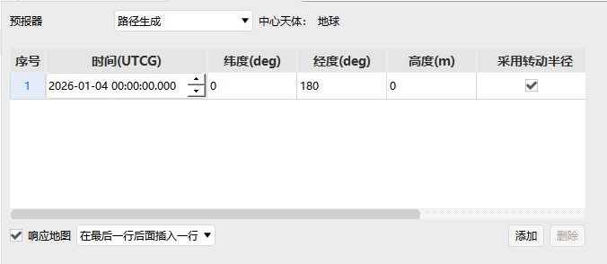
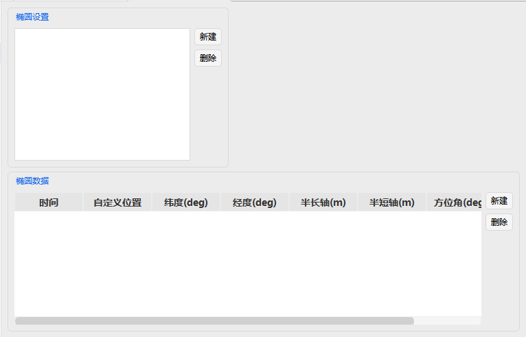
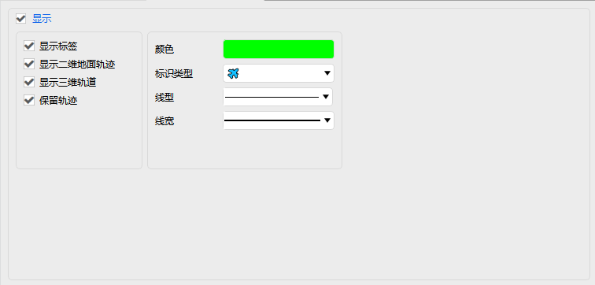
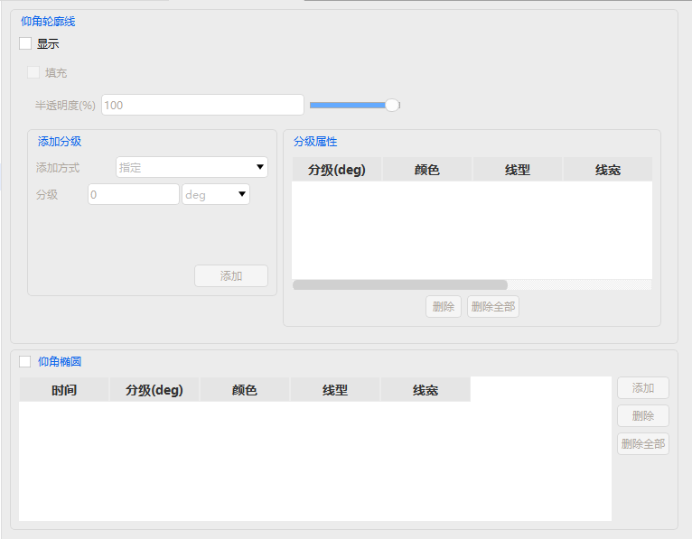
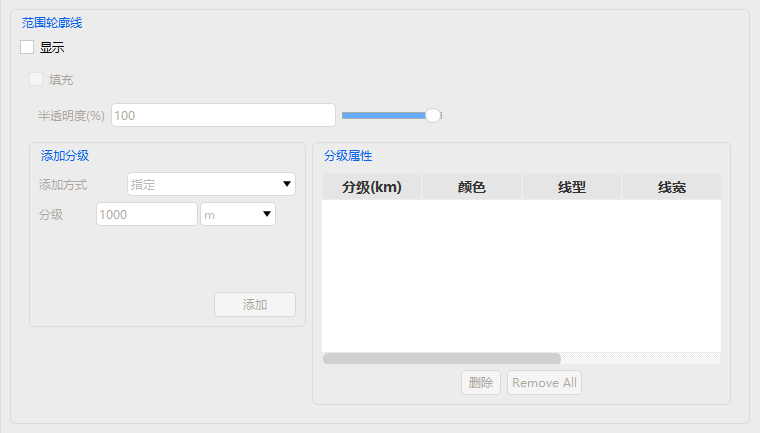
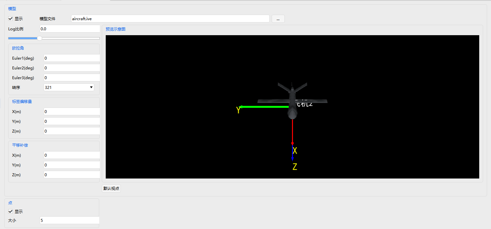
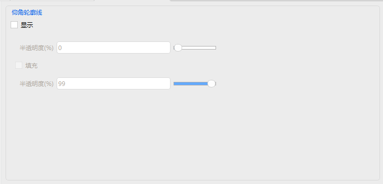
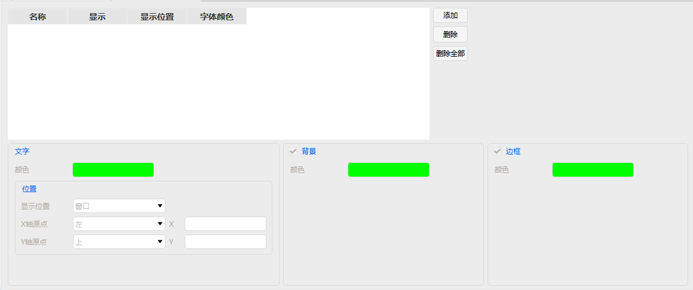
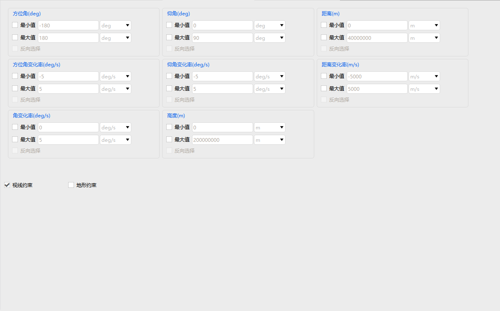
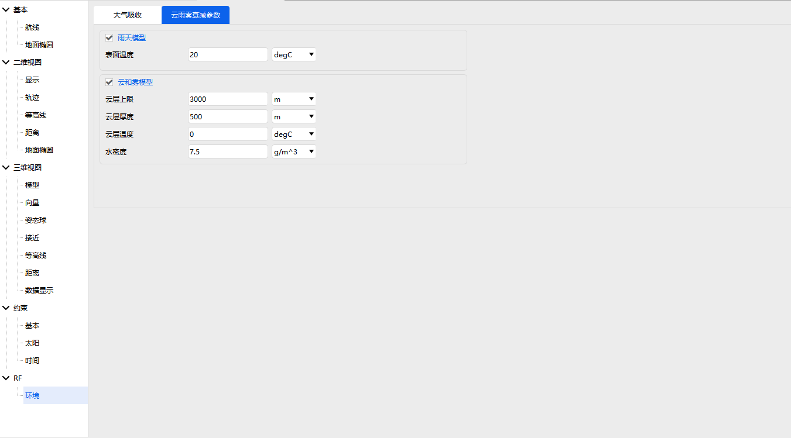

# Aircraft

Aircraft is a typical moving platform object in ATK, with properties covering five complete modules: **Basic Properties, 2D Graphics, 3D Graphics, Constraints, and RF**. It also serves as the reference benchmark for other platform-type objects (Vehicle, Ship, Submarine, etc.).

---

## Basic Properties

- **Route**: Set the aircraft's motion path.
- **Ground Ellipses**: Configure ellipse parameters for ground projection.

---

## 2D Graphics

Includes five groups of settings: **Show, Ground Track, Contours, Range, and Ground Ellipses**.

### Show

Controls overall visibility, labels, ground track, orbit, colors, markers, line styles, etc.

### Ground Track

Supports four track types:
- Point
- Time
- All
- None

### Contours / Range

- Contours: Elevation Contours, Elevation Ellipse.
- Range: Range Contours.
Both types of contours support level display settings.

---

## 3D Graphics

Includes **Model, Vector, Attitude Sphere, Proximity, Contours, Range, and Data Display**.

### Model

Load 3D models (ive / 3ds / flt / fbk, etc.) and set scale, Euler angles, offset, translation, etc.

### Vector

Configure display, labels, line thickness, and colors for vectors in various coordinate systems.

### Attitude Sphere

Set attitude sphere display, colors, zero-degree lines, reference coordinate system, scale, and projections.

### Proximity

Configure uncertainty region type, display, colors, line width, and text annotations.

### Contours / Range

Same as in 2D Graphics, supporting elevation contour and range contour display.

### Data Display

Overlay dynamic report data in the 3D scene; set position, font, color, etc.

---

## Constraints

Divided into three categories: **Basic Constraints, Solar Constraints, and Temporal Constraints**.

### Basic Constraints

Can constrain: Azimuth Angle / Rate, Elevation Angle / Rate, Altitude, Range / Range Rate, Propagation Delay, etc.; supports Min/Max values and reverse selection; also supports Line of Sight and Terrain Mask constraints.

### Solar Constraints

Constrain Sun Elevation Angle and Lunar Elevation Angle; set Sun/Lunar Exclusion Angles and Central Body Obstruction.

### Temporal Constraints

Constraint by time type, start/stop times, duration, and intervals.

---

## RF Environment

Used for link attenuation calculations:
- **Atmospheric Absorption**: Surface Temperature, Water Vapor Concentration.
- **Rain, Cloud & Fog**: Rain Model, Cloud and Fog Model (cloud ceiling, thickness, temperature, liquid water density).

