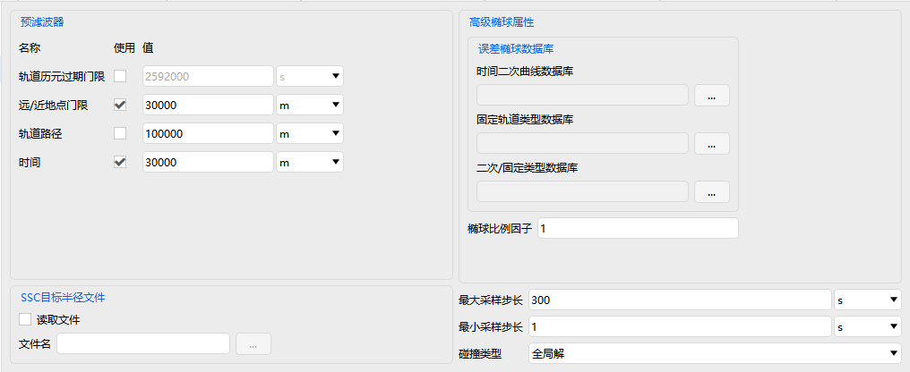

# Advanced CAT

Advanced CAT is used for refined assessment of close approaches, collision risks, and relative positions among multiple objects. Its property settings include two sections: **Basic Properties** and **Visualization**.

---

## Basic Properties

Includes three configuration pages: **Main**, **Advanced**, and **Nonelinear Compute**.

### Main

- Analysis period settings
- Primary List and Secondary List
- Range/Threshold settings
- Option to use range measurement
- Built-in <kbd>Compute</kbd> and <kbd>Report</kbd> buttons

### Advanced

- Pre-Filters settings
- Advanced Ellipsoid Properties
- SSC Hard Body Radius File
- Max/Min Sample Step
- Conjunction Type settings

### Nonelinear Compute

#### Parameter Settings

- Integration Duration
- Max Time Step, Max Angular Bend
- Resolution, Fractional Limit of Probability
- End Sigma, Max Sigma Step

#### Computation Types

- Compute Linearity Test
- Compute Prob (Cylinders)
- Compute Prob (Bundles)

---

## Visualization

Controls the display of risk ellipsoids in the 3D scene:

- Overall display toggle
- Show Primary Ellipsoids
- Show Secondary Ellipsoids
- Secondary ellipsoid display mode: All / With Conjunctions

