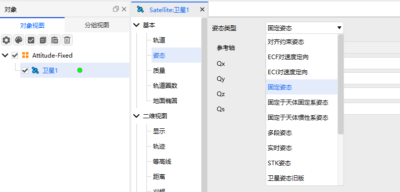
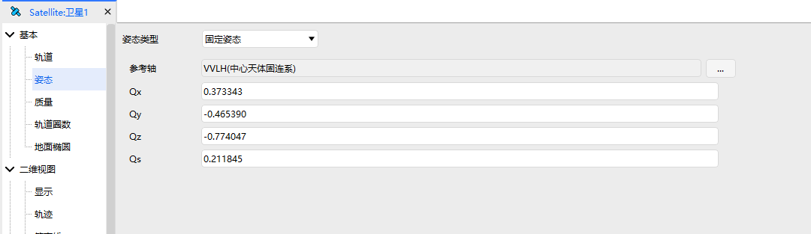
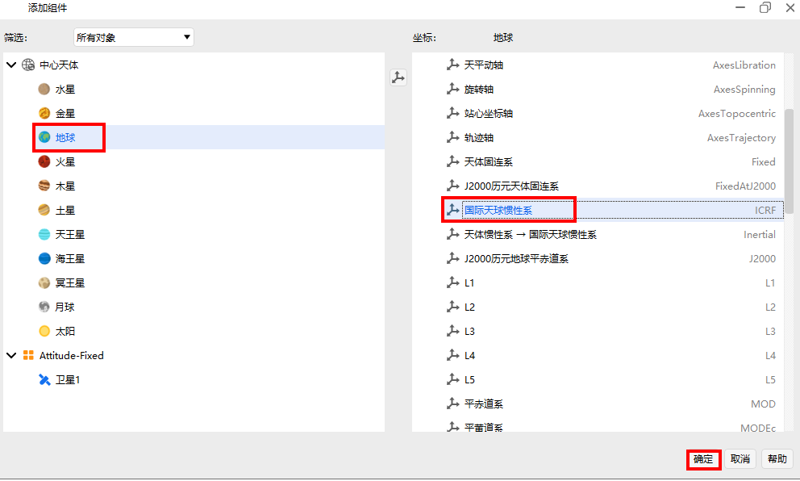
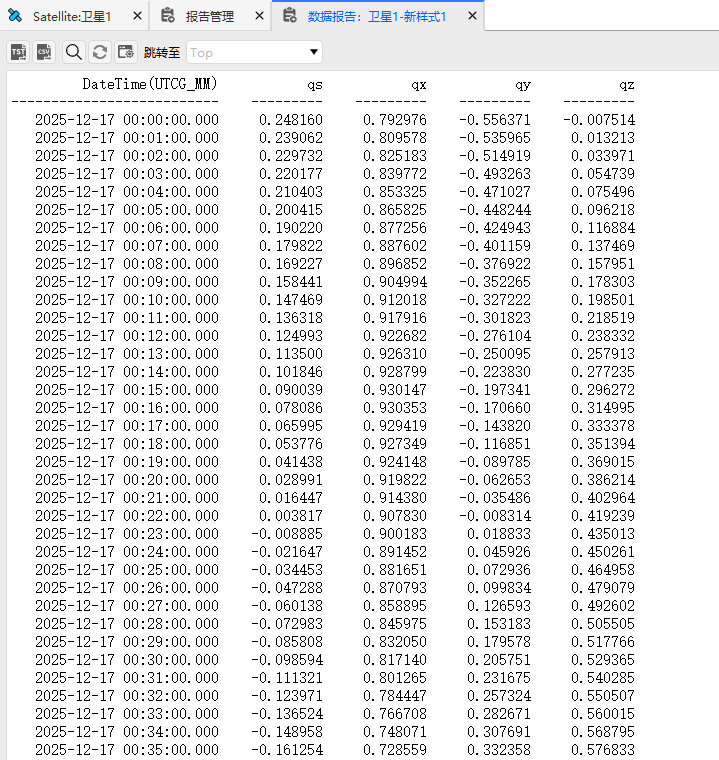
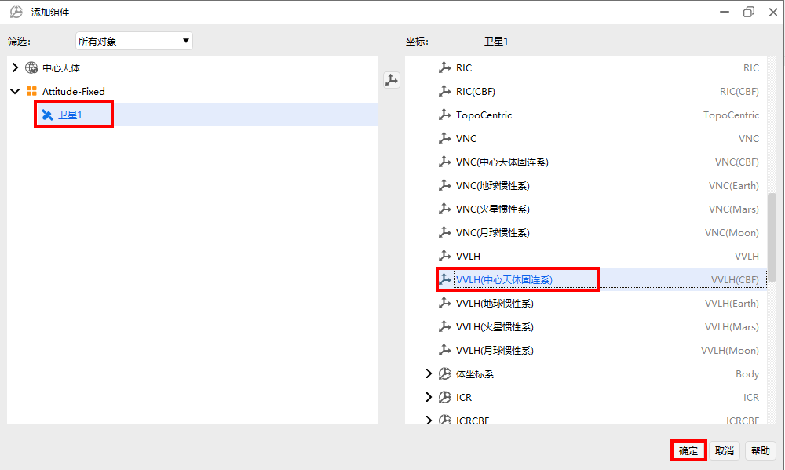
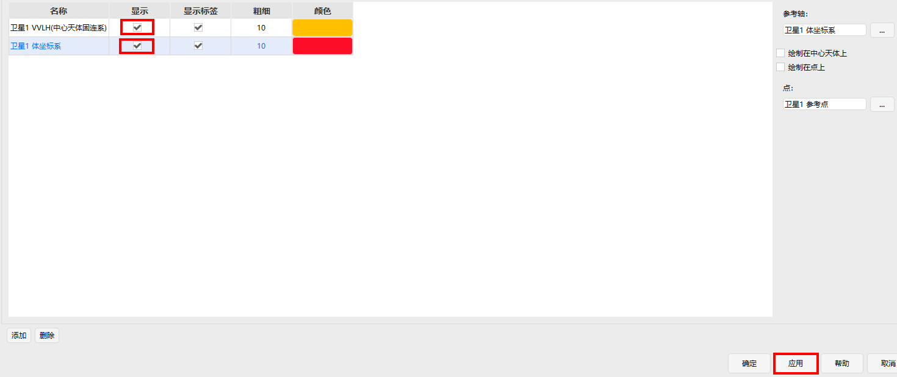
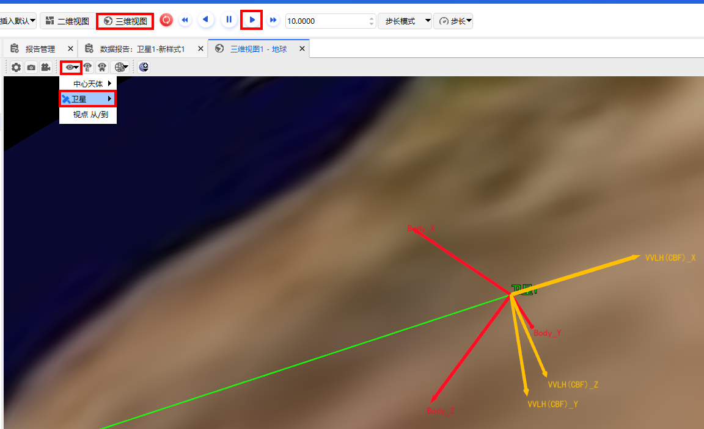

# 固定姿态

## 定义

相对于所选参考轴姿态固定

## 介绍

相对于用户所选的坐标轴，姿态不随时间或轨道变化

## 使用教程

###  选择姿态操作

点击卫星【属性】，选择【姿态】，选择姿态类型为【固定姿态】

### 配置参数

1. 参考轴：定义姿态固定的参考轴

2. Qx,Qy,Qz,Qs：四元数分量，定义物体相对于参考坐标系的固定旋转关系 

## 姿态报告

1. 打开数据报告

右键【卫星1】，点击【数据报告】，选中【卫星1】

2. 新建报告

点击【新建】，选中新建好的【新样式1】，点击【属性】进行配置

3. 配置属性

找到【Attitude Quaternions in Select Axes】, 选中 qs, qx, qy, qz, 点击【→】

4. 点击生成

选择配置好的数据报告样式【新样式1】，点击【生成】

5. 选择参考系

以配置地球天体惯性系为例，选择中心天体为【地球】，选择【国际天体惯性系】，点击【确定】

6. 显示报告

生成姿态报告

## 可视化

1. 添加坐标系

点击【卫星1】，选择【向量】，点击【添加】，给卫星1添加坐标系

2. 选择坐标系

在添加的组件中，选中【卫星1】对象，选中【VVLH(中心天体固连系)】，点击【确定】

3. 坐标系配置

同样的方式添加卫星1的体坐标系，接着勾选【显示】，点击【应用】或【确定】

4. 三维可视化

在主菜单栏中点击【三维视图】，选中【局部视点】，选择【卫星1】视角，点击【▶】播放动画，卫星的姿态（即体坐标）将固定于VVLH(CBF)坐标系

