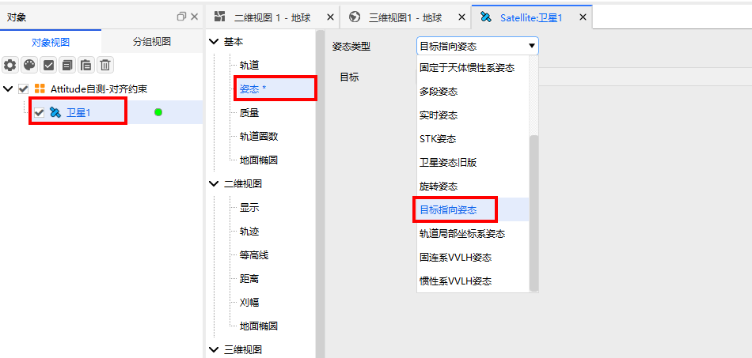
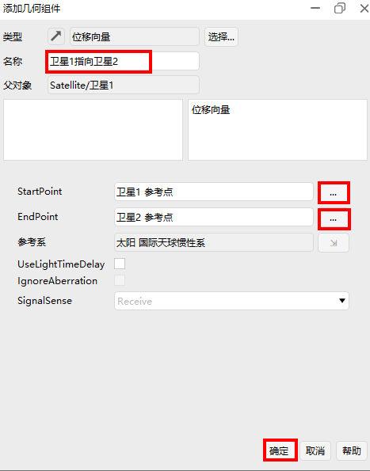

# Targeted Attitude

## Definition

Attitude pointing to a target point.

## Introduction

The attitude points to a specified target.

## Usage

### Selecting the Attitude Operation

Open the satellite's **Properties**, select **Attitude**, and choose **Targeted** as the attitude type.

### Configuring Parameters

**Target**: The target point to which the attitude points.

The example uses pointing to Satellite2. Insert Satellite2, set its position different from Satellite1, and set the target to Satellite2.

## Attitude Report

1. **Open Data Report**

Right-click **Satellite1**, select **Report**, and choose **Satellite1**.

2. **Create a New Report**

Click **New**, select the newly created **New Style1**, and click **Properties** to configure it.

3. **Configure Properties**

Locate **Attitude Quaternions in Select Axes**, select qs, qx, qy, qz, and click the right arrow **→**.

4. **Generate the Report**

Select the configured data report style **New Style1** and click **Generate**.

5. **Select the Reference Frame**

Using Earth Central Body Inertial as an example, select **Earth** as the central body, choose **Central Body Inertial Axes**, and click **OK**.

6. **Display the Report**

The attitude report is generated.

## Visualization

1. **Add a Vector Geometry Vector**

Click **Vector Geometry Tool** in the main menu bar, select **Satellite1**, and click **↗** to add a vector.

2. **Add a Displacement Vector**

Click **Select**, choose **VectorDisplacement**, and click **OK**.

3. **Configure the Displacement Vector**

Edit the **Name**, select the start point as Satellite1's reference point and the end point as Satellite2's reference point, then click **OK**.

4. **Add a Coordinate System**

Click **Satellite1**, select **Vector**, click **Add** to add a coordinate system for Satellite1.

5. **Select the Coordinate System**

In the added component, select **Satellite1** as the object, choose **Body Axes**, and click **OK**.

6. **Coordinate System Configuration**

Check **Show** and click **Apply**.

7. **Add Vectors**

Select **Vector**, click **Add**.

8. **Select the Vector**

Select **Satellite1**, choose **Satellite1 to Satellite2** from the custom components, and click **OK** to add it.

9. **Vector Configuration**

Check **Show** and click **Apply** or **OK**.

10. **3D Visualization**

In the main menu, click **3D View**, select **View From/To**, choose the **Satellite1** viewpoint, and click **▶** to play the animation. Satellite1's pointing vector to Satellite2 remains constant in the body coordinate system, with the default alignment axis being the Z-axis.

