# 固连系VVLH姿态

## 定义

对天体定向且固连系速度约束

## 介绍

Z轴：指向对象的中心天体

X轴：朝向中心天体固连系速度方向（不一定重合）

Y轴：与X轴和Z轴组成右手坐标系

## 使用方法

###  选择姿态操作

点击卫星【属性】，选择【姿态】，选择姿态类型为【】

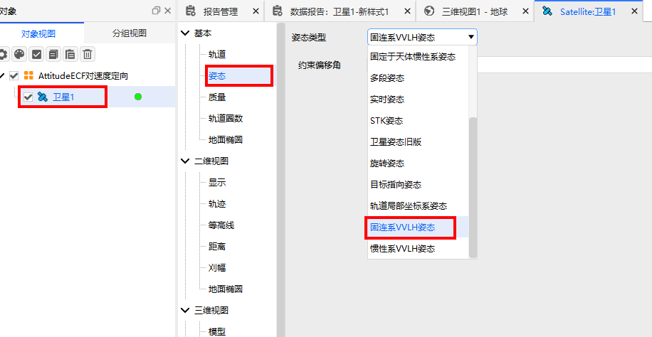

### 配置参数

约束偏移角：参考姿态基础上的固定偏移量

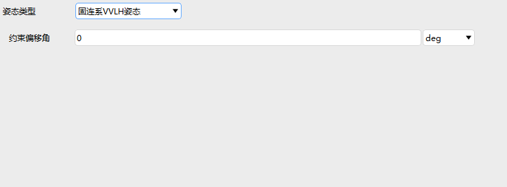

配置偏移角0为例

## 姿态报告

1. 打开数据报告

右键【卫星1】，点击【数据报告】，选中【卫星1】

2. 新建报告

点击【新建】，选中新建好的【新样式1】，点击【属性】进行配置

3. 配置属性

找到【Attitude Quaternions in Select Axes】, 选中 qs, qx, qy, qz, 点击【→】

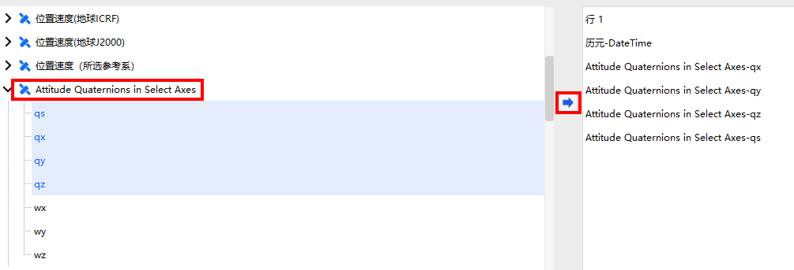

4. 点击生成

选择配置好的数据报告样式【新样式1】，点击【生成】

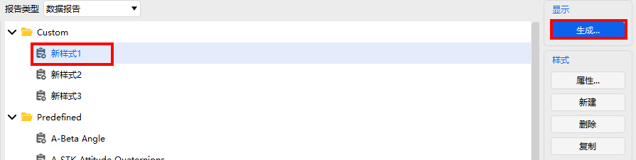

5. 选择参考系

以配置天体惯性系为例，选择【卫星1】，选择【国际天球惯性系】，点击【确定】

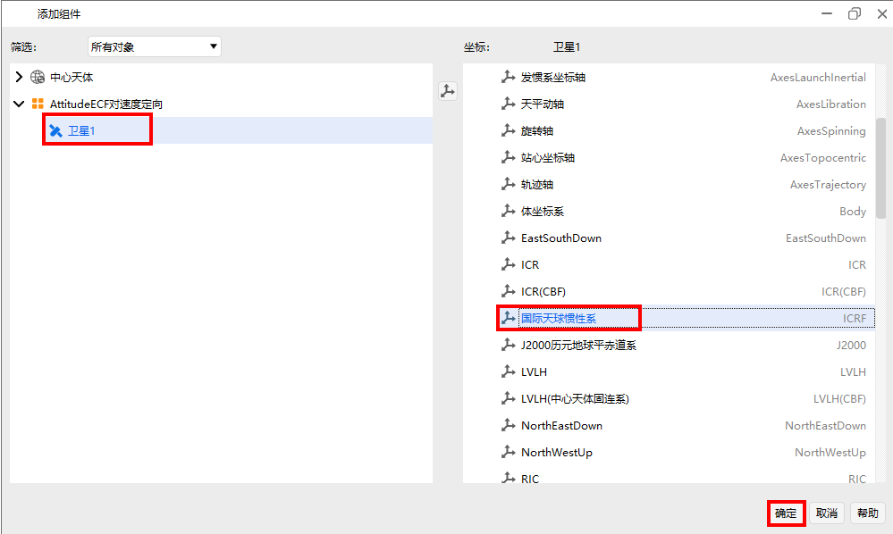

6. 显示报告z

生成姿态报告

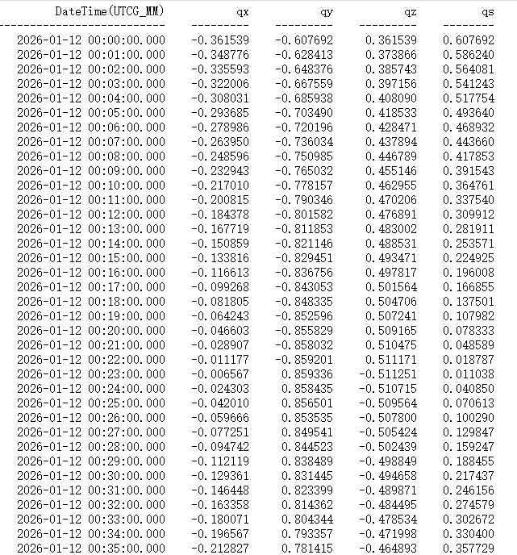

## 可视化

1. 添加坐标系

点击【卫星1】，选择【向量】，点击【添加】，给卫星1添加坐标系

2. 选择坐标系

在添加的组件中，选中【卫星1】对象，选中【体坐标系】，点击【确定】

3. 坐标系配置

勾选【显示】，点击【应用】

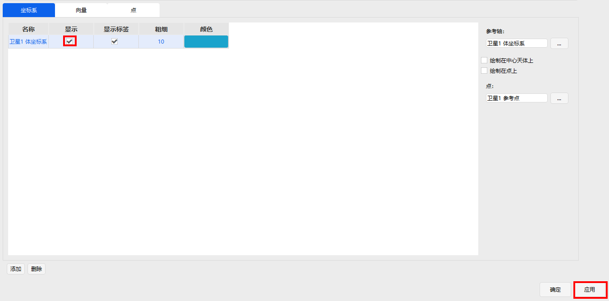

4. 添加向量

选择【向量】，点击【添加】

5. 选择向量

选择【卫星1】，点击【Nadir(Detic)】进行添加，其含义为卫星指向地心向量

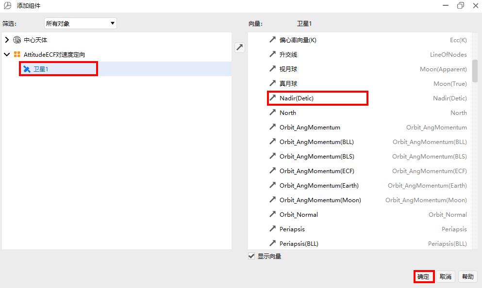

选择【卫星1】，点击【速度】进行添加

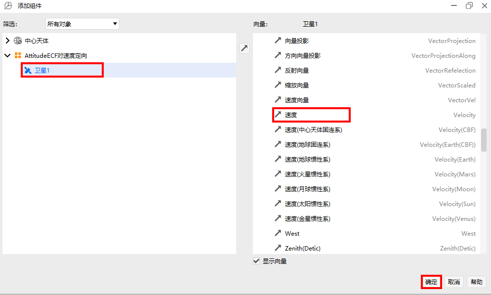

6. 向量配置

勾选【显示】，点击【应用】或【确定】

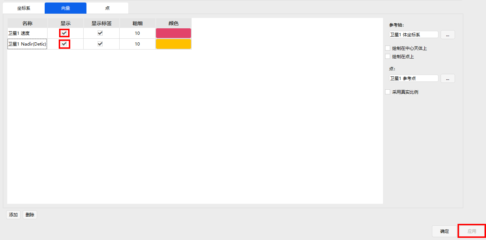

7. 三维可视化

在主菜单栏中点击【三维视图】，选中【局部视点】，选择【卫星1】视角，点击【▶】播放动画，卫星的Z轴将指向天体中心（对齐），卫星的x轴将尽量指向速度方向（约束），速度向量应约束在XZ平面内

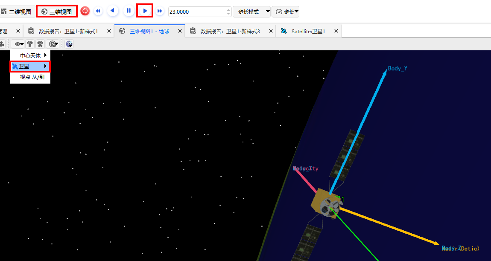