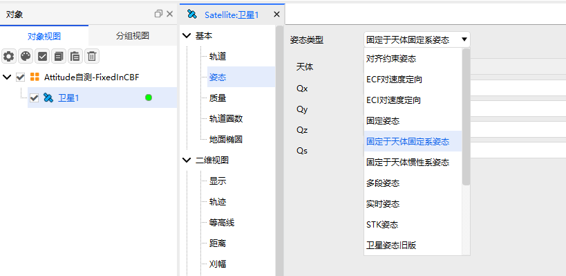
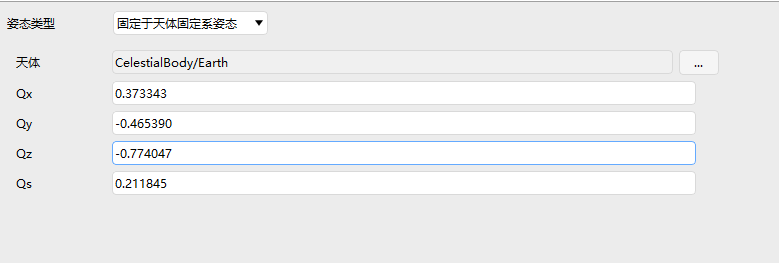

# Fixed in CBF Attitude

## Definition

The attitude is fixed relative to the Central Body Fixed (CBF) coordinate axes.

## Introduction

The attitude is fixed relative to the central body; as the central body rotates, the attitude rotates with it.

## Tutorial

### Selecting the Attitude Operation

Open the satellite's **Properties**, select **Attitude**, and choose **Fixed in CBF** as the attitude type.

### Configuring Parameters

1. **Celestial Body**: The central body of the reference frame.
2. **Qx, Qy, Qz, Qs**: Quaternion components defining the fixed rotational relationship of the object relative to the reference coordinate system.

