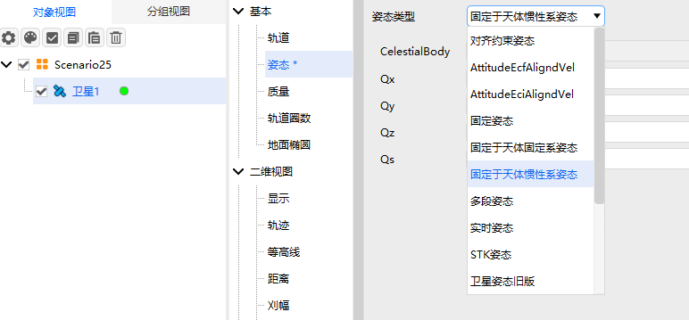

# Fixed in CBI Attitude

## Definition

The attitude is fixed in the Central Body Inertial coordinate system.

## Introduction

The attitude remains fixed in inertial space and does not change with orbital motion or Earth's rotation.

## Tutorial

### Selecting the Attitude Operation

Open the satellite's **Properties**, select **Attitude**, and choose the **Attitude Type**.

### Configuring Parameters

1. **Celestial Body**: The central body of the reference frame.

2. **Qx, Qy, Qz, Qs**: Quaternion components defining the fixed rotational relationship of the object relative to the reference coordinate system.